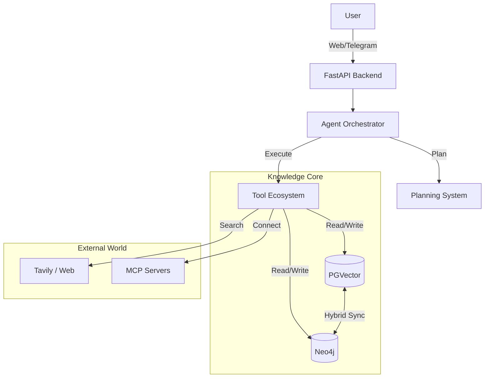

# 🧠 Kognito AI System


**Kognito AI** is a sophisticated **Digital Exocortex** designed to augment human intelligence through a collaborative, multi-agent ecosystem. It integrates advanced **Hybrid Knowledge Graphs**, **Vector Memory (RAG)**, and **Autonomous Agents** to organize your digital life, automate complex workflows, and unlock deep insights from your data.

Unlike traditional assistants, Kognito AI "thinks" before it acts, planning execution strategies to solve complex problems, conducting deep research, and proactively managing your knowledge base.

---

## 🌟 Key Capabilities

### 🧠 **Hybrid Cognitive Architecture**
Kognito AI combines the best of semantic search and relational knowledge:
*   **Graph-RAG Engine**: Merges **PGVector** (semantic similarity) with **Neo4j** (conceptual relationships) for context-aware retrieval.
*   **Cognee Integration**: Automatically maps unstructured documents into structured knowledge graphs, identifying entities and relationships.
*   **Hybrid Processing**: Uses spaCy + Ollama embeddings for fast, accurate entity extraction and intelligent deduplication.
*   **Visual Exploration**: Interact with your knowledge through dynamic, navigable graphs.

### 🤖 **Advanced Autonomous Agents**
*   **Planning System**: The agent employs a "thinking phase" to analyze query complexity, handle ambiguity, and select optimal strategies before execution.
*   **Deep Research Agent**: Conducts exhaustive multi-step research using **Tavily API** and **MCP Servers**, synthesizing information from web sources and internal documents.
*   **Proactive Insights**: Scheduled background agents analyze your data daily to discover hidden patterns, connection gaps, and new synergies.
*   **Multi-Agent Ecosystem (In Development)**: A specialized fleet of agents (Deep Researcher, Insight Generator, Knowledge Manager) coordinated by a Master Orchestrator.

### 🔌 **Extensibility & Integration**
*   **Model Context Protocol (MCP)**: Seamlessly connects with external tools and data sources via standard MCP servers.
*   **30+ Specialized Tools**: From GitHub repository analysis and code insights to image generation and mind mapping.
*   **Scheduled Tasks**: Automate maintenance, analysis, and reporting with a robust scheduling system (Daily Analysis, Weekly Cleanup).

### 🌐 **Multi-Platform Interface**
*   **Next.js Dashboard**: A rich web interface for managing workspaces, visualizing graphs, and interacting with agents.
*   **Telegram Integration**: Full-featured bot and Web App for on-the-go access and quick capture.
*   **Real-time Streaming**: Robust WebSocket architecture for responsive, reliable agent communication.

---

## 🚀 System Architecture

Kognito AI is built as a modular microservices system:



### Tech Stack
*   **Backend**: Python 3.11, FastAPI, LangGraph, SQLAlchemy (Async)
*   **AI/LLM**: Google Gemini 2.0 Flash/Pro, LangChain, LiteLLM
*   **Knowledge Graph**: Neo4j 5, Cognee, NetworkX
*   **Frontend**: Next.js 14, TypeScript, Tailwind CSS, Shadcn/ui, Cytoscape.js
*   **Infrastructure**: Docker, Nginx, Celery (planned), Redis

---

## 🛠️ Getting Started

### Prerequisites
*   Docker & Docker Compose
*   Google API Key (for Gemini models)
*   Tavily API Key (for Deep Research)
*   8GB+ RAM recommended

### Quick Setup

1.  **Clone the repository**
    ```bash
    git clone https://github.com/your-org/kognito-ai.git
    cd kognito-ai
    ```

2.  **Configure Environment**
    ```bash
    cp .env.example .env
    # Edit .env with your API keys (GOOGLE_API_KEY, TAVILY_API_KEY, etc.)
    ```

3.  **Launch System**
    ```bash
    docker-compose up -d
    ```

4.  **Access Interfaces**
    *   **Web Dashboard**: http://localhost:8880
    *   **API Docs**: http://localhost:8889/docs
    *   **Neo4j Browser**: http://localhost:7474

---

## 📚 Documentation

*   **[Core Architecture](docs/core_structure.md)**: Deep dive into the backend modules.
*   **[Agent Planning](docs/agent_planning_system.md)**: How the agent thinks and plans.
*   **[Deep Research & MCP](docs/deep_research_apis_mcp.md)**: Configuring external search and tools.
*   **[Hybrid Graph Processing](docs/mejoras_procesamiento_hibrido.md)**: Details on the entity extraction pipeline.
*   **[Scheduled Tools](docs/SCHEDULED_TOOLS.md)**: Setting up automated tasks.

---

## 🔮 Roadmap

*   **Q1 2025**: Full Multi-Agent System implementation, enhanced graph visualization.
*   **Q2 2025**: Native mobile apps, generative UI for graphs.
*   **Q3 2025**: Enterprise security, multi-tenant support, advanced analytics.

---

**© 2024-2025 Kognito AI System.** *Empowering human intelligence through technology.*