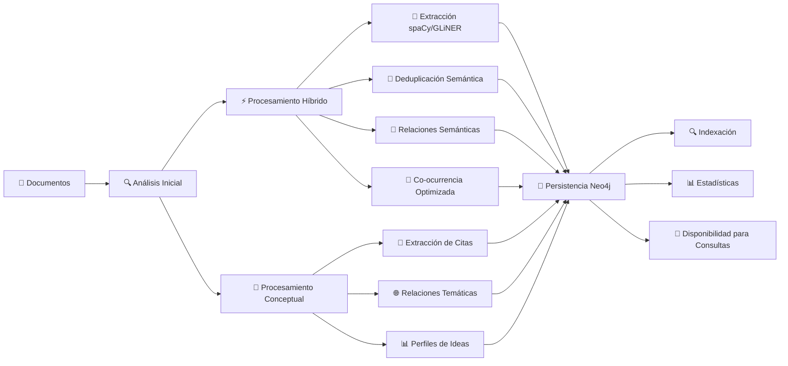

# Diagrama de Procesamiento Híbrido

```mermaid
graph LR
    A[📄 Documentos] --> B[🔍 Análisis Inicial]
    B --> C[⚡ Procesamiento Híbrido]
    B --> D[🧠 Procesamiento Conceptual]
    
    C --> E[🔧 Extracción spaCy/GLiNER]
    C --> F[🧬 Deduplicación Semántica]
    C --> G[🔗 Relaciones Semánticas]
    C --> H[📍 Co-ocurrencia Optimizada]
    
    D --> I[💭 Extracción de Citas]
    D --> J[🌐 Relaciones Temáticas]
    D --> K[📊 Perfiles de Ideas]
    
    E --> L[💾 Persistencia Neo4j]
    F --> L
    G --> L
    H --> L
    I --> L
    J --> L
    K --> L
    
    L --> M[🔍 Indexación]
    L --> N[📊 Estadísticas]
    L --> O[🎯 Disponibilidad para Consultas]
```