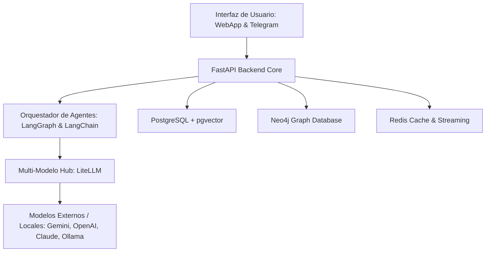
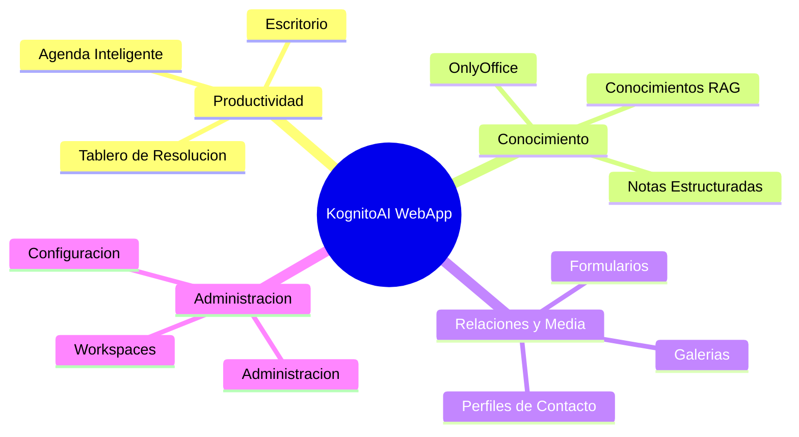

# 📘 Manual de Usuario y Guía Funcional de KognitoAI
*Plataforma Corporativa de Inteligencia Aumentada y Soberanía Cognitiva*
*Edición 2026 - Kognito AI Labs*

---

## 🎯 1. ¿Qué es KognitoAI?

**KognitoAI** no es un simple chat de inteligencia artificial; es un ecosistema avanzado de **Inteligencia Aumentada (IAu)** diseñado para funcionar como el **"Exocerebro Digital"** de los usuarios y las organizaciones. Su propósito principal es capturar, refinar y conectar toda la propiedad intelectual y el conocimiento acumulado de una organización, poniéndolo al servicio de la toma de decisiones y la productividad diaria de forma segura, privada y proactiva.

El software se basa en tres principios estratégicos fundamentales:

*   **Soberanía Cognitiva & "AI Self":** Toda la inteligencia del sistema reside donde residen los datos del cliente. KognitoAI está diseñado para ser desplegado de forma privada (On-Premise, nube privada o entornos *Air-Gapped* sin conexión externa). Esto asegura que los planes, razonamientos e ideas estratégicas generados sean activos exclusivos y protegidos de la propiedad intelectual de la empresa, evitando la fuga de información a nubes públicas de IA.
*   **El Gemelo Digital ("Second Me"):** A través de un modelado de memoria jerárquica y algoritmos de alineación con el usuario (*Me-Alignment*), KAI replica el razonamiento, el estilo de escritura y la base conceptual del usuario o la marca. Esto permite clonar el conocimiento experto de la organización para que esté operativo de forma ininterrumpida.
*   **Red Descentralizada de Saberes:** Permite que diferentes instancias de "Second Me" de departamentos, sucursales o investigadores de la organización colaboren compartiendo grafos de relaciones conceptuales sin comprometer la seguridad ni revelar los datos en bruto originales de los documentos sensibles.

---

## ⚖️ 2. Enfoque y Diferenciación en el Mercado

La mayoría de los sistemas tradicionales utilizan arquitecturas lineales basadas en servicios SaaS en la nube. A continuación se presenta una comparativa que ilustra el enfoque diferencial de KognitoAI:

| Característica | KognitoAI (Soberanía Cognitiva) | Soluciones Cloud SaaS (ChatGPT, Copilot, etc.) |
| :--- | :--- | :--- |
| **Privacidad y Control** | **Total.** Despliegue en servidores propios. Soporte para entornos locales y cerrados (*Air-Gapped*). | **Limitado.** Los datos viajan a la nube y alimentan modelos públicos o se usan con políticas variables. |
| **Razonamiento Relacional** | **Basado en Grafos de Conocimiento (Neo4j).** Conecta contratos, correos, notas e imágenes de forma multidimensional. | **Lineal / Semántico Plano.** Recuperación simple basada en palabras clave o proximidad vectorial elemental. |
| **Trazabilidad y Veracidad** | **Citas Verificables 2.0.** Cada respuesta de la IA cuenta con enlaces directos y referencias al fragmento y documento exacto. | **Riesgo de Alucinación.** Respuestas generadas sin justificación de origen, difíciles de auditar de forma precisa. |
| **Modularidad de Entorno** | **Workspaces aislados** con prompts de IA y configuraciones de almacenamiento 100% independientes por área. | **Talla única.** La misma configuración general se aplica a todo el perfil o hilo, limitando la especialización. |
| **Ejecución de Misiones** | **Agentes Autónomos (LangGraph).** Crean planes multietapa supervisables y editables por el usuario. | **Reactivo.** Solo responde instrucción por instrucción (Single-turn o secuencial básico sin planificador visible). |

---

## 🏗️ 3. Stack Tecnológico de KognitoAI

La arquitectura técnica de KognitoAI es modular, desacoplada y optimizada para el alto rendimiento de procesamiento de lenguaje natural y procesamiento multimodal:

### 3.1. Capa de Presentación (Frontend)
*   **Next.js 14+ con TypeScript:** Framework React de alto rendimiento para una carga ultrarrápida y renderizado del lado del servidor (SSR).
*   **Tailwind CSS:** Diseño UI elegante, premium y responsivo basado en una paleta sofisticada con soporte completo para modo oscuro (*dark mode*) y efectos de *glassmorphism*.
*   **Framer Motion:** Microanimaciones fluidas para transiciones e interacciones de usuario de nivel premium.

### 3.2. Capa de Lógica y Servicios (Backend)
*   **FastAPI:** API central basada en Python, caracterizada por su alta velocidad de procesamiento asíncrono y generación automática de OpenAPI.
*   **LangGraph & LangChain:** Motor para definir grafos de estado cíclicos y agentes autónomos capaces de razonar, validar y corregir planes de acción en tiempo real.
*   **LiteLLM & LitellmConverter:** Interfaz unificada de llamadas que permite cambiar dinámicamente entre proveedores (Gemini 2.0, GPT-4o, Claude 3.5 y modelos locales mediante Ollama), convirtiendo esquemas de mensajes y mapeando citas bibliográficas de manera transparente.
*   **OperationParser:** Sistema de metaprogramación que lee esquemas de OpenAPI de APIs externas y genera herramientas dinámicas de Python para que la IA realice operaciones CRUD directamente en los sistemas de la organización (ERPs, CRMs, etc.).

### 3.3. Capa de Almacenamiento y Bases de Datos
*   **PostgreSQL + pgvector:** Persistencia híbrida de datos relacionales y almacenamiento de vectores de alta dimensionalidad. Facilita búsquedas semánticas y el almacenamiento estructurado de memorias a largo plazo.
*   **Neo4j:** Base de datos relacional de grafos para la indexación y consulta del Grafo de Conocimiento Neuronal conceptual mediante el lenguaje Cypher.
*   **Redis:** Motor en memoria para la caché de ultra-alta velocidad, gestión de estados efímeros del agente de IA, sesiones de chat y colas de streaming de tokens mediante WebSockets.

### 3.4. Procesamiento de Modelos y Periféricos de IA
*   **Whisper / BiCifParaformer:** Transcripción de audio a texto de alta fidelidad con marcas de tiempo (*timestamps*) y exportación a formatos estándar de subtitulado (WebVTT/SRT).
*   **emotion2vec:** Algoritmo avanzado para extraer el tono y el estado de ánimo emocional de las grabaciones de voz de los usuarios o clientes.
*   **Mistral Vision / AWS Bedrock Nova Canvas:** Modelos multimodales para el análisis visual avanzado, OCR de documentos complejos con diagramas y generación creativa de imágenes a partir de descripciones de texto.

---

## 🧠 4. Funcionalidades del Motor de Inteligencia (Core)

El backend de KognitoAI ejecuta de forma invisible varios pipelines de procesamiento inteligente que alimentan la interfaz de usuario:

### 4.1. NoteService y Refinamiento Cognitivo
Cuando el usuario sube documentos o escribe notas, el sistema ejecuta un flujo de curaduría:
1.  **Segmentación Inteligente (Smart Chunking):** El texto se divide conservando su cohesión semántica y lógica conceptual.
2.  **Mapeo Temático Jerárquico:** Clasificación automatizada de fragmentos en temas y subtemas (`L1ChunkTopic`), asociando a cada uno un control de versiones de conocimiento (`L1Version`).
3.  **Extracción de Conceptos:** La IA analiza los fragmentos, identifica entidades (personas, proyectos, contratos, tecnologías) y sus relaciones, inyectándolos directamente en la base de datos de grafos **Neo4j**.

### 4.2. Agentes Autónomos e Investigación Profunda (Deep Research)
El motor de agentes permite realizar consultas complejas estructurando misiones:
*   **Detección de Brechas de Conocimiento:** Identifica automáticamente vacíos de información o contradicciones dentro del exocerebro corporativo.
*   **Deep Researcher Agent:** Planifica y ejecuta de forma autónoma ciclos de búsqueda externa en internet (mediante Tavily o Brave API) y cruce de datos con la memoria interna, produciendo informes técnicos exhaustivos provistos de bibliografía y diagramas de mapa mental.

---

## 💻 5. Mapeo Módulo por Módulo (Interfaz Web)

El panel web de KognitoAI está organizado en secciones de productividad que integran la base cognitiva. A continuación, se detalla el funcionamiento de cada vista:

---

### 5.1. Escritorio (`/dashboard`)

#### ¿Para qué sirve?
Es el centro de operaciones y la página de inicio personalizada del usuario. Ofrece una vista consolidada sobre el estado del conocimiento de la organización y es el punto de partida rápido para interactuar con la IA de forma conversacional.

#### Funcionalidades Principales
*   **Estadísticas de Procesamiento:** Tarjetas dinámicas que muestran el volumen de análisis realizados, la tasa de éxito operativo, el volumen de documentos procesados y los insights activos generados de manera proactiva.
*   **Brechas de Conocimiento (Knowledge Gaps Slider):** Visualizador de áreas críticas que requieren investigación, detectadas a partir de inconsistencias en los datos cargados.
*   **Temas Clave (Key Topics Slider):** Carrusel interactivo que resalta los conceptos conceptuales más recurrentes en el exocerebro, permitiendo hacer clic para ver su desglose de relaciones.
*   **Preguntas para Explorar:** Propuestas sugeridas automáticamente por la IA para profundizar en temas de interés latente.
*   **Caja de Chat Universal:** Interfaz para introducir consultas rápidas utilizando entrada de texto, pegado de contexto, carga de archivos o transcripción de notas de voz.

#### ¿Cómo se usa?
1.  **Revisión del estado cognitivo:** Al iniciar el día, consulte los carruseles de *Brechas de Conocimiento* y *Temas Clave*. Al hacer clic en un tema clave, se abrirá un diálogo con los detalles y relaciones de ese concepto.
2.  **Iniciar una consulta:** Escriba su pregunta en la caja inferior. Si desea que la IA realice una búsqueda web en tiempo real, active el botón **Búsqueda Web** (icono de red). Si requiere un reporte exhaustivo que investigue a fondo, active **Deep Research** (icono de investigación).
3.  **Dictar nota de voz:** Haga clic en el icono del micrófono para grabar una consulta oral. El sistema transcribirá el audio en tiempo real y rellenará la caja de texto para su envío.
4.  **Procesar archivos rápidamente:** Arrastre un archivo (PDF, DOCX, imagen) al área de chat para que KAI lo ingeste y lo asocie al nuevo hilo de conversación.

---

### 5.2. Tablero de Resolución (`/resolution-board`)

#### ¿Para qué sirve?
Es un panel operativo diseñado bajo el principio de acción corporativa. Convierte patrones detectados de forma repetida (insights) en compromisos y tareas reales con plazos de cumplimiento estrictos de 48 horas, evitando la parálisis por análisis en la toma de decisiones.

#### Funcionalidades Principales
*   **Detección de Recurrencia:** El backend monitoriza las interacciones; si un problema, brecha o idea se identifica más de 2 veces, se autogenera una tarea en este tablero.
*   **Controles de Tiempo (Plazo de 48 horas):** Cada tarea posee una cuenta regresiva que muestra las horas restantes en tiempo real.
*   **Mecanismo de Escalación:** Las tareas que expiran sin resolverse se agrupan en una sección de emergencia ("Decisión Requerida: Tareas Escaladas"). El usuario debe forzar su postergación por 48 horas adicionales o cancelarla formalmente con una justificación.
*   **Historial de Cierres:** Registro de tareas completadas o canceladas para auditar la agilidad operativa.
*   **Alertas de Escalación Proactivas:** Tarjetas con alertas generadas de manera autónoma por el sistema de monitoreo.

#### ¿Cómo se usa?
1.  **Revisar tareas activas:** Acceda a la sección central de *Tareas Activas en Resolución* para ver qué compromisos están próximos a vencer.
2.  **Completar una resolución:** Cuando la acción física asociada a la tarea se haya realizado, haga clic en el botón verde **Completar**. La tarea se guardará en el historial.
3.  **Gestionar tareas escaladas (Expiradas):** Si tiene tareas en color rojo (escaladas), pulse **Postergar (48h)** para otorgar más tiempo o **Cancelar Tarea** si la acción ya no es relevante o viable.
4.  **Consultar alertas proactivas:** Lea la columna derecha para ver los eventos del sistema e incidentes analizados automáticamente por KAI, aplicando las sugerencias de acción sugeridas al pie de cada alerta.

---

### 5.3. Conocimientos / RAG (`/rag`)

#### ¿Para qué sirve?
Es la biblioteca y biblioteca de datos central de KognitoAI. Permite la ingesta multimodal masiva de documentos corporativos, su organización temática y el control de la indexación semántica (RAG - *Retrieval-Augmented Generation*).

#### Funcionalidades Principales
*   **Subida Multimodal:** Soporta documentos de texto (PDF, DOCX, TXT, CSV), audios (grabaciones de reuniones, entrevistas) e imágenes (diagramas de flujo, fotos de pizarras).
*   **Monitoreo de Procesamiento:** Indicadores visuales en la esquina de la pantalla que muestran el progreso de subida y el estado de indexación/vectorización en segundo plano.
*   **Clasificación en Temas (Topics):** Categorización y segmentación de documentos por área temática para búsquedas filtradas.
*   **Visión OCR:** Digitalización inteligente de imágenes y capturas de pantalla integrando modelos de visión para extraer contenido estructurado.

#### ¿Cómo se usa?
1.  **Subir nuevos archivos:** Haga clic en el botón de carga o arrastre archivos al área de soltado. Puede asignarles un tema o Workspace específico.
2.  **Seguir el estado de ingesta:** Observe el componente de progreso en la esquina inferior derecha. KAI notificará cuando el archivo se haya convertido, fragmentado y guardado en la base de datos vectorial PostgreSQL (`pgvector`).
3.  **Buscar y Filtrar:** Utilice la barra de búsqueda interna para localizar fragmentos conceptuales indexados, verificando cómo la IA ha mapeado los tópicos de cada documento.

---

### 5.4. Agenda (`/agenda`)

#### ¿Para qué sirve?
Es un calendario inteligente que conecta la gestión del tiempo y las reuniones con la base de conocimiento organizacional acumulada en el exocerebro.

#### Funcionalidades Principales
*   **Sincronización CalDAV:** Conexión bidireccional estándar con calendarios corporativos de Apple, Google, Microsoft Outlook y servidores privados (Nextcloud, etc.).
*   **Briefing Inteligente de Reuniones:** Sistema que localiza las reuniones programadas para las próximas horas y, analizando el nombre de los participantes y el tema, compila de forma automática un informe con los antecedentes, chats pasados, contratos y notas asociadas para que el usuario asista plenamente preparado.

#### ¿Cómo se usa?
1.  **Vincular calendario:** Conecte sus credenciales CalDAV desde los ajustes del módulo.
2.  **Revisar el día:** Visualice sus eventos y tareas programadas en la vista de calendario (mes, semana o día).
3.  **Solicitar Briefing:** Seleccione una reunión próxima y pulse el botón **Generar Briefing de Contexto**. La IA procesará en segundos los documentos y correos previos vinculados al contacto y al proyecto, entregando un resumen estructurado con notas y compromisos pendientes.

---

### 5.5. Notas (`/notes`)

#### ¿Para qué sirve?
Es el módulo de redacción y almacenamiento de conocimiento libre o estructurado. A diferencia de las notas tradicionales, las notas en KAI forman parte del grafo de conocimiento y están versionadas de forma automática.

#### Funcionalidades Principales
*   **Editor Enriquecido:** Soporte para formato Markdown y bloques de código.
*   **Control de Tópicos Jerárquicos y Versiones:** Cada nota se cataloga bajo una jerarquía conceptual y registra sus cambios con marcas de versión (`L1Version`).
*   **Asociación Relacional:** Las notas se pueden interconectar entre sí o asociarse directamente a perfiles de personas, álbumes fotográficos o tareas del Tablero de Resolución.

#### ¿Cómo se usa?
1.  **Crear una nota:** Haga clic en **Nueva Nota** y asigne un título y un tema de clasificación.
2.  **Redacción asistida:** Escriba su contenido. Puede pedirle a KAI (mediante la barra lateral de chat) que complete ideas, corrija la redacción de la nota o extraiga un resumen ejecutivo.
3.  **Relacionar conocimiento:** Use etiquetas o el botón de relaciones para vincular la nota a un perfil de cliente específico en el sistema.

---

### 5.6. Perfiles de Contacto (`/profiles`)

#### ¿Para qué sirve?
Es un gestor relacional de relaciones (CRM inteligente). Consolida todo lo que la organización sabe sobre personas (clientes, socios, colaboradores) cruzando de forma automática notas, fotos, correos y formularios vinculados.

#### Funcionalidades Principales
*   **Fichas de Identidad Unificada:** Agrupa la información de contacto y metadatos del perfil.
*   **Vinculaciones Semánticas:**
    *   `link-note`: Conecta actas de reuniones y notas escritas relacionadas con la persona.
    *   `link-album`: Vincula álbumes fotográficos y evidencias visuales de visitas o proyectos.
    *   `link-form-response`: Integra las encuestas, entrevistas o formularios completados por el contacto.
*   **Línea de Tiempo:** Registro histórico integrado de actividades, tareas y eventos de la agenda donde participa el contacto.

#### ¿Cómo se usa?
1.  **Crear un perfil:** Pulse **Añadir Perfil** e ingrese los datos básicos (nombre, cargo, correo, teléfono).
2.  **Enlazar registros:** En el panel del perfil, haga clic en *Asociar Nota* o *Asociar Galería* para seleccionar elementos existentes en el sistema y tender puentes semánticos hacia el contacto.
3.  **Ver historial:** Al abrir la ficha de un cliente, revise la línea de tiempo consolidada para tener un panorama completo antes de llamarlo o reunirse con él.

---

### 5.7. Galerías y Activos Visuales (`/galleries`)

#### ¿Para qué sirve?
Es el almacén multimedia del exocerebro. Sirve para archivar, optimizar y analizar las imágenes, capturas y diagramas de la organización.

#### Funcionalidades Principales
*   **Organización por Álbumes:** Creación de colecciones visuales según temáticas, visitas a obras, o campañas de marketing.
*   **Procesamiento de Miniaturas:** Generación automática y optimizada de thumbnails para cargas rápidas en la interfaz web.
*   **Compartición Segura:** Creación de enlaces web externos protegidos con contraseña, con la opción de establecer fechas de caducidad automáticas.

#### ¿Cómo se usa?
1.  **Crear Álbum:** Vaya a Galerías, haga clic en **Nuevo Álbum** y elija un nombre identificativo.
2.  **Subir Imágenes:** Suba imágenes arrastrándolas. El motor de visión OCR las analizará y las pondrá a disposición de las búsquedas textuales de la IA.
3.  **Compartir de forma segura:** Seleccione una galería, pulse **Compartir Enlace**, configure una clave y defina si caducará en 24 horas, 7 días o nunca. Copie el enlace generado para enviarlo a clientes o colaboradores externos.

---

### 5.8. Formularios Dinámicos (`/forms`)

#### ¿Para qué sirve?
Permite diseñar, recolectar e interpretar datos estructurados (encuestas, auditorías, checklists de calidad o evaluaciones internas) automatizando la generación de informes PDF profesionales.

#### Funcionalidades Principales
*   **Diseñador de Formularios:** Creación rápida de campos (texto, opción múltiple, fecha, firmas).
*   **Recolección de Respuestas:** Almacenamiento seguro de las entradas de formularios completadas.
*   **Generador Automático de Reportes:** Transformación instantánea de los formularios respondidos en documentos PDF oficiales con diseño y formato corporativo.

#### ¿Cómo se usa?
1.  **Diseñar Formulario:** Acceda a la sección de Formularios, pulse **Crear Formulario** y agregue las secciones y tipos de preguntas deseadas.
2.  **Enviar a clientes/usuarios:** Comparta el enlace público del formulario con los destinatarios para que lo completen en su navegador.
3.  **Generar PDF de salida:** Una vez recibido el formulario contestado, pulse **Generar Reporte**. El sistema procesará las respuestas y descargará un documento PDF maquetado listo para archivar o enviar por correo.

---

### 5.9. OnlyOffice (`/documents`)

#### ¿Para qué sirve?
Es la suite ofimática colaborativa local incrustada directamente en KognitoAI. Permite editar y redactar documentos de texto (`.docx`), hojas de cálculo (`.xlsx`) y presentaciones (`.pptx`) en tiempo real, de manera privada y con la asistencia interactiva de los agentes de IA.

#### Funcionalidades Principales
*   **Co-edición en Tiempo Real:** Trabajo simultáneo entre varios miembros del equipo en un mismo archivo documental de forma local y soberana.
*   **Asistencia Contextual de IA:** Capacidad para seleccionar texto dentro del editor OnlyOffice y llamar al agente de IA para expandir, resumir, traducir o contrastar la información basándose en el RAG organizacional.

#### ¿Cómo se usa?
1.  **Crear o abrir un documento:** Seleccione un archivo de su biblioteca en OnlyOffice o cree uno nuevo desde la interfaz del módulo.
2.  **Trabajar colaborativamente:** Comparta el enlace interno del documento con su equipo para editar celdas o párrafos simultáneamente.
3.  **Invocar asistencia cognitiva:** Seleccione un fragmento de texto dentro del documento, haga clic derecho o pulse el botón del menú de KognitoAI para abrir el chat integrado. Solicite a KAI acciones como: *"Redacta una cláusula de confidencialidad usando de base el contrato Alpha"* y aplique la respuesta directamente en el editor.

---

### 5.10. Espacios de Trabajo (`/workspaces`)

#### ¿Para qué sirve?
Es el módulo organizativo de alto nivel. Permite crear silos lógicos (Workspaces) para diferentes departamentos, clientes o proyectos específicos de la empresa, controlando de manera granular qué información comparte cada equipo y qué directrices debe seguir la IA.

#### Funcionalidades Principales
*   **Aislamiento Semántico y de Tareas:** Los chats, tareas, documentos y grafos de un workspace no se mezclan con los de otros, garantizando una total privacidad por área.
*   **Control de Accesos por Roles:**
    *   `owner`: Propietario con control absoluto del espacio (creación, edición, borrado y compartición).
    *   `editor`: Puede crear y editar contenido, además de compartir con otros colaboradores.
    *   `viewer`: Acceso restringido a solo lectura (no puede crear tareas ni alterar documentos).
*   **Personalización Visual e Instrucciones IA:** Cada espacio permite asignar un color distintivo para evitar errores de contexto y definir un *System Prompt* (instrucciones del sistema) específico que moldea el comportamiento del agente de IA en ese entorno.

#### ¿Cómo se usa?
1.  **Crear Workspace:** Pulse **Nuevo Workspace**, asigne un nombre (ej. *Área Legal*), seleccione un color (ej. *Púrpura*) y escriba la instrucción del sistema (ej. *"Actúa como un abogado corporativo y prioriza citas de leyes nacionales"*).
2.  **Invitar Colaboradores:** Abra la configuración del Workspace, pulse **Compartir**, escriba el correo electrónico del miembro del equipo y asigne su rol (`editor` o `viewer`).
3.  **Cambiar de contexto:** Seleccione el Workspace en el menú lateral o en el selector superior. Automáticamente, sus búsquedas, chats y tareas se filtrarán para mostrar únicamente los datos correspondientes a ese espacio de trabajo.

---

### 5.11. Configuración Personal (`/settings`)

#### ¿Para qué sirve?
Es el panel donde el usuario define sus preferencias de interfaz, ingresa credenciales de servicios y gestiona las herramientas activas del sistema.

#### Funcionalidades Principales
*   **Administración de API Keys:** Permite configurar y guardar de forma segura las llaves para modelos externos (OpenAI, Anthropic, Gemini, DeepSeek).
*   **Selección de Proveedor Activo:** Selector para definir qué LLM procesará las consultas por defecto.
*   **Ajustes de Interfaz:** Control de tema visual (Claro / Oscuro) y personalización del perfil de usuario.
*   **Panel de Características:** Permite activar o desactivar módulos del sistema (Profiles, Galleries, Forms) según las necesidades de uso.

#### ¿Cómo se usa?
1.  **Configurar proveedores de IA:** Acceda a la pestaña de proveedores e introduzca las API Keys correspondientes a las plataformas que desee habilitar. Pulse **Guardar**.
2.  **Alternar características:** Active o desactive los interruptores de los módulos que desee visualizar en el menú de navegación lateral.
3.  **Ajustes visuales:** Seleccione el modo visual de su preferencia (Claro, Oscuro o Automático del Sistema).

---

### 5.12. Administración del Sistema (`/admin`)

#### ¿Para qué sirve?
Es el panel exclusivo para usuarios administradores. Ofrece herramientas avanzadas de auditoría, control de accesos a nivel de servidor y optimización del backend.

#### Funcionalidades Principales
*   **Control de Cuentas:** Administración de registros de usuario y control de permisos de administrador (`is_admin`).
*   **Auditoría de Logs LLM:** Visualización en tiempo real del flujo de llamadas, tokens consumidos y costos acumulados por usuario o departamento.
*   **Herramientas Programadas (Scheduled Tools):** Panel para configurar rutinas automáticas de backend, como la limpieza de base de datos, sincronizaciones CalDAV masivas durante la noche o re-indexación de grafos.

#### ¿Cómo se usa?
1.  **Gestionar usuarios:** Acceda a la pestaña de usuarios para aprobar registros nuevos o revocar accesos de cuentas inactivas.
2.  **Auditar costos:** Monitoree el gráfico de uso de tokens para detectar consumos inusuales o derivar presupuestos de API a diferentes áreas.
3.  **Programar tareas de mantenimiento:** Defina tareas recurrentes en el programador de backend para automatizar la organización del sistema.

---

## 🤖 6. Módulo de Telegram (Bot Conversacional)

KognitoAI extiende su alcance permitiendo la interacción asíncrona a través de un Bot de Telegram. Este bot comparte la **Identidad Universal** (`account_id`) de la aplicación web, de modo que toda interacción realizada en el chat de Telegram repercute y se registra en la base de datos central de la organización.

### 6.1. Comandos Disponibles en Telegram
El usuario puede controlar el sistema mediante comandos explícitos:

*   `/start`: Inicia la conversación con el bot. Registra automáticamente la cuenta del usuario en la base de datos asociando su ID de Telegram si no existía previamente.
*   `/documentos`: Genera un enlace cifrado único que abre la WebApp de KognitoAI directamente en un marco integrado (*Telegram WebApp*) de manera segura, transmitiendo la identidad del usuario a través de `initData` de Telegram.
*   `/abrir_conversacion <nombre>`: Abre o crea un hilo de conversación de chat con un nombre específico en su cuenta, permitiendo ordenar las temáticas directamente desde el móvil.
*   `/workspace`: Despliega un menú interactivo en el chat con botones inline para alternar el espacio de trabajo activo en Telegram. Toda consulta posterior se procesará bajo el contexto y las reglas del workspace elegido.
*   `/help`: Despliega un menú de ayuda detallando el uso de comandos y ejemplos prácticos de interacciones comunes.

### 6.2. Interacción por Voz y Multimedia en Telegram
El bot de Telegram está capacitado para recibir interacciones multimodales:
1.  **Mensajes de Voz:** Al enviar un audio, el bot lo transcribirá (utilizando Whisper/BiCifParaformer), analizará su tono emocional mediante `emotion2vec` y responderá al fondo de la consulta en formato de texto o con una nota de voz sintetizada.
2.  **Imágenes de Documentos:** Envíe fotos de facturas, contratos o capturas de pizarras. El bot procesará la imagen por OCR de visión y la indexará directamente como una memoria en la sección de Conocimiento general o del workspace activo.

---
*Manual Magna KognitoAI - Documentación de Sistema. Todos los derechos reservados © 2026.*
