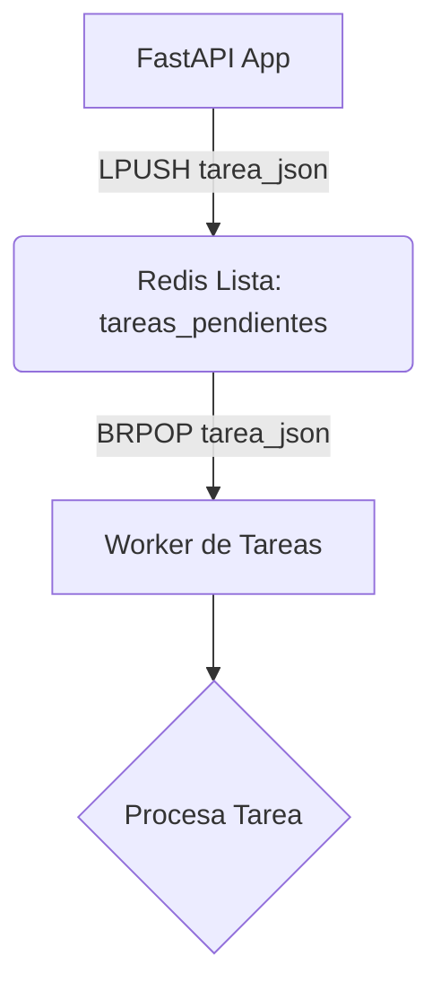
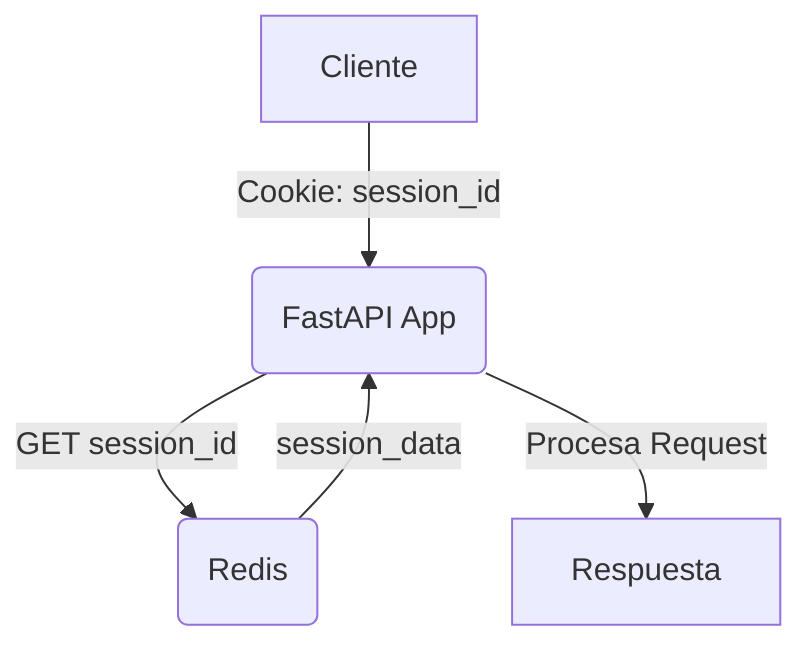
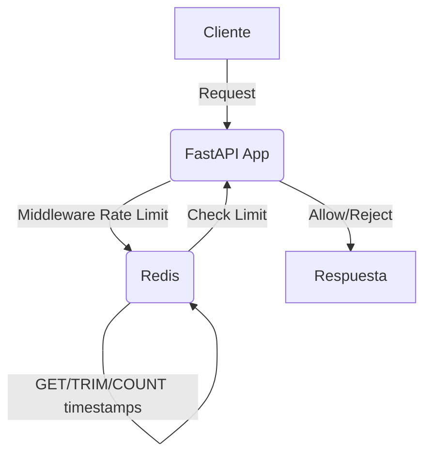

# 🚀 Optimizando FastAPI con Redis: Estrategias Avanzadas 🚀

Este documento detalla recomendaciones concretas y estratégicas para aprovechar al máximo Redis en una aplicación FastAPI, considerando la estructura actual y la ausencia de una herramienta de gestión de colas de tareas como Celery.

## 💡 1. Caching Avanzado con `fastapi_cache2`

`fastapi_cache2` ya está en uso, lo que es un excelente punto de partida. Podemos expandir su uso para mejorar significativamente el rendimiento.

### 🎯 Estrategias de Caching

*   **Caching de Resultados de Funciones/Endpoints:**
    *   Aplica el decorador `@cache()` de `fastapi_cache2` a endpoints de FastAPI o funciones que realicen cálculos costosos o accedan a datos que no cambian con frecuencia.
    *   **Ejemplo:** Resultados de consultas a la base de datos para listas de elementos (ej. `GET /api/products`), resultados de análisis complejos, o respuestas de APIs externas.
    *   **Consideraciones:** Define un tiempo de expiración (`expire`) adecuado para cada caché.

*   **Caching de Datos de Base de Datos (Nivel de Servicio):**
    *   Cacha los resultados de consultas a la base de datos en la capa de servicio (ej. en `core/` o `api/` si tienes servicios dedicados).
    *   Esto es útil cuando múltiples endpoints o funciones internas necesitan los mismos datos.
    *   **Ejemplo:** Una función que obtiene la configuración global de la aplicación o una lista de usuarios activos.

### 🔄 Invalidación de Cache

La invalidación es crucial para evitar servir datos obsoletos.

*   **Invalidación Manual:**
    *   Utiliza `FastAPICache.clear()` o `FastAPICache.clear(namespace="my_namespace")` cuando los datos subyacentes cambian.
    *   **Ejemplo:** Después de una operación `POST`, `PUT` o `DELETE` que modifica los datos que están en caché.
    *   **Implementación:** Puedes crear un endpoint administrativo o un hook en tus servicios para disparar la invalidación.

*   **Invalidación Basada en Tiempo (TTL):**
    *   Define un `expire` razonable en el decorador `@cache()`. Para datos que cambian poco, un TTL largo es aceptable. Para datos más dinámicos, un TTL corto.

### 🛠️ Configuración y Uso (Ejemplo Conceptual)

Aunque no encontramos la configuración explícita, así es como se vería una configuración típica y su uso:

```python
# En algún lugar de inicialización (ej. api/main.py o core/config.py)
from fastapi_cache import FastAPICache
from fastapi_cache.backends.redis import RedisBackend
from redis import asyncio as aioredis

async def init_cache():
    redis = aioredis.from_url("redis://kognito_redis:6379", encoding="utf8", decode_responses=True)
    FastAPICache.init(RedisBackend(redis), prefix="fastapi-cache")

# En tu aplicación FastAPI (ej. api/main.py)
from fastapi import FastAPI
from fastapi_cache.decorator import cache

app = FastAPI()

@app.on_event("startup")
async def startup():
    await init_cache()

@app.get("/items")
@cache(expire=60) # Cachea esta respuesta por 60 segundos
async def get_items():
    # Lógica para obtener ítems de la base de datos
    return {"items": ["item1", "item2"]}

@app.post("/items")
async def create_item(item: str):
    # Lógica para crear un ítem en la base de datos
    # ...
    await FastAPICache.clear(namespace="fastapi-cache") # Invalida la caché de ítems
    return {"message": f"Item '{item}' created and cache cleared."}
```

## 📦 2. Colas de Tareas Ligeras con Redis (sin Celery)

Dado que no se usa Celery, Redis puede servir como un broker de mensajes simple para tareas asíncronas que no requieren la robustez de una solución completa.

### 📝 Concepto

Utiliza las estructuras de datos de lista de Redis (`LPUSH` para añadir a la cola, `BRPOP` para consumir de forma bloqueante) para implementar un sistema de cola de mensajes básico.

### 🚀 Implementación

1.  **Productor (en FastAPI):** Cuando una tarea deba ejecutarse en segundo plano, la serializas (ej. a JSON) y la añades a una lista de Redis.
2.  **Consumidor (Worker separado):** Un script Python separado (o un proceso en el mismo contenedor `core` si es ligero) se conecta a Redis y consume tareas de la lista.



### 💡 Ejemplo Conceptual

```python
# core/redis_queue.py
import json
import asyncio
from redis import asyncio as aioredis

REDIS_URL = "redis://kognito_redis:6379"
TASK_QUEUE_KEY = "background_tasks"

async def enqueue_task(task_data: dict):
    """Añade una tarea a la cola de Redis."""
    redis = aioredis.from_url(REDIS_URL)
    await redis.lpush(TASK_QUEUE_KEY, json.dumps(task_data))
    await redis.close()
    print(f"Tarea encolada: {task_data}")

async def process_tasks():
    """Worker que procesa tareas de la cola de Redis."""
    redis = aioredis.from_url(REDIS_URL)
    print("Worker de tareas iniciado. Esperando tareas...")
    while True:
        # BRPOP bloquea hasta que haya un elemento en la lista
        _, task_json = await redis.brpop(TASK_QUEUE_KEY)
        task_data = json.loads(task_json)
        print(f"Procesando tarea: {task_data}")
        
        # Aquí iría la lógica real de la tarea
        if task_data.get("type") == "send_email":
            print(f"Enviando email a {task_data['to']} con asunto '{task_data['subject']}'")
            await asyncio.sleep(2) # Simula trabajo
        elif task_data.get("type") == "generate_report":
            print(f"Generando reporte para {task_data['user_id']}")
            await asyncio.sleep(5) # Simula trabajo
        
        print(f"Tarea '{task_data.get('type')}' completada.")

# En un endpoint de FastAPI (ej. api/main.py o api/users.py)
from fastapi import APIRouter, BackgroundTasks
from core.redis_queue import enqueue_task

router = APIRouter()

@router.post("/send-welcome-email/{user_id}")
async def send_welcome_email(user_id: int):
    task_data = {"type": "send_email", "to": f"user_{user_id}@example.com", "subject": "Bienvenido!"}
    await enqueue_task(task_data)
    return {"message": "Email de bienvenida encolado."}

# Para ejecutar el worker (en un script separado o como parte del comando de inicio del contenedor 'core')
# if __name__ == "__main__":
#     asyncio.run(process_tasks())
```

**Consideraciones:**
*   Este enfoque es más simple que Celery, pero carece de reintentos automáticos, manejo de errores avanzado, programación de tareas, etc.
*   Para tareas críticas, considera añadir lógica de reintentos manual y un mecanismo para mover tareas fallidas a una "cola de errores".
*   El worker puede ejecutarse en un contenedor Docker separado o como un proceso en segundo plano dentro del contenedor `core`.

## 🔑 3. Redis como Base de Datos de Sesión

Para aplicaciones web que requieren mantener el estado del usuario entre solicitudes (ej. carritos de compra, preferencias de usuario), Redis es una excelente opción para almacenar sesiones.

### 🌟 Ventajas

*   **Rendimiento:** Acceso a datos de sesión extremadamente rápido en comparación con bases de datos relacionales.
*   **Escalabilidad:** Fácilmente escalable horizontalmente.
*   **Desacoplamiento:** Las sesiones no están atadas a una instancia específica de la aplicación, facilitando el balanceo de carga.

### 🚀 Implementación

1.  **Generación de ID de Sesión:** Al iniciar una sesión, genera un ID único (ej. UUID) y envíalo al cliente como una cookie.
2.  **Almacenamiento en Redis:** Usa el ID de sesión como clave y un objeto serializado (ej. JSON) con los datos de la sesión como valor.
3.  **Middleware de FastAPI:** Un middleware puede interceptar las solicitudes, leer la cookie de sesión, recuperar los datos de Redis y adjuntarlos al objeto `Request`.



### 💡 Ejemplo Conceptual

```python
# core/session_manager.py
import json
import uuid
from datetime import datetime, timedelta
from redis import asyncio as aioredis
from typing import Optional, Dict, Any

REDIS_URL = "redis://kognito_redis:6379"
SESSION_EXPIRE_SECONDS = 3600 # 1 hora

async def get_redis_client():
    return aioredis.from_url(REDIS_URL, encoding="utf8", decode_responses=True)

async def create_session(user_id: int) -> str:
    session_id = str(uuid.uuid4())
    session_data = {"user_id": user_id, "created_at": datetime.utcnow().isoformat()}
    redis = await get_redis_client()
    await redis.setex(f"session:{session_id}", SESSION_EXPIRE_SECONDS, json.dumps(session_data))
    await redis.close()
    return session_id

async def get_session(session_id: str) -> Optional[Dict[str, Any]]:
    redis = await get_redis_client()
    session_json = await redis.get(f"session:{session_id}")
    await redis.close()
    if session_json:
        return json.loads(session_json)
    return None

async def delete_session(session_id: str):
    redis = await get_redis_client()
    await redis.delete(f"session:{session_id}")
    await redis.close()

# En api/main.py (o un middleware separado)
from starlette.middleware.base import BaseHTTPMiddleware
from starlette.requests import Request
from starlette.responses import Response
from starlette.types import ASGIApp
from core.session_manager import get_session, create_session, delete_session

class SessionMiddleware(BaseHTTPMiddleware):
    def __init__(self, app: ASGIApp):
        super().__init__(app)

    async def dispatch(self, request: Request, call_next):
        session_id = request.cookies.get("session_id")
        if session_id:
            session_data = await get_session(session_id)
            if session_data:
                request.state.session = session_data
            else:
                # Sesión expirada o inválida, limpiar cookie
                response = await call_next(request)
                response.delete_cookie("session_id")
                return response
        
        response = await call_next(request)
        return response

# Añadir el middleware a la app
# app.add_middleware(SessionMiddleware)

# En un endpoint de FastAPI
@app.get("/protected-data")
async def protected_data(request: Request):
    if not hasattr(request.state, "session"):
        raise HTTPException(status_code=401, detail="No autenticado")
    user_id = request.state.session["user_id"]
    return {"message": f"Hola, usuario {user_id}! Aquí tus datos protegidos."}

@app.post("/login")
async def login(user_id: int, response: Response):
    session_id = await create_session(user_id)
    response.set_cookie(key="session_id", value=session_id, httponly=True, max_age=SESSION_EXPIRE_SECONDS)
    return {"message": "Login exitoso"}
```

## 🚦 4. Redis para Limitar Tasas (Rate Limiting)

Protege tu API de abusos y asegura la disponibilidad limitando el número de solicitudes que un usuario o IP puede hacer en un período de tiempo.

### 🛡️ Concepto

Redis es ideal para almacenar contadores de solicitudes debido a su velocidad y operaciones atómicas.

### 🚀 Implementación (Algoritmo de Ventana Deslizante - Sliding Window)

1.  **Clave por Usuario/IP:** Usa una clave de Redis única para cada usuario o IP (ej. `rate_limit:ip:<ip_address>`).
2.  **Almacenar Timestamps:** Cada vez que se recibe una solicitud, añade el timestamp actual a una lista de Redis asociada a la clave.
3.  **Recortar y Contar:** Recorta la lista para mantener solo los timestamps dentro de la ventana de tiempo definida (ej. últimos 60 segundos). Cuenta los elementos restantes.
4.  **Verificar Límite:** Si el conteo excede el límite permitido, rechaza la solicitud.



### 💡 Ejemplo Conceptual

```python
# core/rate_limiter.py
import time
from redis import asyncio as aioredis

REDIS_URL = "redis://kognito_redis:6379"

async def get_redis_client():
    return aioredis.from_url(REDIS_URL)

async def check_rate_limit(key: str, limit: int, window_seconds: int) -> bool:
    """
    Verifica el límite de tasas para una clave dada usando el algoritmo de ventana deslizante.
    Retorna True si la solicitud es permitida, False si es denegada.
    """
    redis = await get_redis_client()
    current_time = int(time.time())
    
    # Eliminar timestamps antiguos
    await redis.zremrangebyscore(key, 0, current_time - window_seconds)
    
    # Añadir el timestamp actual
    await redis.zadd(key, {current_time: current_time})
    
    # Establecer expiración para la clave (opcional, para limpiar claves inactivas)
    await redis.expire(key, window_seconds + 5) # Un poco más que la ventana
    
    # Contar solicitudes en la ventana
    count = await redis.zcard(key)
    await redis.close()
    
    return count <= limit

# En api/main.py (o un middleware separado)
from fastapi import Request, HTTPException
from starlette.middleware.base import BaseHTTPMiddleware
from starlette.types import ASGIApp
from core.rate_limiter import check_rate_limit

class RateLimitMiddleware(BaseHTTPMiddleware):
    def __init__(self, app: ASGIApp, limit: int = 5, window_seconds: int = 60):
        super().__init__(app)
        self.limit = limit
        self.window_seconds = window_seconds

    async def dispatch(self, request: Request, call_next):
        # Usar la IP del cliente como clave para el rate limiting
        # En un entorno de producción, asegúrate de obtener la IP real (ej. de X-Forwarded-For si usas proxy)
        client_ip = request.client.host
        if not await check_rate_limit(f"rate_limit:ip:{client_ip}", self.limit, self.window_seconds):
            raise HTTPException(status_code=429, detail="Demasiadas solicitudes. Intenta de nuevo más tarde.")
        return await call_next(request)

# Añadir el middleware a la app
# app.add_middleware(RateLimitMiddleware, limit=10, window_seconds=30) # 10 solicitudes cada 30 segundos
```

## 📊 5. Monitoreo y Métricas de Redis

Para asegurar que Redis está funcionando de manera óptima y para diagnosticar problemas, es fundamental monitorearlo.

*   **Comando `INFO` de Redis:** Proporciona una gran cantidad de métricas sobre el estado del servidor, memoria, clientes, persistencia, etc. Puedes ejecutarlo periódicamente.
*   **Herramientas de Monitoreo:**
    *   **RedisInsight:** Una GUI oficial de Redis para visualizar y gestionar tus instancias de Redis.
    *   **Prometheus + Grafana:** Configura un exporter de Redis para Prometheus y visualiza las métricas en Grafana para un monitoreo avanzado.
    *   **Logs de Docker:** Revisa los logs del contenedor `kognito_redis` para detectar errores o advertencias.

---

Espero que estas recomendaciones te sean de gran utilidad para optimizar tu aplicación FastAPI con Redis. ¡Estoy listo para cualquier pregunta o para ayudarte a implementar estas ideas!