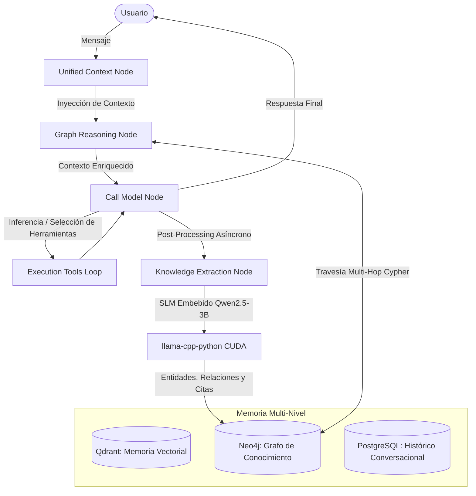
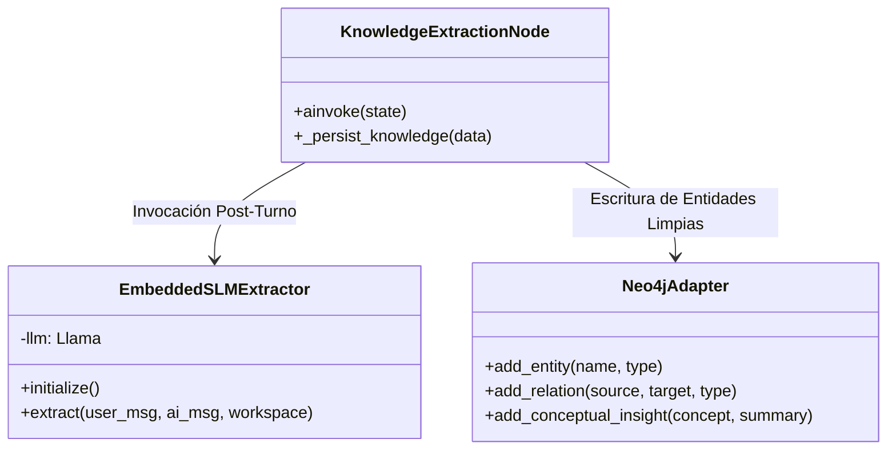

# Arquitectura de Razonamiento y Memoria del Agente KAI (Kognito AI)

## 1. Visión General de la Arquitectura

El agente **KAI** (*Kognito AI*) es un sistema cognitivo multi-capa diseñado para procesamiento de información compleja, razonamiento relacional latente y retención de conocimiento a largo plazo.

A diferencia de los agentes basados en memoria plana (simple histórico de mensajes o RAG vectorial aislado), KAI utiliza un **Modelo de Memoria Tridimensional** impulsado por un flujo de orquestación en **LangGraph**, enriquecido con un motor embebido de modelos de lenguaje pequeños (**SLM Qwen2.5-3B en GPU**) y grafos de conocimiento enriquecidos en **Neo4j**.

---

## 2. El Sistema de Memoria Multi-Nivel (3D Memory Architecture)

La memoria de KAI no es monolítica; se organiza en tres estratos complementarios:

| Estrato de Memoria | Tecnología Base | Propósito y Función |
| :--- | :--- | :--- |
| **Memoria de Trabajo (Short-Term)** | PostgreSQL + Buffer de Contexto LangGraph | Mantiene el hilo inmediato de conversación, ventana de tokens activa y estado intermedio de razonamiento. |
| **Memoria Semántica (Vectorial)** | Qdrant | Búsqueda por similitud coseno de embeddings (`text-embedding-004`). Recupera fragmentos de documentos y mensajes pasados conceptualmente similares. |
| **Memoria Relacional y Razonamiento (Graph Memory)** | Neo4j | Mantiene entidades del dominio, conceptos teóricos de alto nivel, decisiones arquitectónicas e interconexiones jerárquicas/funcionales. |

---

## 3. Ciclo de Razonamiento en LangGraph

El razonamiento de KAI se ejecuta como un grafo dirigido de estados a través de los siguientes nodos:

### A. Nodo de Contexto Unificado (`unified_context_node`)
- **Misión:** Agrupar información proveniente de múltiples fuentes (documentos seleccionados, notas activas, historial conversacional, variables de workspace).
- **Proceso:** Construye la representación del estado inicial (`AgentState`) garantizando que el modelo reciba las restricciones de espacio de trabajo y parámetros del usuario.

### B. Nodo de Razonamiento en Grafo y Neural Insights (`graph_reasoning_node`)
- **Misión:** Realizar travesías subconscientes en Neo4j para descubrir conexiones no evidentes entre los conceptos mencionados por el usuario y el conocimiento almacenado.
- **Mecanismo de Travesía:**
  1. Extrae términos clave y entidades del mensaje del usuario.
  2. Ejecuta consultas Cypher avanzadas (`shortestPath` de hasta 4 saltos y expansión de vecindad de 2 saltos).
  3. Si la travesía supera el umbral de relevancia, el motor sintetiza una **hipótesis latente** (*Neural Insight*).
  4. Genera un mapa visual en formato **Mermaid Diagram** que se inyecta directamente al prompt y se persiste en la base de datos para consumo del frontend.

### C. Nodo de Inferencia y Toma de Decisiones (`call_model_node`)
- **Misión:** Decidir si responde directamente o invoca herramientas especializadas.
- **Capacidades:** Posee acceso dinámico a más de 30 herramientas (búsqueda web, análisis de código, gestión de documentos, ejecución de comandos, generación de medios).

---

## 4. Motor de Extracción de Conocimiento Embebido (Embedded SLM Engine)

Para evitar la sobrepoblación y degradación del grafo con términos conversacionales banales (*"el bot"*, *"revisa"*, *"el mensaje"*), KAI integra un extractor autónomo de conocimiento basado en un **SLM embebido local**:

- **Modelo:** `Qwen2.5-3B-Instruct GGUF` (`qwen2.5-3b-instruct-q4_k_m.gguf`).
- **Motor de Inferencia:** `llama-cpp-python` alojado directamente en la GPU (aceleración CUDA en VRAM de 4 GB).
- **Independencia de Red:** Funciona 100% nativo en Python, sin requerir servicios o demonios externos como Ollama.
- **Filtro Anti-Ruido Estricto:**
  - Aplica reglas de exclusión para ignorar rellenos conversacionales y comandos de sistema.
  - Clasifica y estructura el conocimiento en JSON estricto bajo 3 pilares:
    1. **Entidades de Dominio:** `TECHNOLOGY`, `TOOL`, `ORGANIZATION`, `PERSON`, `FEATURE`.
    2. **Citas Conceptuales de Alto Nivel:** Teorías, decisiones estratégicas y metodologías.
    3. **Relaciones Estructuradas:** `USES`, `DEPENDS_ON`, `IMPLEMENTS`, `REFINES`, `PART_OF`.

---

## 5. Visualización e Integración de Neural Insights

Los resultados del razonamiento del grafo no solo enriquecen la respuesta del agente, sino que se exponen en la interfaz de usuario en el **Centro de Análisis**:

- **Tarjetas Dinámicas:** Muestran resúmenes limpios extraídos del payload del análisis (`neural_insight`).
- **Visor Mermaid Interactivo:** Permite al usuario explorar visualmente el mapa mental o las rutas latentes que conectan sus ideas con el conocimiento de KAI.
- **Filtrado Rápido:** Integración directa en el frontend para filtrar por tipo de análisis (*Neural Insights*, *Investigación Profunda*, *Documentos*, *Notas*, *Código*).

---

## 6. Resumen de Seguridad y Resiliencia

- **Capa de Fallback:** Si los drivers CUDA o `llama-cpp-python` no están disponibles en un entorno secundario, el extractor conmuta automáticamente al LLM rápido del sistema vía LangChain sin interrumpir la experiencia del usuario.
- **Aislación de Entornos:** La arquitectura mantiene una separación estricta entre el código fuente de desarrollo y las instancias locales de prueba/despliegue mediante scripts de actualización automatizados con `git reset --hard HEAD` implícito.
