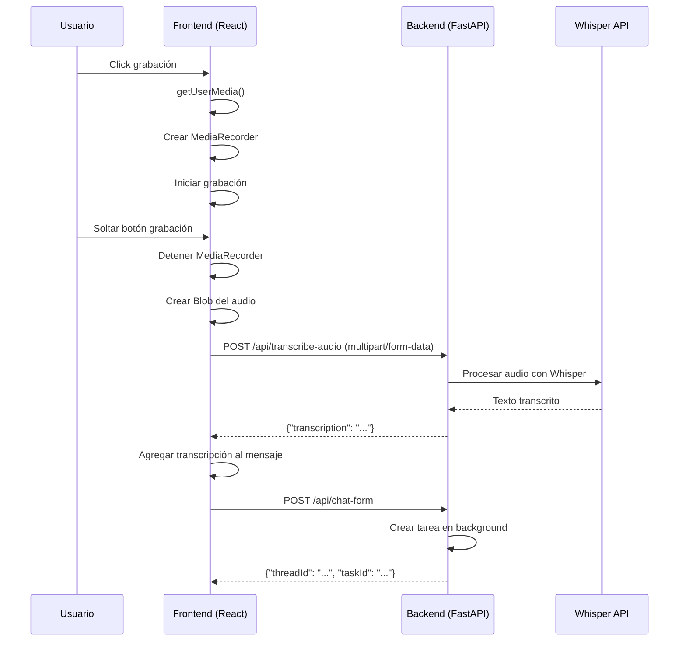

# Flujo de Transcripción de Audio - KognitoAI

## Resumen Ejecutivo

Este documento describe el flujo completo desde la grabación de audio en el frontend hasta la transcripción en el backend, incluyendo todos los componentes, endpoints y flujos de datos involucrados.

---

## 1. Arquitectura General

El sistema utiliza una arquitectura híbrida que combina:
- **Frontend**: Next.js (React + TypeScript)
- **Backend**: FastAPI (Python)
- **Servicios de IA**: Whisper para transcripción

---

## 2. Componentes Frontend

### 2.1 ChatInputBar.tsx

**Ubicación**: `src/components/ChatInputBar.tsx`

#### Estado de Grabación
```typescript
const [isRecording, setIsRecording] = useState(false);
const [isProcessingAudio, setIsProcessingAudio] = useState(false);
const audioStreamRef = useRef<MediaStream | null>(null);
const mediaRecorderRef = useRef<MediaRecorder | null>(null);
```

#### Botón de Grabación
```tsx
<Button
  type="button"
  variant="ghost"
  size="icon"
  onClick={() => {
    const action = isRecording ? onStopRecording : onStartRecording;
    action?.();
  }}
  disabled={isProcessingAudio}
  className={`rounded-full ${isRecording ? 'text-red-500' : 'text-muted-foreground'}`}
>
  {isProcessingAudio ? <Loader2 className="h-5 w-5 animate-spin" /> : <Mic className="h-5 w-5" />}
</Button>
```

---

## 3. Flujo de Grabación y Envío

### 3.1 CommonChat.tsx - Manejo de Grabación

**Ubicación**: `src/components/CommonChat.tsx`

#### Función handleStartRecording
```typescript
const handleStartRecording = useCallback(async () => {
  try {
    // Solicitar permiso del micrófono
    const stream = await navigator.mediaDevices.getUserMedia({ audio: true });
    audioStreamRef.current = stream;
    
    // Determinar MIME type soportado
    const mimeTypes = [
      'audio/webm;codecs=opus',
      'audio/webm',
      'audio/ogg;codecs=opus',
      'audio/ogg',
    ];
    const supportedMimeType = mimeTypes.find(type => MediaRecorder.isTypeSupported(type));
    
    // Crear MediaRecorder
    const recorder = new MediaRecorder(stream, { mimeType: supportedMimeType });
    
    // Configurar handlers
    recorder.ondataavailable = (event) => {
      if (event.data.size > 0) {
        localAudioChunks.push(event.data);
      }
    };
    
    recorder.onstop = async () => {
      // Procesar audio grabado
      await finalizeRecording();
    };
    
    recorder.start(500);
    setIsRecording(true);
  } catch (error) {
    toast.error('No se pudo acceder al micrófono.');
  }
}, []);
```

#### Función handleStopRecording
```typescript
const handleStopRecording = useCallback(async () => {
  if (mediaRecorder && mediaRecorder.state === 'recording') {
    mediaRecorder.requestData();
    mediaRecorder.stop();
    // La lógica de procesamiento se maneja en recorder.onstop
  }
}, [mediaRecorder]);
```

---

## 4. API Endpoints

### 4.1 Endpoint de Transcripción

**Archivo**: `api/chat.py`

#### Endpoint: POST /api/transcribe-audio
```python
@router.post("/transcribe-audio")
async def transcribe_audio(file: UploadFile = File(...)):
    """
    Endpoint para transcribir un archivo de audio utilizando Faster Whisper.
    """
    try:
        audio_file_io = BytesIO(await file.read())
        file_format = file.filename.split(".")[-1] if file.filename else "webm"
        
        transcription = await transcribe_audio_file(audio_file_io, file_format)
        
        return {"transcription": transcription}
    except Exception as e:
        raise HTTPException(
            status_code=status.HTTP_500_INTERNAL_SERVER_ERROR,
            detail=f"Error interno del servidor: {e}",
        )
```

### 4.2 Endpoint de Envío de Mensaje con Audio

**Archivo**: `api/chat.py`

#### Endpoint: POST /api/chat-form
```python
@router.post("/chat-form", status_code=status.HTTP_202_ACCEPTED)
async def handle_chat_form(
    background_tasks: BackgroundTasks,
    thread_id: str = Form(...),
    account_id: str = Form(...),
    user_message: Optional[str] = Form(None),
    # ... otros campos
):
    """
    Procesa un mensaje de chat con FormData, inicia una tarea en segundo plano.
    """
    # ... procesamiento
    return {"thread_id": thread_id, "taskId": task_id}
```

---

## 5. Servicios de Transcripción

### 5.1 Audio Transcriber

**Ubicación**: `utils/audio_transcriber.py`

#### Función principal: transcribe_audio_file
```python
async def transcribe_audio_file(
    audio_file_io: BytesIO,
    filename: str = "audio.webm",
    language: str = "es",
    task: str = "transcribe",
    condition_on_previous_text: bool = True,
    compression_ratio_threshold: float = 2.4,
    temperature: Union[float, tuple] = 0.0,
    logprob_threshold: float = -1.0,
    no_speech_threshold: float = 0.6,
    vad: Optional[dict] = None,
) -> str:
    """
    Transcribe audio utilizando el modelo Whisper.
    """
    # Cargar modelo (caching global)
    model = get_whisper_model()
    
    # Transcribir
    result = model.transcribe(
        audio_file_io,
        language=language,
        task=task,
        condition_on_previous_text=condition_on_previous_text,
        compression_ratio_threshold=compression_ratio_threshold,
        temperature=temperature,
        logprob_threshold=logprob_threshold,
        no_speech_threshold=no_speech_threshold,
        vad=vad,
    )
    
    return result.get("text", "").strip()
```

#### Detección automática de GPU/CPU
```python
def get_whisper_model(force_cpu=False):
    """Carga el modelo Whisper con detección automática de GPU/CPU"""
    global _whisper_model
    
    use_gpu = torch.cuda.is_available() and not force_cpu
    
    if use_gpu:
        # Modelo GPU optimizado
        model_name = "large-v2"
        _whisper_model = whisper.load_model(model_name).to("cuda")
    else:
        # Modelo CPU
        model_name = "large-v2"
        _whisper_model = whisper.load_model(model_name)
    
    return _whisper_model
```

---

## 6. Flujo de Datos Completo



---

## 7. Componentes Involucrados

### 7.1 Frontend
| Archivo | Propósito |
|---------|-----------|
| `ChatInputBar.tsx` | UI para grabación y envío |
| `CommonChat.tsx` | Lógica de grabación y manejo de estados |
| `EmptyChat.tsx` | Página de chat vacío |
| `page.tsx` | Página principal de chat |

### 7.2 Backend
| Archivo | Propósito |
|---------|-----------|
| `api/chat.py` | Endpoints de chat y transcripción |
| `utils/audio_transcriber.py` | Servicio de transcripción con Whisper |

---

## 8. Flujo de Mensajes

### 8.1 Grabación Exitosa
1. Usuario hace clic en botón de micrófono
2. `handleStartRecording()` solicita permiso del micrófono
3. Se crea un `MediaRecorder` con MIME type soportado
4. Se inicia la grabación con `recorder.start(500)` (chunks cada 500ms)

### 8.2 Envío del Audio
1. Usuario suelta el botón de grabación
2. `handleStopRecording()` llama a `mediaRecorder.stop()`
3. En `recorder.onstop`:
   - Se crea un `Blob` con los chunks grabados
   - Se crea un `File` con nombre `audio.webm`
   - Se llama a `apiClient.post('/api/transcribe-audio', formData)`

### 8.3 Transcripción
1. Backend recibe el archivo en `transcribe_audio()`
2. Se lee el archivo como `BytesIO`
3. Se extrae el formato del filename
4. Se llama a `transcribe_audio_file()` con el audio y formato
5. Whisper transcribe el audio y devuelve el texto

### 8.4 Envío del Mensaje
1. Frontend recibe la transcripción
2. Se agrega al estado `newMessage`
3. Se llama a `handleSendMessage()`
4. Se crea un nuevo hilo si es necesario
5. Se envía el mensaje a `/api/chat-form`

---

## 9. Configuración y Parámetros

### 9.1 Parámetros de Whisper
```python
# Idioma por defecto: español
language = "es"

# Tarea: transcribir o traducir
task = "transcribe"

# Temperatura para sampling (0.0 = determinístico)
temperature = 0.0

# Umbral para detectar silencio/no speech
no_speech_threshold = 0.6

# Compresión para detectar contenido repetitivo
compression_ratio_threshold = 2.4
```

### 9.2 Modelos Soportados
- **GPU**: `large-v2` en dispositivo CUDA
- **CPU**: `large-v2` en CPU

---

## 10. Manejo de Errores

### 10.1 Errores de Grabación
```typescript
if (totalBytes <= 110) {
  toast.error('La grabación quedó incompleta. Intenta de nuevo.');
  return;
}

if (audioBlob.size === 0) {
  toast.error('El audio grabado está vacío. Intenta de nuevo.');
  return;
}
```

### 10.2 Errores de Transcripción
```python
except InvalidAudioFileError as e:
    raise HTTPException(status_code=400, detail=str(e))
except AudioTranscriptionError as e:
    raise HTTPException(status_code=500, detail="No se pudo transcribir el audio.")
```

---

## 11. Consideraciones de Seguridad

1. **Permisos del navegador**: Se solicita permiso explícito de micrófono
2. **CORS**: Los endpoints deben permitir requests multipart/form-data
3. **Autenticación**: Los endpoints requieren autenticación válida
4. **Tamaño de archivo**: No hay límite explícito de tamaño (configurable según necesidad)

---

## 12. Optimizaciones

1. **Caching del modelo**: El modelo Whisper se carga una vez y se reutiliza
2. **Detección automática de GPU**: Se usa GPU cuando está disponible
3. **Chunks de audio**: Grabación en chunks de 500ms para mejor rendimiento
4. **Timeouts**: Se pueden configurar timeouts para operaciones largas

---

## 13. Diagrama de Componentes

```
┌─────────────────────────────────────────────────────────────────┐
│                        FRONTEND (Next.js)                        │
├─────────────────────────────────────────────────────────────────┤
│  ChatInputBar.tsx                                              │
│  ├─ Estado: isRecording, isProcessingAudio                    │
│  ├─ Botón Mic/Square (grabar/detener)                         │
│  └─ Llamada a API: POST /api/transcribe-audio                 │
│                                                                 │
│  CommonChat.tsx                                              │
│  ├─ handleStartRecording()                                    │
│  ├─ handleStopRecording()                                     │
│  └─ handleSendMessage()                                       │
└─────────────────────────────────────────────────────────────────┘
                              │
                              ▼
┌─────────────────────────────────────────────────────────────────┐
│                         BACKEND (FastAPI)                       │
├─────────────────────────────────────────────────────────────────┤
│  api/chat.py                                                   │
│  ├─ POST /api/transcribe-audio                                │
│  ├─ POST /api/chat-form                                         │
│  └─ POST /api/chat (legacy)                                     │
│                                                                 │
│  utils/audio_transcriber.py                                    │
│  ├─ transcribe_audio_file()                                     │
│  └─ get_whisper_model()                                         │
└─────────────────────────────────────────────────────────────────┘
                              │
                              ▼
┌─────────────────────────────────────────────────────────────────┐
│                      SERVIDOR WHISPER                              │
├─────────────────────────────────────────────────────────────────┤
│  Modelo: large-v2                                              │
│  Hardware: GPU (si disponible) / CPU                           │
│  Idioma: Spanish                                               │
└─────────────────────────────────────────────────────────────────┘
```

---

## 14. Referencias de Archivos

### Frontend
- `/home/gato/Proyectos/KognitoAI/kognito-ai/src/components/ChatInputBar.tsx`
- `/home/gato/Proyectos/KognitoAI/kognito-ai/src/components/CommonChat.tsx`
- `/home/gato/Proyectos/KognitoAI/kognito-ai/src/components/EmptyChat.tsx`
- `/home/gato/Proyectos/KognitoAI/kognito-ai/src/app/(dashboard)/chat/page.tsx`
- `/home/gato/Proyectos/KognitoAI/kognito-ai/src/app/(dashboard)/chat/[id]/page.tsx`

### Backend
- `/home/gato/Proyectos/KognitoAI/kognito-ai/api/chat.py`
- `/home/gato/Proyectos/KognitoAI/kognito-ai/utils/audio_transcriber.py`

---

## 15. Próximos Pasos

Para mejorar este flujo:
1. Agregar soporte para otros formatos de audio (MP3, WAV)
2. Implementar compresión antes de enviar al backend
3. Agregar soporte para transcripción en tiempo real
4. Implementar caché de transcripciones para evitar re-transcribir