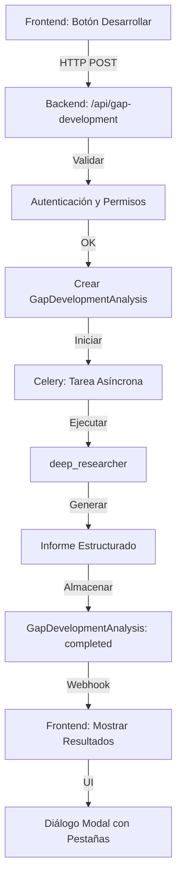

# Arquitectura de la Funcionalidad "Desarrollar Brecha"

## Visión General

La funcionalidad "Desarrollar Brecha" permite a los usuarios iniciar investigaciones profundas sobre brechas de conocimiento o preguntas exploratorias, generando informes estructurados y detallados mediante un agente especializado (`deep_researcher`).

## Componentes Principales

### 1. Backend

#### Endpoint REST
- **Ruta:** `POST /api/gap-development`
- **Propósito:** Procesar solicitudes de investigación profunda
- **Parámetros de entrada:**
  - `gap_id`: UUID de la brecha de conocimiento
  - `context`: Contexto adicional para la investigación
  - `depth`: Profundidad de la investigación (opcional)
- **Validaciones:**
  - Permisos de usuario (roles `analyst`/`admin`)
  - Parámetros requeridos

#### Integración con Agente `deep_researcher`
- **Ubicación:** `core/agents/deep_researcher.py`
- **Ejecución:** Asíncrona mediante Celery/RabbitMQ
- **Proceso:**
  1. Validar solicitud
  2. Iniciar tarea asíncrona
  3. Almacenar resultados en `GapDevelopmentAnalysis`
  4. Notificar al frontend mediante webhooks

#### Modelo de Datos `GapDevelopmentAnalysis`
```json
{
  "gap_id": "UUID",
  "status": "pending|processing|completed|failed",
  "report": {
    "summary": "string",
    "findings": ["string"],
    "sources": [{"url": "string", "relevance": "number"}],
    "recommendations": ["string"]
  },
  "created_at": "timestamp",
  "updated_at": "timestamp"
}
```

### 2. Frontend

#### Interfaz de Usuario
- **Diálogo Slide:**
  - Botón "Desarrollar" con confirmación previa
  - Indicadores de estado (spinner + barra de progreso)
  - Mensajes dinámicos

- **Visualización de Resultados:**
  - Diálogo modal con pestañas:
    - Resumen Ejecutivo
    - Hallazgos Detallados
    - Fuentes Citadas
    - Recomendaciones
  - Tarjetas interactivas (colapsables, resaltado de keywords)
  - Opciones de exportación (PDF/Markdown)
  - Botones de acción: Guardar, Compartir, Reiniciar

### 3. Base de Datos

#### Modelo `GapDevelopmentAnalysis`
- **Campos:**
  - `id`: UUID (primary key)
  - `gap_id`: UUID (foreign key)
  - `account_id`: UUID (foreign key)
  - `status`: String (pending|processing|completed|failed)
  - `report`: JSONB (estructura detallada)
  - `created_at`: Timestamp
  - `updated_at`: Timestamp
- **Índices:**
  - `gap_id` para búsquedas rápidas
  - `status` para filtrado eficiente

## Flujo de Datos

1. **Solicitud de Investigación:**
   - Usuario hace clic en "Desarrollar" en el diálogo slide
   - Frontend envía solicitud a `POST /api/gap-development`

2. **Procesamiento Backend:**
   - Validar permisos y parámetros
   - Crear registro en `GapDevelopmentAnalysis` con estado `pending`
   - Iniciar tarea asíncrona con `deep_researcher`
   - Actualizar estado a `processing`

3. **Ejecución del Agente:**
   - `deep_researcher` realiza investigación profunda
   - Genera informe estructurado
   - Almacena resultados en `GapDevelopmentAnalysis`
   - Actualiza estado a `completed` o `failed`

4. **Notificación al Frontend:**
   - Webhook notifica cambios de estado
   - Frontend actualiza UI según estado
   - Muestra resultados en diálogo modal

## Requisitos Técnicos

### Seguridad
- Validar permisos de usuario antes de iniciar investigaciones
- Solo roles `analyst`/`admin` pueden usar esta funcionalidad

### Resiliencia
- Retry automático para fallos en el agente (máx. 3 intentos)
- Logging detallado para depuración

### UI/UX
- Animaciones suaves para transiciones de estado
- Tooltip explicativo en el botón "Desarrollar"
- Feedback claro durante procesos largos

### Integración
- Reutilizar componentes existentes:
  - `AnalysisCard`
  - `SourceList`
  - `LoadingSpinner`
  - `ProgressBar`

## Diagrama de Arquitectura



## Implementación Planificada

1. **Backend:**
   - Crear modelo `GapDevelopmentAnalysis`
   - Implementar endpoint `/api/gap-development`
   - Integrar con `deep_researcher`
   - Configurar webhooks

2. **Frontend:**
   - Diseñar diálogo slide con botón "Desarrollar"
   - Implementar visualización de resultados
   - Integrar con backend mediante API

3. **Documentación:**
   - API Documentation (OpenAPI/Swagger)
   - Guía de usuario
   - Diagrama de arquitectura

## Consideraciones Adicionales

- **Rendimiento:** Usar índices en `gap_id` y `status` para consultas rápidas
- **Escalabilidad:** Procesamiento asíncrono para manejar múltiples solicitudes
- **Mantenibilidad:** Código modular y bien documentado
- **Seguridad:** Validación de entrada y control de acceso basado en roles