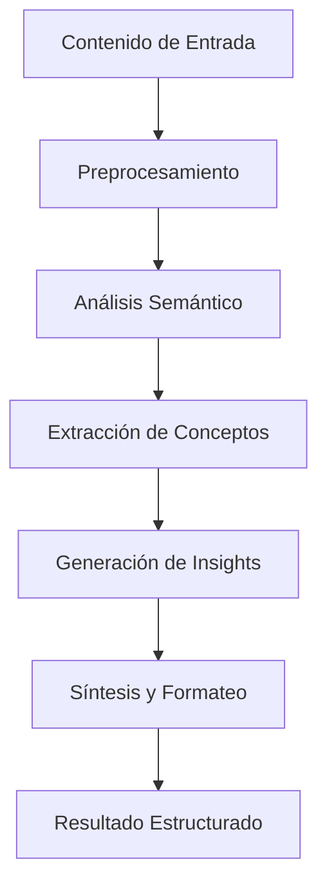
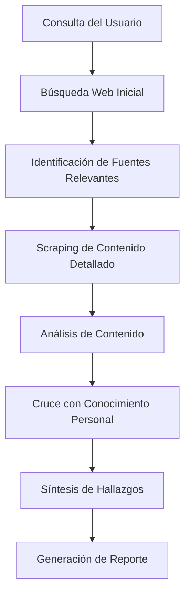
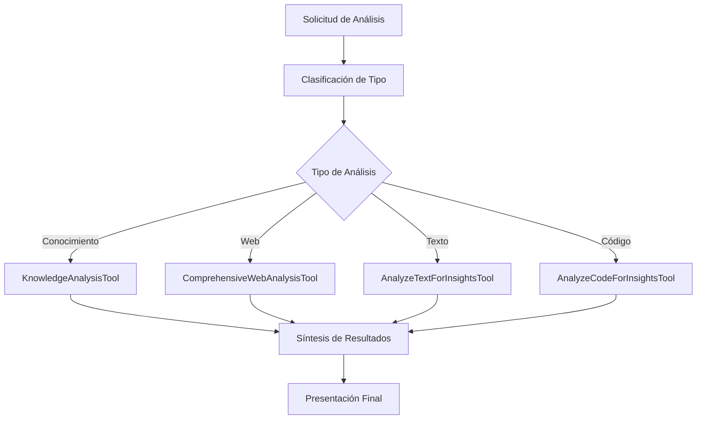

# Herramientas de Análisis y Procesamiento - Sistema Kognito

## Introducción

Las herramientas de análisis de Kognito implementan capacidades avanzadas de procesamiento de información, síntesis de conocimiento y generación de insights. Estas herramientas utilizan modelos de lenguaje de gran escala para transformar datos en bruto en conocimiento estructurado y actionable.

## Arquitectura del Sistema de Análisis

### Componentes Principales
- **Motores de Análisis**: LLMs especializados para diferentes tipos de análisis
- **Procesadores de Contenido**: Sistemas de chunking y estructuración
- **Generadores de Insights**: Algoritmos de extracción de patrones
- **Sintetizadores**: Herramientas de combinación y resumen

### Flujo de Procesamiento


## Herramientas Principales

### 1. KnowledgeAnalysisTool

#### Funcionalidad
Realiza análisis proactivo de patrones en la base de conocimiento del usuario, identificando conexiones, tendencias y oportunidades de aprendizaje que pueden no ser evidentes a primera vista.

#### Estrategia Metodológica
1. **Análisis Temporal**: Examina evolución de conocimiento en el tiempo
2. **Detección de Patrones**: Identifica temas recurrentes y conexiones
3. **Análisis de Gaps**: Encuentra áreas de conocimiento incompletas
4. **Generación de Insights**: Crea observaciones actionables
5. **Priorización**: Ordena insights por relevancia e impacto

#### Parámetros de Entrada
```python
class KnowledgeAnalysisInput(BaseModel):
    user_request: str  # Solicitud específica del usuario
    account_id: str    # Identificador del usuario
    analysis_scope: str = "comprehensive"  # Alcance del análisis
    time_range: str = "all"  # Rango temporal
    focus_areas: List[str] = []  # Áreas específicas de interés
```

#### Tipos de Análisis
- **Análisis de Tendencias**: Evolución de intereses y conocimientos
- **Análisis de Conexiones**: Relaciones entre diferentes áreas de conocimiento
- **Análisis de Completitud**: Identificación de gaps de conocimiento
- **Análisis Predictivo**: Sugerencias de áreas de aprendizaje futuro

#### Algoritmo de Procesamiento
```python
# Pseudocódigo del análisis
1. knowledge_base = retrieve_user_knowledge(account_id, time_range)
2. patterns = detect_patterns(knowledge_base)
3. connections = analyze_connections(patterns)
4. gaps = identify_knowledge_gaps(knowledge_base, patterns)
5. insights = generate_insights(patterns, connections, gaps)
6. prioritized_insights = prioritize_by_relevance(insights)
7. formatted_output = format_for_presentation(prioritized_insights)
```

### 2. ComprehensiveWebAnalysisTool

#### Funcionalidad
Herramienta de investigación integral que orquesta búsqueda web, scraping y análisis cruzado con la base de conocimiento personal para proporcionar análisis profundos y contextualizados.

#### Estrategia Metodológica
1. **Búsqueda Multimodal**: Combina múltiples fuentes de información web
2. **Scraping Inteligente**: Extracción selectiva de contenido relevante
3. **Análisis Cruzado**: Comparación con conocimiento personal existente
4. **Síntesis Contextual**: Integración de información nueva con conocimiento previo
5. **Validación**: Verificación de consistencia y credibilidad

#### Parámetros de Entrada
```python
class ComprehensiveWebAnalysisInput(BaseModel):
    query: str  # Consulta de investigación
    account_id: str  # ID del usuario
    workspace_id: str = ""  # Contexto de workspace
    depth_level: str = "standard"  # Profundidad del análisis
    source_types: List[str] = ["web", "academic", "news"]  # Tipos de fuentes
```

#### Flujo de Investigación


#### Capacidades Avanzadas
- **Multi-Query Search**: Reformulación automática de consultas
- **Source Credibility**: Evaluación de confiabilidad de fuentes
- **Bias Detection**: Identificación de sesgos en la información
- **Fact Checking**: Verificación cruzada de datos

### 3. AnalyzeTextForInsightsTool

#### Funcionalidad
Análisis profundo de texto para extraer insights, conceptos clave, relaciones semánticas y patrones ocultos en contenido textual extenso.

#### Estrategia Metodológica
1. **Segmentación Inteligente**: División del texto en unidades semánticas
2. **Análisis Multinivel**: Procesamiento a nivel de palabra, frase y párrafo
3. **Extracción de Entidades**: Identificación de personas, lugares, conceptos
4. **Análisis de Sentimiento**: Evaluación de tono y emociones
5. **Generación de Resúmenes**: Síntesis de puntos clave

#### Parámetros de Entrada
```python
class AnalyzeTextInput(BaseModel):
    text_content: str  # Texto a analizar
    analysis_focus: str = "comprehensive"  # Enfoque del análisis
    account_id: str  # ID del usuario
    extract_entities: bool = True  # Extraer entidades nombradas
    generate_summary: bool = True  # Generar resumen
    identify_themes: bool = True  # Identificar temas principales
```

#### Tipos de Análisis Disponibles
- **Análisis Semántico**: Significado y contexto del contenido
- **Análisis Estructural**: Organización y flujo de ideas
- **Análisis de Conceptos**: Identificación de ideas principales
- **Análisis Relacional**: Conexiones entre diferentes partes del texto

### 4. ScopedRagAnalysisTool

#### Funcionalidad
Análisis RAG (Retrieval-Augmented Generation) focalizado que combina recuperación vectorial específica con análisis contextual profundo para responder consultas complejas.

#### Estrategia Metodológica
1. **Scoping Inteligente**: Definición automática del alcance de búsqueda
2. **Recuperación Dirigida**: Búsqueda vectorial con filtros específicos
3. **Análisis Contextual**: Procesamiento considerando el contexto completo
4. **Síntesis Augmentada**: Generación de respuestas enriquecidas
5. **Validación Cruzada**: Verificación con múltiples fuentes

#### Parámetros de Entrada
```python
class ScopedRagAnalysisInput(BaseModel):
    query: str  # Consulta específica
    document_scope: str  # Alcance de documentos
    account_id: str  # ID del usuario
    analysis_depth: str = "standard"  # Profundidad del análisis
    include_related: bool = True  # Incluir contenido relacionado
```

#### Algoritmo RAG Mejorado
```python
# Pseudocódigo del análisis RAG
1. scope_definition = define_search_scope(query, document_scope)
2. relevant_chunks = retrieve_relevant_content(scope_definition)
3. context_analysis = analyze_context(relevant_chunks, query)
4. augmented_response = generate_with_context(query, context_analysis)
5. validation = cross_validate_response(augmented_response, relevant_chunks)
6. final_output = format_validated_response(augmented_response, validation)
```

### 5. AnalyzeCodeForInsightsTool

#### Funcionalidad
Análisis especializado de código fuente para extraer patrones, identificar mejoras potenciales, documentar funcionalidades y generar insights sobre arquitectura y calidad.

#### Estrategia Metodológica
1. **Parsing Sintáctico**: Análisis de estructura del código
2. **Análisis de Complejidad**: Evaluación de complejidad ciclomática
3. **Detección de Patrones**: Identificación de patrones de diseño
4. **Análisis de Dependencias**: Mapeo de relaciones entre componentes
5. **Generación de Documentación**: Creación automática de documentación

#### Parámetros de Entrada
```python
class AnalyzeCodeInput(BaseModel):
    code_content: str  # Código fuente a analizar
    language: str  # Lenguaje de programación
    analysis_type: str = "comprehensive"  # Tipo de análisis
    account_id: str  # ID del usuario
    include_suggestions: bool = True  # Incluir sugerencias de mejora
```

#### Capacidades de Análisis
- **Code Quality**: Evaluación de calidad y mantenibilidad
- **Security Analysis**: Identificación de vulnerabilidades potenciales
- **Performance Insights**: Sugerencias de optimización
- **Architecture Review**: Análisis de patrones arquitectónicos

## Herramientas de Soporte

### 1. GetAnalysisResultsTool

#### Funcionalidad
Recupera y presenta resultados de análisis previos, permitiendo seguimiento de procesos de análisis largos y acceso a resultados históricos.

#### Características
- **Gestión de Estado**: Seguimiento de análisis en progreso
- **Histórico**: Acceso a análisis anteriores
- **Filtrado**: Búsqueda por tipo, fecha, estado
- **Exportación**: Múltiples formatos de salida

### 2. MultiQuerySearchTool

#### Funcionalidad
Realiza búsquedas con múltiples consultas reformuladas automáticamente para obtener una cobertura más completa de la información disponible.

#### Estrategia
- **Query Expansion**: Expansión automática de consultas
- **Parallel Processing**: Búsquedas paralelas para eficiencia
- **Result Aggregation**: Combinación inteligente de resultados
- **Deduplication**: Eliminación de duplicados

## Integración y Orquestación

### Flujo de Análisis Integral


### Coordinación entre Herramientas
- **Pipeline Automático**: Encadenamiento de análisis complementarios
- **Shared Context**: Contexto compartido entre herramientas
- **Result Caching**: Reutilización de resultados intermedios
- **Error Recovery**: Manejo robusto de fallos en el pipeline

## Métricas y Evaluación

### Métricas de Calidad
- **Relevancia**: Pertinencia de los insights generados
- **Completitud**: Cobertura de aspectos importantes
- **Precisión**: Exactitud de las observaciones
- **Actionabilidad**: Utilidad práctica de los resultados

### Métricas de Rendimiento
- **Tiempo de Procesamiento**: Latencia de análisis
- **Throughput**: Volumen de análisis por unidad de tiempo
- **Resource Usage**: Utilización de recursos computacionales
- **Success Rate**: Tasa de análisis completados exitosamente

## Consideraciones Técnicas

### Optimización
- **Parallel Processing**: Procesamiento paralelo para velocidad
- **Incremental Analysis**: Análisis incremental para eficiencia
- **Smart Caching**: Cache inteligente de resultados
- **Resource Management**: Gestión eficiente de recursos

### Escalabilidad
- **Horizontal Scaling**: Escalado horizontal para volumen
- **Load Balancing**: Distribución de carga de análisis
- **Queue Management**: Gestión de colas de procesamiento
- **Priority Handling**: Manejo de prioridades de análisis

### Calidad y Confiabilidad
- **Validation Pipelines**: Pipelines de validación automática
- **Quality Assurance**: Aseguramiento de calidad de resultados
- **Error Handling**: Manejo robusto de errores
- **Monitoring**: Monitoreo continuo de calidad

## Conclusión

Las herramientas de análisis de Kognito proporcionan capacidades avanzadas de procesamiento de información que transforman datos en bruto en insights valiosos y actionables. La combinación de técnicas de NLP, análisis semántico y síntesis inteligente permite al sistema generar valor significativo a partir de la información disponible, facilitando la toma de decisiones informadas y el descubrimiento de conocimiento oculto.
