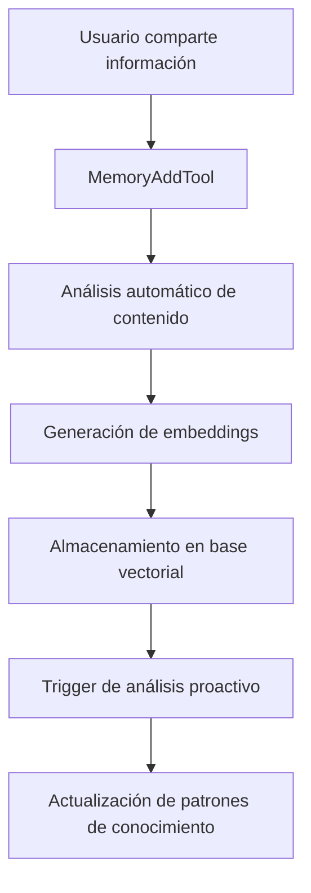
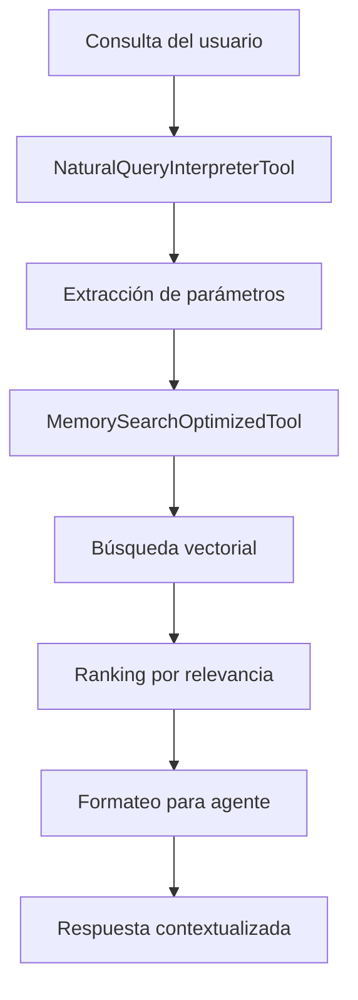

# Herramientas de Gestión de Memoria y Conocimiento - Sistema Kognito

## Introducción

Las herramientas de memoria y conocimiento forman el núcleo del sistema de inteligencia artificial de Kognito. Estas herramientas implementan un sistema de memoria vectorial avanzado que permite al agente aprender, recordar y recuperar información de manera contextual y personalizada.

## Arquitectura del Sistema de Memoria

### Base de Datos Vectorial
- **Tecnología**: PostgreSQL con extensión pgvector
- **Embeddings**: Modelos de Google Gemini para representación vectorial
- **Estructura**: Tabla `langchain_pg_embedding` con columnas especializadas
- **Indexación**: Índices vectoriales para búsqueda semántica eficiente

### Metadatos Estructurados
```sql
Columnas principales:
- account_id: Identificador único del usuario
- workspace_id: Contexto de trabajo específico
- content_type: Tipo de contenido (user_memory, document, chat_summary)
- topic: Categorización temática automática
- category: Clasificación manual o automática
- visibility_teams: Control de acceso por equipos
```

## Herramientas Principales

### 1. MemoryAddTool

#### Funcionalidad
Herramienta esencial para guardar información valiosa en la memoria vectorial a largo plazo del usuario. Se activa automáticamente cuando el usuario declara hechos, preferencias, hábitos, intereses, habilidades, metas o cualquier detalle personal.

#### Estrategia Metodológica
1. **Análisis de Contenido**: Evalúa la relevancia y tipo de información
2. **Categorización Automática**: Asigna topic basado en el contenido
3. **Embedding Generation**: Convierte texto a representación vectorial
4. **Almacenamiento Estructurado**: Guarda con metadatos completos
5. **Trigger Proactivo**: Activa análisis de conocimiento relacionado

#### Parámetros de Entrada
```python
class MemoryAddInput(BaseModel):
    content: str  # Información a guardar
    account_id: str  # ID del usuario
    type: str = "user_memory"  # Tipo de memoria
    workspace_id: str = ""  # Contexto de trabajo
    category: str = ""  # Categoría específica
```

#### Flujo de Ejecución
1. **Validación**: Verifica que el contenido no esté vacío
2. **Procesamiento**: Genera embeddings del contenido
3. **Almacenamiento**: Inserta en base de datos vectorial
4. **Indexación**: Actualiza índices para búsqueda
5. **Trigger**: Activa análisis proactivo de conocimiento

#### Lugar en el Sistema
- **Rol Central**: Componente fundamental para personalización
- **Integración**: Se conecta con todas las herramientas de análisis
- **Automatización**: Activación automática durante conversaciones
- **Aprendizaje**: Base para el aprendizaje continuo del agente

### 2. MemorySearchOptimizedTool

#### Funcionalidad
Búsqueda semántica optimizada en la base de conocimiento personal del usuario. Utiliza similitud vectorial para encontrar información relevante basada en el contexto de la consulta.

#### Estrategia Metodológica
1. **Query Embedding**: Convierte consulta a vector de búsqueda
2. **Filtrado Contextual**: Aplica filtros por cuenta y workspace
3. **Búsqueda Semántica**: Utiliza similitud coseno para ranking
4. **Post-procesamiento**: Formatea resultados para el agente
5. **Relevancia**: Filtra por umbral de similitud

#### Parámetros de Entrada
```python
class MemorySearchInput(BaseModel):
    query: str  # Consulta de búsqueda
    account_id: str  # ID del usuario
    workspace_id: str = ""  # Filtro de workspace
    max_results: int = 10  # Límite de resultados
    similarity_threshold: float = 0.7  # Umbral de relevancia
```

#### Algoritmo de Búsqueda
```python
# Pseudocódigo del algoritmo
1. query_vector = generate_embedding(query)
2. candidates = vector_search(query_vector, filters)
3. ranked_results = rank_by_similarity(candidates)
4. filtered_results = filter_by_threshold(ranked_results)
5. formatted_output = format_for_agent(filtered_results)
```

#### Optimizaciones
- **Índices Vectoriales**: Búsqueda aproximada para velocidad
- **Caching**: Resultados frecuentes en memoria
- **Batch Processing**: Múltiples consultas en paralelo
- **Filtrado Inteligente**: Reducción de espacio de búsqueda

### 3. VectorDBSearchTool

#### Funcionalidad
Herramienta de bajo nivel para consultas directas y específicas a la base de datos vectorial. Proporciona acceso granular para debugging y análisis avanzado.

#### Estrategia Metodológica
1. **Acceso Directo**: Consultas SQL directas a la base vectorial
2. **Flexibilidad**: Parámetros personalizables para diferentes casos
3. **Debugging**: Información detallada sobre el proceso de búsqueda
4. **Análisis**: Métricas de similitud y distribución de resultados

#### Casos de Uso
- **Debugging**: Verificación de almacenamiento correcto
- **Análisis**: Exploración de patrones en los datos
- **Mantenimiento**: Limpieza y optimización de la base
- **Desarrollo**: Pruebas de nuevos algoritmos de búsqueda

### 4. NaturalQueryInterpreterTool

#### Funcionalidad
Interpreta consultas en lenguaje natural del usuario y extrae automáticamente parámetros relevantes para otras herramientas de búsqueda y análisis.

#### Estrategia Metodológica
1. **Análisis de Intención**: Identifica qué tipo de búsqueda necesita
2. **Extracción de Entidades**: Encuentra fechas, temas, categorías
3. **Mapeo de Parámetros**: Convierte lenguaje natural a parámetros técnicos
4. **Validación**: Verifica coherencia de parámetros extraídos
5. **Routing**: Dirige a la herramienta más apropiada

#### Patrones de Interpretación
```python
Ejemplos de interpretación:
- "mis notas sobre IA del mes pasado" → 
  {topic: "IA", date_range: "last_month", type: "notes"}
  
- "documentos relacionados con Python" → 
  {keywords: ["Python"], type: "documents", category: "programming"}
  
- "conversaciones sobre proyectos" → 
  {topic: "proyectos", type: "chat_summary", context: "work"}
```

#### Integración con LLM
- **Modelo**: Google Gemini para interpretación
- **Prompt Engineering**: Plantillas optimizadas para extracción
- **JSON Output**: Respuestas estructuradas para procesamiento
- **Error Handling**: Manejo robusto de interpretaciones ambiguas

### 5. MemoryContextSearchTool

#### Funcionalidad
Búsqueda contextual que considera no solo el contenido sino también el contexto temporal, temático y relacional de las memorias almacenadas.

#### Estrategia Metodológica
1. **Análisis Contextual**: Evalúa contexto de la consulta actual
2. **Búsqueda Multidimensional**: Combina similitud semántica con contexto
3. **Ranking Contextual**: Prioriza resultados por relevancia contextual
4. **Agregación**: Combina múltiples fuentes de información
5. **Síntesis**: Presenta información de manera coherente

#### Dimensiones de Contexto
- **Temporal**: Relevancia basada en tiempo
- **Temática**: Coherencia con el tema actual
- **Conversacional**: Continuidad con la conversación
- **Personal**: Alineación con preferencias del usuario

## Flujos de Trabajo Integrados

### Flujo de Aprendizaje Continuo


### Flujo de Recuperación Inteligente


## Métricas y Monitoreo

### Métricas de Rendimiento
- **Latencia de búsqueda**: Tiempo promedio de respuesta
- **Precisión**: Relevancia de resultados recuperados
- **Cobertura**: Porcentaje de información recuperable
- **Satisfacción**: Feedback del usuario sobre resultados

### Métricas de Calidad
- **Diversidad**: Variedad en los resultados
- **Actualidad**: Relevancia temporal de la información
- **Completitud**: Cobertura de aspectos de la consulta
- **Coherencia**: Consistencia en respuestas similares

## Consideraciones Técnicas

### Escalabilidad
- **Particionamiento**: División por account_id para escalabilidad
- **Índices Optimizados**: Estructuras de datos eficientes
- **Caching Inteligente**: Reducción de carga en base de datos
- **Procesamiento Asíncrono**: Operaciones no bloqueantes

### Privacidad y Seguridad
- **Aislamiento**: Separación estricta por cuenta de usuario
- **Encriptación**: Protección de datos sensibles
- **Auditoría**: Registro de accesos y modificaciones
- **Compliance**: Cumplimiento de regulaciones de privacidad

### Mantenimiento
- **Limpieza Automática**: Eliminación de datos obsoletos
- **Optimización de Índices**: Mantenimiento periódico
- **Backup**: Respaldo regular de datos críticos
- **Monitoreo**: Alertas por problemas de rendimiento

## Conclusión

Las herramientas de memoria y conocimiento de Kognito implementan un sistema sofisticado de gestión de información que permite al agente de IA proporcionar respuestas personalizadas y contextualmente relevantes. La combinación de tecnologías vectoriales avanzadas con interfaces intuitivas crea una experiencia de usuario fluida mientras mantiene la robustez técnica necesaria para aplicaciones empresariales.
