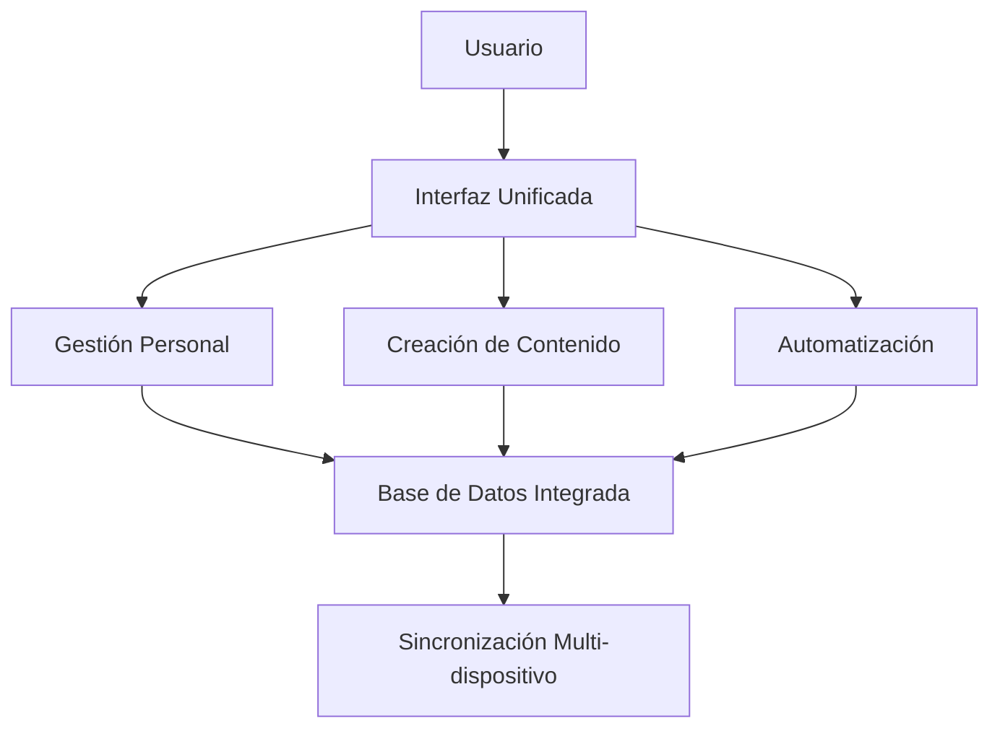
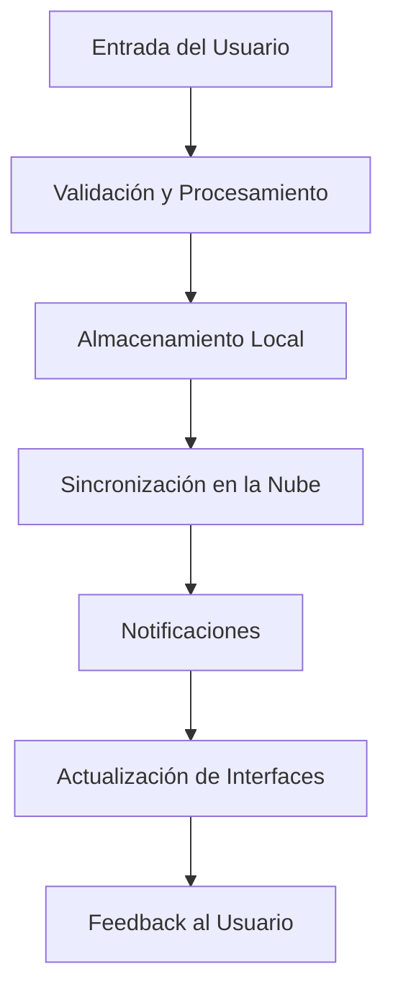

# Herramientas de Productividad y Generación de Contenido - Sistema Kognito

## Introducción

Las herramientas de productividad y generación de contenido de Kognito están diseñadas para potenciar la eficiencia personal y la creatividad del usuario. Estas herramientas abarcan desde gestión de notas y agenda hasta generación de contenido visual y mapas mentales, proporcionando un ecosistema completo para la productividad digital.

## Arquitectura del Sistema de Productividad

### Componentes Principales
- **Gestión Personal**: Notas, agenda, recordatorios y perfil de usuario
- **Generación Visual**: Imágenes, mapas mentales y procesamiento visual
- **Automatización**: Programación de tareas y ejecución automática
- **Integración**: Conexión con servicios externos y APIs

### Filosofía de Diseño


## Herramientas de Gestión Personal

### 1. Sistema de Notas

#### AddNoteTool
**Funcionalidad**: Creación de notas personales con categorización automática y búsqueda semántica integrada.

**Estrategia Metodológica**:
1. **Captura Rápida**: Interfaz optimizada para captura rápida de ideas
2. **Categorización Automática**: Clasificación inteligente por contenido
3. **Integración Vectorial**: Almacenamiento en base vectorial para búsqueda semántica
4. **Metadatos Enriquecidos**: Adición automática de contexto temporal y temático
5. **Sincronización**: Sincronización automática entre dispositivos

```python
class AddNoteInput(BaseModel):
    content: str  # Contenido de la nota
    title: str = ""  # Título opcional
    category: str = ""  # Categoría específica
    tags: List[str] = []  # Tags personalizados
    account_id: str  # ID del usuario
    is_private: bool = True  # Privacidad de la nota
```

#### GetNotesTool
**Funcionalidad**: Recuperación inteligente de notas con filtros avanzados y búsqueda semántica.

**Características**:
- **Búsqueda Semántica**: Encuentra notas por significado, no solo palabras clave
- **Filtros Temporales**: Búsqueda por rangos de fecha
- **Filtros Categóricos**: Organización por categorías y tags
- **Ranking Inteligente**: Ordenación por relevancia y recencia

#### UpdateNoteTool & DeleteNoteTool
**Funcionalidad**: Gestión completa del ciclo de vida de las notas con versionado y recuperación.

**Características**:
- **Versionado**: Historial de cambios para recuperación
- **Soft Delete**: Eliminación suave con posibilidad de recuperación
- **Audit Trail**: Registro de todas las modificaciones
- **Conflict Resolution**: Resolución de conflictos en edición concurrente

### 2. Sistema de Agenda y Recordatorios

#### ScheduleEventTool
**Funcionalidad**: Programación de eventos con integración inteligente de calendario y detección de conflictos.

**Estrategia Metodológica**:
1. **Parsing de Lenguaje Natural**: Interpretación de fechas y horarios en lenguaje natural
2. **Detección de Conflictos**: Identificación automática de solapamientos
3. **Sugerencias Inteligentes**: Propuestas de horarios alternativos
4. **Integración Externa**: Sincronización con calendarios externos
5. **Notificaciones Proactivas**: Alertas y recordatorios automáticos

```python
class ScheduleEventInput(BaseModel):
    title: str  # Título del evento
    description: str = ""  # Descripción detallada
    start_time: str  # Hora de inicio (formato flexible)
    end_time: str = ""  # Hora de fin (opcional)
    location: str = ""  # Ubicación del evento
    attendees: List[str] = []  # Lista de asistentes
    reminder_minutes: int = 15  # Minutos antes para recordatorio
    account_id: str  # ID del usuario
```

#### GetAgendaTool
**Funcionalidad**: Visualización inteligente de agenda con análisis de patrones y sugerencias de optimización.

**Características**:
- **Vista Adaptativa**: Diferentes vistas (día, semana, mes)
- **Análisis de Patrones**: Identificación de patrones en la agenda
- **Optimización de Tiempo**: Sugerencias para mejor gestión del tiempo
- **Integración Contextual**: Conexión con notas y tareas relacionadas

#### SetReminderTool
**Funcionalidad**: Sistema avanzado de recordatorios con múltiples canales de notificación y lógica inteligente.

**Estrategia**:
- **Multi-canal**: Notificaciones por Telegram, email, push
- **Recordatorios Inteligentes**: Ajuste automático basado en contexto
- **Escalación**: Sistema de escalación para recordatorios críticos
- **Aprendizaje**: Adaptación a patrones de respuesta del usuario

### 3. Gestión de Perfil

#### UpdateProfileTool
**Funcionalidad**: Gestión completa del perfil de usuario con personalización avanzada y preferencias de IA.

**Características**:
- **Preferencias de IA**: Configuración del comportamiento del agente
- **Datos Personales**: Gestión segura de información personal
- **Configuración de Privacidad**: Control granular de privacidad
- **Sincronización**: Sincronización de preferencias entre dispositivos

## Herramientas de Generación de Contenido

### 1. ImageGenerationTool

#### Funcionalidad
Generación de imágenes de alta calidad a partir de descripciones textuales utilizando modelos de IA avanzados.

#### Estrategia Metodológica
1. **Prompt Engineering**: Optimización automática de prompts para mejores resultados
2. **Style Adaptation**: Adaptación de estilo basada en preferencias del usuario
3. **Quality Control**: Validación automática de calidad de imagen generada
4. **Format Optimization**: Optimización de formato para diferentes usos
5. **Metadata Preservation**: Preservación de metadatos de generación

```python
class ImageGenerationInput(BaseModel):
    prompt: str  # Descripción de la imagen deseada
    style: str = "realistic"  # Estilo de imagen
    aspect_ratio: str = "1:1"  # Relación de aspecto
    quality: str = "high"  # Calidad de imagen
    account_id: str  # ID del usuario
    telegram_id: str = ""  # Para entrega por Telegram
```

#### Integración con Vertex AI
- **Modelo Avanzado**: Utiliza modelos de última generación
- **Optimización de Costos**: Gestión eficiente de recursos
- **Escalabilidad**: Manejo de múltiples solicitudes concurrentes
- **Fallback**: Sistemas de respaldo para alta disponibilidad

### 2. MindmapGeneratorTool

#### Funcionalidad
Generación de mapas mentales visuales y dinámicos a partir de documentos o conceptos, con renderizado interactivo en el frontend.

#### Estrategia Metodológica
1. **Análisis de Conceptos**: Extracción automática de conceptos clave
2. **Jerarquización**: Organización jerárquica de información
3. **Visualización Adaptativa**: Adaptación visual según el contenido
4. **Interactividad**: Generación de elementos interactivos
5. **Exportación Múltiple**: Múltiples formatos de salida

```python
class MindmapGeneratorInput(BaseModel):
    document_content: str  # Contenido a mapear
    topic_hint: str = ""  # Pista sobre el tema principal
    concept_query: str = "temas clave"  # Tipo de conceptos a extraer
    style: str = "hierarchical"  # Estilo del mapa mental
    max_nodes: int = 20  # Máximo número de nodos
    account_id: str  # ID del usuario
```

#### Algoritmo de Generación
```python
# Pseudocódigo para generación de mapas mentales
1. content_analysis = analyze_document_structure(document_content)
2. key_concepts = extract_key_concepts(content_analysis, concept_query)
3. concept_hierarchy = build_concept_hierarchy(key_concepts)
4. visual_layout = generate_visual_layout(concept_hierarchy, style)
5. interactive_elements = add_interactive_features(visual_layout)
6. export_formats = generate_multiple_formats(interactive_elements)
7. frontend_data = prepare_frontend_data(export_formats)
```

#### Formatos de Salida
- **MermaidJS**: Para renderizado web interactivo
- **JSON**: Para procesamiento programático
- **SVG**: Para gráficos vectoriales escalables
- **PNG**: Para imágenes estáticas de alta calidad

### 3. ImageBackgroundEraserTool

#### Funcionalidad
Procesamiento avanzado de imágenes para eliminación de fondos con IA, optimizado para diferentes tipos de contenido visual.

#### Estrategia Metodológica
1. **Detección de Sujeto**: Identificación automática del sujeto principal
2. **Segmentación Precisa**: Segmentación de alta precisión
3. **Edge Refinement**: Refinamiento de bordes para resultados naturales
4. **Batch Processing**: Procesamiento por lotes para eficiencia
5. **Quality Assurance**: Validación automática de resultados

#### Casos de Uso
- **Fotografía de Producto**: Eliminación de fondos para e-commerce
- **Retratos**: Procesamiento de fotografías personales
- **Documentos**: Limpieza de documentos escaneados
- **Presentaciones**: Preparación de imágenes para presentaciones

## Herramientas de Automatización

### 1. ScheduleToolExecutionTool

#### Funcionalidad
Sistema de programación de tareas que permite automatizar la ejecución de herramientas en horarios específicos o basados en eventos.

#### Estrategia Metodológica
1. **Cron-like Scheduling**: Sistema de programación similar a cron
2. **Event-driven Triggers**: Disparadores basados en eventos
3. **Dependency Management**: Gestión de dependencias entre tareas
4. **Error Recovery**: Recuperación automática de errores
5. **Monitoring**: Monitoreo continuo de tareas programadas

```python
class ScheduleToolExecutionInput(BaseModel):
    tool_name: str  # Nombre de la herramienta a ejecutar
    schedule_expression: str  # Expresión de programación (cron-like)
    parameters: Dict[str, Any]  # Parámetros para la herramienta
    account_id: str  # ID del usuario
    enabled: bool = True  # Estado de la programación
    max_retries: int = 3  # Máximo número de reintentos
```

#### Tipos de Programación
- **Temporal**: Basada en tiempo (diario, semanal, mensual)
- **Condicional**: Basada en condiciones específicas
- **Reactiva**: En respuesta a eventos del sistema
- **Adaptativa**: Que se ajusta según patrones de uso

### 2. ListScheduledToolsTool

#### Funcionalidad
Gestión y monitoreo de tareas programadas con capacidades de edición, cancelación y análisis de rendimiento.

#### Características
- **Vista Completa**: Lista de todas las tareas programadas
- **Estado en Tiempo Real**: Estado actual de cada tarea
- **Historial de Ejecución**: Registro de ejecuciones pasadas
- **Métricas de Rendimiento**: Análisis de éxito y fallos

## Integración y Sincronización

### Flujo de Datos Unificado


### Sincronización Multi-dispositivo
- **Conflict Resolution**: Resolución automática de conflictos
- **Offline Support**: Soporte para trabajo offline
- **Delta Sync**: Sincronización incremental eficiente
- **Real-time Updates**: Actualizaciones en tiempo real

## Métricas y Análisis

### Métricas de Productividad
- **Task Completion Rate**: Tasa de completación de tareas
- **Time Management**: Análisis de gestión del tiempo
- **Goal Achievement**: Seguimiento de logro de objetivos
- **Efficiency Trends**: Tendencias de eficiencia personal

### Métricas de Contenido
- **Generation Quality**: Calidad del contenido generado
- **User Satisfaction**: Satisfacción del usuario con resultados
- **Usage Patterns**: Patrones de uso de herramientas
- **Performance Metrics**: Métricas de rendimiento técnico

## Consideraciones de Privacidad y Seguridad

### Protección de Datos Personales
- **Encryption**: Encriptación end-to-end de datos sensibles
- **Access Control**: Control de acceso granular
- **Data Minimization**: Minimización de datos recolectados
- **User Control**: Control total del usuario sobre sus datos

### Compliance
- **GDPR**: Cumplimiento con regulaciones europeas
- **CCPA**: Cumplimiento con regulaciones de California
- **Data Portability**: Portabilidad completa de datos
- **Right to Deletion**: Derecho al olvido implementado

## Roadmap y Futuras Mejoras

### Próximas Funcionalidades
- **Voice Integration**: Integración con comandos de voz
- **AR/VR Support**: Soporte para realidad aumentada/virtual
- **Advanced Analytics**: Análisis predictivo de productividad
- **Team Collaboration**: Herramientas de colaboración en equipo

### Mejoras Técnicas
- **Performance Optimization**: Optimización continua de rendimiento
- **AI Model Updates**: Actualización de modelos de IA
- **API Enhancements**: Mejoras en APIs y integraciones
- **Mobile Optimization**: Optimización para dispositivos móviles

## Conclusión

Las herramientas de productividad y generación de contenido de Kognito forman un ecosistema integrado que potencia la eficiencia personal y la creatividad. La combinación de gestión personal inteligente, generación de contenido avanzada y automatización sofisticada proporciona a los usuarios las herramientas necesarias para maximizar su productividad mientras mantienen el control total sobre sus datos y preferencias.
