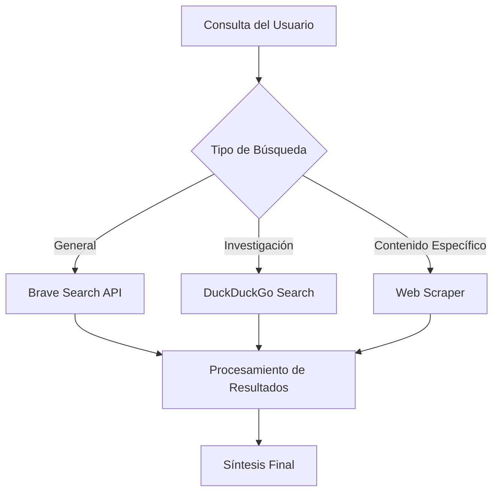
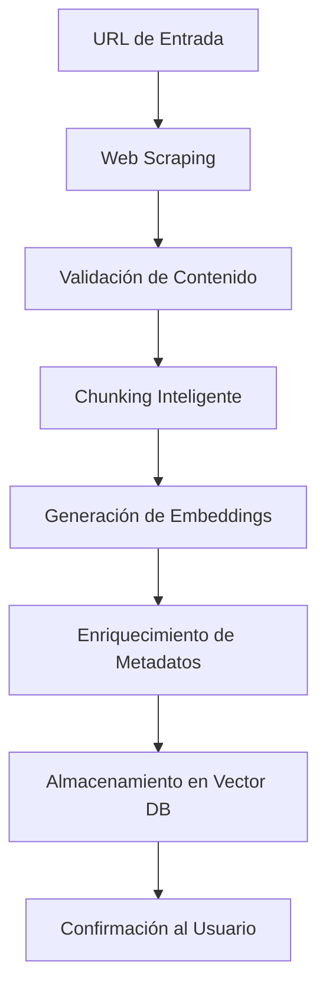

# Herramientas de Búsqueda Web y Scraping - Sistema Kognito

## Introducción

Las herramientas de búsqueda web y scraping de Kognito proporcionan capacidades avanzadas para acceder, extraer y procesar información de la web. Estas herramientas están diseñadas para complementar el conocimiento interno del sistema con información actualizada y externa, manteniendo un equilibrio entre velocidad, calidad y respeto por los límites de las APIs.

## Arquitectura del Sistema Web

### Componentes Principales
- **Motores de Búsqueda**: Integración con múltiples APIs de búsqueda
- **Scrapers Inteligentes**: Extracción de contenido con manejo robusto
- **Rate Limiters**: Control de velocidad para evitar bloqueos
- **Content Processors**: Limpieza y estructuración de contenido web

### Estrategia Multi-Motor


## Herramientas Principales

### 1. WebSearchTool (Brave Search)

#### Funcionalidad
Motor de búsqueda principal que utiliza la API de Brave Search para obtener resultados web actualizados y relevantes. Optimizado para consultas generales y búsqueda de información factual.

#### Estrategia Metodológica
1. **Query Optimization**: Optimización automática de consultas de búsqueda
2. **Result Filtering**: Filtrado de resultados por relevancia y calidad
3. **Content Extraction**: Extracción de snippets y metadatos relevantes
4. **Source Validation**: Validación básica de credibilidad de fuentes
5. **Format Standardization**: Estandarización de formato para el agente

#### Parámetros de Configuración
```python
# Configuración de la API Brave Search
brave_api_url = "https://api.search.brave.com/res/v1/web/search"
params = {
    "q": query,           # Consulta de búsqueda
    "count": 10,          # Número de resultados
    "safesearch": "moderate",  # Filtro de contenido
    "freshness": "all"    # Frescura de resultados
}
```

#### Características Técnicas
- **Rate Limiting**: Respeta límites de la API de Brave
- **Error Handling**: Manejo robusto de errores de red y API
- **Timeout Management**: Timeouts configurables para evitar bloqueos
- **Response Caching**: Cache temporal de resultados frecuentes

#### Flujo de Procesamiento
```python
# Pseudocódigo del flujo de búsqueda
1. query_validation = validate_search_query(query)
2. api_request = build_brave_api_request(query_validation)
3. raw_results = execute_search_request(api_request)
4. filtered_results = filter_by_relevance(raw_results)
5. formatted_output = format_for_agent(filtered_results)
6. source_list = extract_source_urls(filtered_results)
7. final_response = combine_content_and_sources(formatted_output, source_list)
```

#### Ventajas de Brave Search
- **Privacy-Focused**: No tracking de usuarios
- **Independent Index**: Índice independiente, no dependiente de Google
- **Fresh Results**: Resultados actualizados frecuentemente
- **API Reliability**: API estable y bien documentada

### 2. DDGSearchTool (DuckDuckGo)

#### Funcionalidad
Motor de búsqueda alternativo que utiliza DuckDuckGo para investigación distribuida en el tiempo, especialmente útil para análisis web que requieren múltiples consultas espaciadas.

#### Estrategia Metodológica
1. **Distributed Searching**: Búsquedas distribuidas en el tiempo
2. **Rate Limit Avoidance**: Espaciado automático para evitar límites
3. **Query Diversification**: Diversificación de consultas para mejor cobertura
4. **Result Aggregation**: Agregación inteligente de múltiples búsquedas
5. **Privacy Protection**: Búsqueda sin tracking para proteger privacidad

#### Parámetros de Entrada
```python
class DDGSearchInput(BaseModel):
    query: str  # Consulta de búsqueda
    account_id: str  # ID del usuario para logging
    max_results: int = 10  # Máximo número de resultados
    time_spacing: int = 2  # Segundos entre consultas
    region: str = "es-es"  # Región para resultados localizados
```

#### Algoritmo de Búsqueda Distribuida
```python
# Pseudocódigo para búsqueda distribuida
1. query_variations = generate_query_variations(base_query)
2. search_schedule = create_time_spaced_schedule(query_variations)
3. results_collection = []
4. for scheduled_query in search_schedule:
5.     wait_for_scheduled_time(scheduled_query.time)
6.     result = execute_ddg_search(scheduled_query.query)
7.     results_collection.append(result)
8. aggregated_results = aggregate_and_deduplicate(results_collection)
9. final_output = rank_by_relevance(aggregated_results)
```

#### Ventajas de DuckDuckGo
- **No Rate Limits**: Menos restrictivo que otras APIs
- **Privacy First**: Búsqueda completamente anónima
- **Global Coverage**: Cobertura global sin sesgos regionales
- **Cost Effective**: Gratuito para uso moderado

### 3. WebScraperTool

#### Funcionalidad
Herramienta especializada para extraer contenido detallado de páginas web específicas. Utiliza técnicas avanzadas de scraping para manejar diferentes tipos de sitios web y formatos de contenido.

#### Estrategia Metodológica
1. **Intelligent Parsing**: Análisis inteligente de estructura HTML
2. **Content Extraction**: Extracción selectiva de contenido relevante
3. **Noise Filtering**: Filtrado de elementos no relevantes (ads, navegación)
4. **Format Preservation**: Preservación de estructura importante del contenido
5. **Error Recovery**: Recuperación robusta de errores de scraping

#### Parámetros de Entrada
```python
class WebScraperInput(BaseModel):
    url: str  # URL completa a scrapear
    extract_links: bool = False  # Extraer enlaces internos
    preserve_formatting: bool = True  # Preservar formato
    max_content_length: int = 50000  # Límite de contenido
    timeout: int = 30  # Timeout en segundos
```

#### Tecnologías Utilizadas
- **LangChain WebBaseLoader**: Cargador robusto de contenido web
- **BeautifulSoup**: Parsing avanzado de HTML
- **Requests**: Manejo de peticiones HTTP con headers personalizados
- **Content Detection**: Detección automática de tipo de contenido

#### Algoritmo de Extracción
```python
# Pseudocódigo del scraping inteligente
1. url_validation = validate_and_normalize_url(url)
2. request_headers = build_browser_like_headers()
3. page_content = fetch_page_with_retries(url_validation, request_headers)
4. parsed_html = parse_html_structure(page_content)
5. main_content = extract_main_content(parsed_html)
6. cleaned_content = remove_noise_elements(main_content)
7. formatted_text = convert_to_readable_text(cleaned_content)
8. metadata = extract_page_metadata(parsed_html)
9. final_output = combine_content_and_metadata(formatted_text, metadata)
```

#### Manejo de Diferentes Tipos de Sitios
- **News Sites**: Extracción de artículos con metadatos
- **Blogs**: Identificación de contenido principal vs sidebar
- **Documentation**: Preservación de estructura jerárquica
- **E-commerce**: Extracción de información de productos
- **Social Media**: Manejo de contenido dinámico

### 4. AddWebToRAGTool

#### Funcionalidad
Herramienta integrada que combina scraping web con procesamiento RAG, permitiendo añadir contenido web directamente a la base de conocimiento del usuario en una sola operación.

#### Estrategia Metodológica
1. **Integrated Pipeline**: Pipeline integrado de scraping y procesamiento RAG
2. **Content Validation**: Validación de calidad del contenido extraído
3. **Automatic Categorization**: Categorización automática del contenido
4. **Metadata Enrichment**: Enriquecimiento con metadatos de la fuente
5. **Vector Storage**: Almacenamiento directo en base vectorial

#### Parámetros de Entrada
```python
class AddWebToRAGInput(BaseModel):
    url: str  # URL del contenido a añadir
    topic: str  # Tema o categoría del contenido
    account_id: str  # ID del usuario
    workspace_id: str = ""  # Workspace específico
    custom_tags: List[str] = []  # Tags personalizados
```

#### Flujo Integrado


#### Ventajas del Enfoque Integrado
- **Simplicidad**: Una sola operación para scraping y almacenamiento
- **Consistencia**: Procesamiento uniforme del contenido web
- **Eficiencia**: Eliminación de pasos intermedios
- **Trazabilidad**: Seguimiento completo del origen del contenido

## Herramientas de Soporte

### 1. Content Quality Validator

#### Funcionalidad
Valida la calidad del contenido extraído antes de procesamiento adicional o almacenamiento.

#### Criterios de Validación
- **Length Check**: Verificación de longitud mínima/máxima
- **Language Detection**: Detección de idioma del contenido
- **Content Type**: Identificación del tipo de contenido
- **Spam Detection**: Detección de contenido spam o irrelevante

### 2. URL Normalizer

#### Funcionalidad
Normaliza y valida URLs antes del procesamiento para evitar errores y duplicados.

#### Características
- **Protocol Validation**: Validación de protocolos HTTP/HTTPS
- **Domain Validation**: Verificación de dominios válidos
- **Parameter Cleaning**: Limpieza de parámetros innecesarios
- **Redirect Following**: Seguimiento de redirecciones

## Estrategias de Optimización

### Rate Limiting Inteligente
```python
# Estrategia de rate limiting adaptativo
class AdaptiveRateLimiter:
    def __init__(self):
        self.request_history = []
        self.current_delay = 1.0
        self.max_delay = 30.0
        
    def wait_if_needed(self):
        if self.should_throttle():
            time.sleep(self.current_delay)
            self.current_delay = min(self.current_delay * 1.5, self.max_delay)
        else:
            self.current_delay = max(self.current_delay * 0.9, 1.0)
```

### Caching Estratégico
- **Result Caching**: Cache de resultados de búsqueda por tiempo limitado
- **Content Caching**: Cache de contenido scrapeado para evitar re-scraping
- **Metadata Caching**: Cache de metadatos de sitios frecuentemente accedidos
- **Error Caching**: Cache temporal de errores para evitar reintentos inmediatos

### Manejo de Errores Robusto
```python
# Estrategia de retry con backoff exponencial
class RobustWebClient:
    def __init__(self):
        self.max_retries = 3
        self.base_delay = 1.0
        
    async def fetch_with_retry(self, url, headers=None):
        for attempt in range(self.max_retries):
            try:
                return await self.fetch_url(url, headers)
            except Exception as e:
                if attempt == self.max_retries - 1:
                    raise e
                delay = self.base_delay * (2 ** attempt)
                await asyncio.sleep(delay)
```

## Métricas y Monitoreo

### Métricas de Rendimiento
- **Response Time**: Tiempo de respuesta promedio por herramienta
- **Success Rate**: Tasa de éxito de operaciones web
- **Error Rate**: Tasa de errores por tipo y fuente
- **Throughput**: Número de operaciones por minuto

### Métricas de Calidad
- **Content Quality Score**: Puntuación de calidad del contenido extraído
- **Relevance Score**: Relevancia de resultados de búsqueda
- **Completeness**: Completitud de la extracción de contenido
- **Freshness**: Frescura de la información obtenida

### Alertas y Monitoreo
- **API Health**: Monitoreo de salud de APIs externas
- **Rate Limit Warnings**: Alertas de aproximación a límites
- **Error Spike Detection**: Detección de picos de errores
- **Performance Degradation**: Alertas de degradación de rendimiento

## Consideraciones Éticas y Legales

### Respeto por robots.txt
- **Automatic Checking**: Verificación automática de robots.txt
- **Compliance**: Cumplimiento de directivas de exclusión
- **Respectful Crawling**: Crawling respetuoso con delays apropiados

### Términos de Servicio
- **ToS Compliance**: Cumplimiento de términos de servicio
- **Fair Use**: Uso justo de contenido web
- **Attribution**: Atribución apropiada de fuentes
- **Copyright Respect**: Respeto de derechos de autor

### Privacidad del Usuario
- **No Tracking**: No seguimiento de actividad del usuario
- **Data Minimization**: Minimización de datos recolectados
- **Secure Storage**: Almacenamiento seguro de contenido
- **User Control**: Control del usuario sobre datos almacenados

## Conclusión

Las herramientas de búsqueda web y scraping de Kognito proporcionan capacidades robustas y éticas para acceder a información externa. La combinación de múltiples motores de búsqueda, técnicas avanzadas de scraping y estrategias inteligentes de rate limiting permite al sistema obtener información actualizada y relevante mientras respeta los límites técnicos y éticos del ecosistema web.
