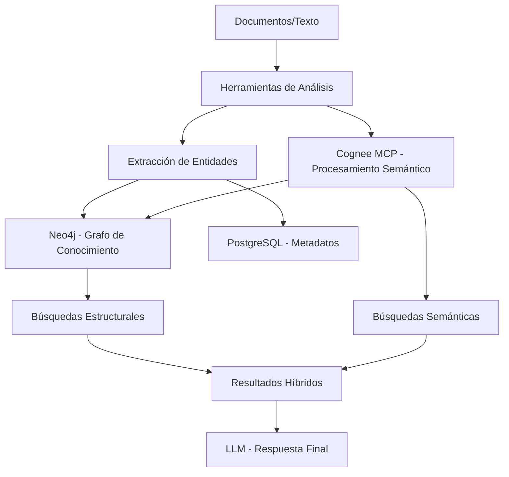

# Integración de Grafos de Conocimiento en KognitoAI

## 📋 Resumen Ejecutivo

Este documento describe la implementación de un sistema híbrido de grafos de conocimiento en KognitoAI, que combina bases de datos relacionales (PostgreSQL), bases de datos de grafos (Neo4j) y procesamiento semántico avanzado (Cognee MCP) para crear una memoria estructurada y consultas inteligentes.

## 🎯 Objetivos

- **Memoria Estructurada**: Crear representaciones persistentes del conocimiento extraído de documentos y conversaciones
- **Búsquedas Inteligentes**: Combinar búsquedas semánticas y estructurales para resultados más precisos
- **Visualización**: Generar mapas mentales y grafos navegables del conocimiento
- **Escalabilidad**: Arquitectura híbrida que aprovecha las fortalezas de cada tipo de base de datos

## 🏗️ Arquitectura del Sistema

### Componentes Principales



### Bases de Datos

#### PostgreSQL (Relacional)
- **Propósito**: Datos transaccionales, metadatos, configuraciones
- **Contenido**: 
  - Información de usuarios y workspaces
  - Metadatos de documentos y análisis
  - Logs y métricas del sistema
  - Configuraciones y preferencias

#### Neo4j (Grafos)
- **Propósito**: Relaciones complejas, navegación de conocimiento
- **Contenido**:
  - Entidades extraídas (conceptos, personas, lugares)
  - Relaciones semánticas y jerárquicas
  - Grafos de conocimiento por workspace
  - Estructuras de mapas mentales

#### Cognee MCP (Procesamiento Semántico)
- **Propósito**: Análisis avanzado de texto y generación de grafos
- **Funcionalidades**:
  - Extracción automática de entidades
  - Detección de relaciones semánticas
  - Búsquedas híbridas (GraphRAG)
  - Procesamiento de lenguaje natural

## 🛠️ Herramientas Implementadas

### 1. TextToKnowledgeGraphTool

**Descripción**: Herramienta híbrida que analiza texto en profundidad y crea grafos de conocimiento.

**Funcionalidades**:
- Análisis de texto (resumen, temas, sentimiento)
- Extracción de entidades y relaciones
- Almacenamiento en Neo4j
- Integración opcional con Cognee

**Uso**:
```python
tool = TextToKnowledgeGraphTool(account_id="user123")
result = await tool._arun(
    text="Tu texto aquí...",
    workspace_id="workspace1",
    graph_name="mi_grafo",
    create_graph=True,
    use_cognee=False
)
```

**Parámetros**:
- `text`: Texto a analizar
- `workspace_id`: ID del workspace (default: "general")
- `graph_name`: Nombre del grafo (se genera automáticamente si no se especifica)
- `create_graph`: Si crear el grafo (default: True)
- `use_cognee`: Si usar Cognee para procesamiento avanzado (default: False)

### 2. MindmapToGraphTool

**Descripción**: Genera mapas mentales visuales y los almacena como grafos persistentes.

**Funcionalidades**:
- Extracción de conceptos jerárquicos
- Generación de estructura visual
- Persistencia en Neo4j
- Detección automática de relaciones

**Uso**:
```python
tool = MindmapToGraphTool(account_id="user123")
result = await tool._arun(
    document_content="Contenido del documento...",
    workspace_id="workspace1",
    topic_hint="Tema Principal",
    concept_query="conceptos clave",
    save_to_graph=True
)
```

**Parámetros**:
- `document_content`: Contenido a analizar
- `workspace_id`: ID del workspace
- `topic_hint`: Pista sobre el tema principal
- `concept_query`: Consulta para extraer conceptos
- `save_to_graph`: Si guardar en Neo4j (default: True)

### 3. KnowledgeGraphTool (Base)

**Descripción**: Herramienta base para integración con Cognee y operaciones avanzadas.

**Funcionalidades**:
- Integración con Cognee MCP
- Búsquedas híbridas
- Gestión de grafos complejos
- Operaciones CRUD en Neo4j

## 📊 Configuración

### Variables de Entorno

```bash
# Neo4j Configuration
NEO4J_PASSWORD=Kn0wl3dg3Gr4ph2024!
NEO4J_USER=neo4j
NEO4J_URI=bolt://neo4j_db:7687

# Cognee Configuration
COGNEE_API_URL=http://cognee_service:8000
```

### Docker Compose

```yaml
# Neo4j Service
neo4j:
  image: neo4j:latest
  container_name: neo4j_db
  restart: always
  ports:
    - "7474:7474"  # Web interface
    - "7687:7687"  # Bolt connection
  environment:
    NEO4J_AUTH: neo4j/${NEO4J_PASSWORD}
  volumes:
    - neo4j_data:/data
  networks:
    - kognito_network

# Cognee Service
cognee:
  image: cognee/cognee-mcp:main
  container_name: cognee_service
  restart: always
  ports:
    - "8011:8000"
  environment:
    COGNEE_API_URL: ${COGNEE_API_URL}
  networks:
    - kognito_network
```

### Dependencias Python

```txt
# Añadido a requirements.txt
neo4j  # Driver oficial para Neo4j
```

## 🚀 Instalación y Configuración

### Paso 1: Levantar Servicios

```bash
# Levantar todos los servicios
docker-compose up -d

# Verificar que Neo4j y Cognee estén corriendo
docker-compose ps neo4j cognee
```

### Paso 2: Verificar Conexión

```bash
# Acceder a Neo4j Browser
# URL: http://localhost:7474
# Usuario: neo4j
# Contraseña: Kn0wl3dg3Gr4ph2024!
```

### Paso 3: Ejecutar Pruebas

```bash
# Ejecutar script de pruebas
python test_knowledge_graph_tools.py
```

## 📈 Casos de Uso

### 1. Análisis de Documentos Complejos

```python
# Analizar un documento técnico y crear grafo
tool = TextToKnowledgeGraphTool(account_id="researcher")
result = await tool._arun(
    text=document_content,
    workspace_id="research_project",
    use_cognee=True  # Para análisis avanzado
)
```

### 2. Mapas Mentales de Reuniones

```python
# Crear mapa mental de notas de reunión
tool = MindmapToGraphTool(account_id="team_lead")
result = await tool._arun(
    document_content=meeting_notes,
    topic_hint="Reunión de Planificación Q1",
    concept_query="decisiones, acciones y responsables"
)
```

### 3. Base de Conocimiento Organizacional

```python
# Construir grafo de conocimiento empresarial
for document in company_documents:
    await tool._arun(
        text=document.content,
        workspace_id="company_knowledge",
        graph_name=f"dept_{document.department}"
    )
```

## 🔍 Consultas y Búsquedas

### Consultas Cypher (Neo4j)

```cypher
-- Encontrar conceptos relacionados
MATCH (c1:Concept)-[r:RELATED_TO]-(c2:Concept)
WHERE c1.name CONTAINS "inteligencia artificial"
RETURN c1, r, c2

-- Buscar por workspace
MATCH (n)
WHERE n.workspace_id = "research_project"
RETURN n.name, labels(n), n.created_at

-- Análisis de centralidad
MATCH (n:Concept)
RETURN n.name, size((n)--()) as connections
ORDER BY connections DESC
```

### Búsquedas Híbridas

```python
# Usar la herramienta base para búsquedas avanzadas
result = await knowledge_graph_tool.search_knowledge_graph(
    query="machine learning applications",
    graph_name="ai_research",
    account_id="researcher",
    search_type="hybrid"  # Combina Neo4j + Cognee
)
```

## 📊 Monitoreo y Métricas

### Métricas Clave

- **Nodos Creados**: Número de entidades en el grafo
- **Relaciones Establecidas**: Conexiones entre entidades
- **Consultas por Segundo**: Rendimiento del sistema
- **Precisión de Extracción**: Calidad de las entidades extraídas

### Logs y Debugging

```python
# Configurar logging detallado
import logging
logging.getLogger('knowledge_graph').setLevel(logging.DEBUG)
logging.getLogger('neo4j').setLevel(logging.INFO)
```

## 🔧 Mantenimiento

### Limpieza de Datos

```cypher
-- Eliminar nodos de prueba
MATCH (n)
WHERE n.account_id = "test_user"
DETACH DELETE n

-- Limpiar grafos antiguos
MATCH (n)
WHERE n.created_at < datetime() - duration('P30D')
DETACH DELETE n
```

### Backup y Recuperación

```bash
# Backup de Neo4j
docker exec neo4j_db neo4j-admin dump --database=neo4j --to=/backups/

# Restaurar backup
docker exec neo4j_db neo4j-admin load --from=/backups/neo4j.dump --database=neo4j
```

## 🚨 Troubleshooting

### Problemas Comunes

1. **Error de Conexión Neo4j**
   - Verificar que el servicio esté corriendo
   - Comprobar credenciales en `.env`
   - Revisar puertos (7474, 7687)

2. **Cognee No Responde**
   - Verificar puerto 8011
   - Comprobar logs del contenedor
   - Reiniciar servicio si es necesario

3. **Herramientas No Registradas**
   - Verificar imports en `core/tools.py`
   - Comprobar que las clases estén en las listas correctas
   - Reiniciar el servicio core

### Comandos de Diagnóstico

```bash
# Verificar servicios
docker-compose ps

# Ver logs
docker-compose logs neo4j
docker-compose logs cognee

# Probar conectividad
curl http://localhost:8011/health
```

## 📚 Referencias

- [Neo4j Documentation](https://neo4j.com/docs/)
- [Cognee Documentation](https://docs.cognee.ai/)
- [GraphRAG Concepts](https://www.cognee.ai/blog/deep-dives/cognee-graphrag-supercharging-search-with-knowledge-graphs-and-vector-magic)
- [LangChain Tools](https://python.langchain.com/docs/modules/agents/tools/)

---

**Última Actualización**: 2025-01-09  
**Versión**: 1.0  
**Autor**: KognitoAI Development Team
