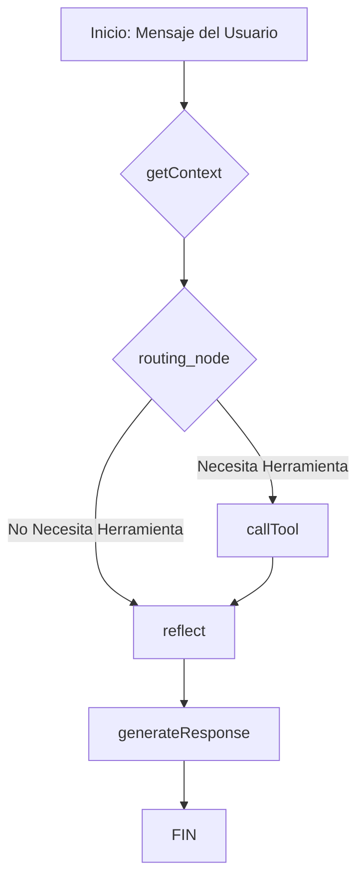

# Plan de Transición de Agente ReAct a LangGraph

**Fecha:** 2025-08-04
**Autor:** Gemini
**Objetivo:** Refactorizar el agente de IA actual, basado en un bucle ReAct, a una arquitectura más robusta, modular y dinámica utilizando LangGraph. El objetivo final es mejorar la verbosidad, el detalle de las respuestas y la mantenibilidad del código.

---

## 1. Motivación

El agente ReAct actual, aunque funcional, opera en un bucle lineal (`Thought -> Action -> Observation`). Esta estructura limita la capacidad del agente para realizar razonamientos complejos, reflexionar sobre la información obtenida o adaptar su estrategia dinámicamente.

La transición a LangGraph nos permitirá modelar el flujo de trabajo del agente como un grafo de estados, donde cada nodo representa un paso de cómputo y cada arista una transición lógica. Esto desbloquea capacidades avanzadas como:

-   **Reflexión Interna:** Añadir nodos que hagan al agente "pensar" sobre la información antes de responder.
-   **Enrutamiento Condicional:** Tomar decisiones complejas sobre qué herramienta usar o si necesita más información.
-   **Resiliencia y Reintentos:** Implementar bucles para corregir errores o intentar diferentes enfoques.
-   **Mantenibilidad:** Desacoplar la lógica en nodos independientes y reutilizables.

## 2. Arquitectura Propuesta

El nuevo agente se basará en un `StateGraph` que operará sobre un objeto de estado (`AgentState`).

**Diagrama del Flujo General:**



## 3. Plan de Implementación por Fases

### Fase 1: Preparación y Cimientos (Setup)

**Objetivo:** Establecer las bases para el nuevo agente sin modificar la lógica existente.

1.  **Verificar Dependencia:** Asegurarse de que `langgraph` esté en `requirements.txt`. (Ya verificado, está presente).
2.  **Definir el Estado del Grafo:** En `core/agent.py`, definir la clase `AgentState` usando `TypedDict`. Esta clase contendrá toda la información que fluirá a través del grafo (mensajes, IDs, resultados de herramientas, etc.).

    ```python
    # En core/agent.py
    from typing import List, TypedDict, Optional
    from langchain_core.messages import BaseMessage

    class AgentState(TypedDict):
        messages: List[BaseMessage]
        account_id: str
        telegram_id: Optional[str]
        workspace_id: Optional[str]
        tool_result: Optional[dict]
        reflection: Optional[str]
    ```

### Fase 2: Construcción del Esqueleto del Grafo

**Objetivo:** Crear la estructura del grafo en `core/agent.py` con nodos vacíos o con lógica mínima, sin conectarlo aún a la API.

1.  **Definir Nodos Esqueleto:** Crear las funciones para cada nodo del grafo (`get_context_node`, `tool_node`, `reflection_node`, `response_generator_node`, `routing_node`) en `core/agent.py`. Inicialmente, estas funciones solo registrarán un mensaje de log y devolverán el estado sin cambios.
2.  **Ensamblar el Grafo:** Crear una nueva función `create_langgraph_agent()` que:
    -   Inicialice un `StateGraph(AgentState)`.
    -   Añada los nodos definidos en el paso anterior.
    -   Defina las aristas (el flujo) entre los nodos, incluyendo la arista condicional del `routing_node`.
    -   Compile el grafo con `workflow.compile()`.

### Fase 3: Migración de la Lógica a los Nodos

**Objetivo:** Mover la lógica del agente ReAct existente a los nodos correspondientes del nuevo grafo.

1.  **Nodo `getContext`:** Mover la lógica de `create_and_run_agent_streaming` que obtiene el perfil de usuario, las memorias relevantes y construye el prompt del sistema. El resultado se añadirá al estado `messages`.
2.  **Nodo `routing_node`:** Implementar la lógica que llama al LLM para decidir si se necesita una herramienta. Puede basarse en la capacidad del LLM para hacer "tool calling". Devolverá `"call_tool"` o `"reflect"`.
3.  **Nodo `tool_node`:** Mover la lógica que invoca a `agent_executor` o una llamada directa a la herramienta. El resultado de la herramienta se guardará en el campo `tool_result` del estado.
4.  **Nodo `reflect`:** Implementar una nueva llamada al LLM con un prompt específico para la reflexión.
    -   **Prompt de Reflexión:** "Revisa la conversación y el resultado de la herramienta. ¿Qué puntos clave debes incluir en tu respuesta? ¿Qué detalles adicionales la harían más útil y completa para el usuario?"
    -   El resultado se guardará en el campo `reflection` del estado.

### Fase 4: Activación del Nuevo Agente y Streaming de Dos Fases

**Objetivo:** Modificar el endpoint de la API para usar el nuevo agente LangGraph y habilitar el streaming completo.

1.  **Modificar `api/chat.py`:**
    -   Dentro de la función `generate_stream` en `handle_chat_stream`.
    -   **Fase 1 - Streaming de Proceso:** Llamar a `agent_app.astream()` para ejecutar el grafo. En cada paso (`chunk`), enviar un mensaje de estado al frontend (ej. `{"type": "status", "message": "Consultando herramientas..."}`).
    -   El grafo se modificará para que termine *después* del nodo de reflexión, devolviendo el estado final completo.
2.  **Implementar Streaming de Tokens:**
    -   **Fase 2 - Streaming de Tokens:** Una vez que el grafo termina y devuelve el `final_state`, construir una cadena LCEL final.
    -   Esta cadena tomará el `final_state` (que incluye la reflexión y los resultados de las herramientas) y lo pasará a un prompt final diseñado para generar la respuesta verbosa.
    -   Llamar a `astream()` en esta cadena final para obtener los tokens de la respuesta uno por uno y enviarlos al frontend como chunks de contenido (`{"type": "chunk", "content": ...}`).

### Fase 5: Limpieza y Refinamiento

**Objetivo:** Eliminar el código obsoleto y refinar los nuevos componentes.

1.  **Eliminar Código Antiguo:**
    -   Remover las funciones `create_and_run_agent` y `create_and_run_agent_streaming` de `api/chat.py` y `core/agent.py`.
    -   Eliminar el `REACT_PROMPT_TEMPLATE` de `core/prompts.py`, ya que no será necesario.
2.  **Refinar Prompts:**
    -   Ajustar el `KAI_SYSTEM_PROMPT` para eliminar cualquier referencia al formato ReAct.
    -   Optimizar los nuevos prompts para los nodos de reflexión y generación de respuesta para maximizar la calidad y verbosidad.
3.  **Documentación Interna:** Añadir comentarios en el código de los nuevos nodos y del grafo para explicar su funcionamiento.
