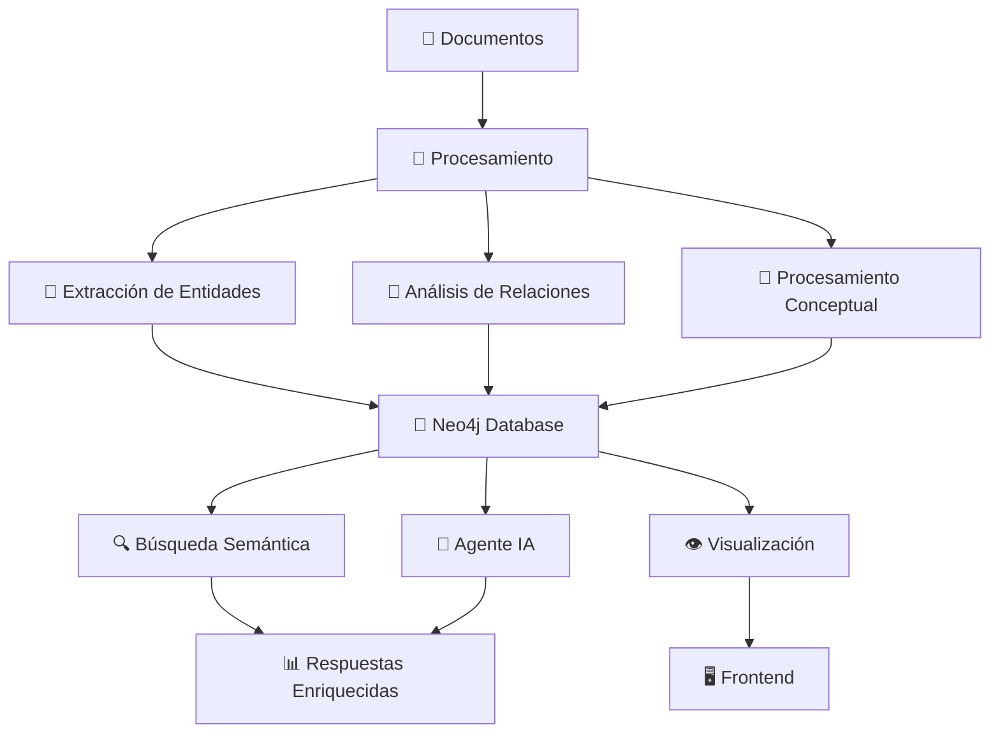
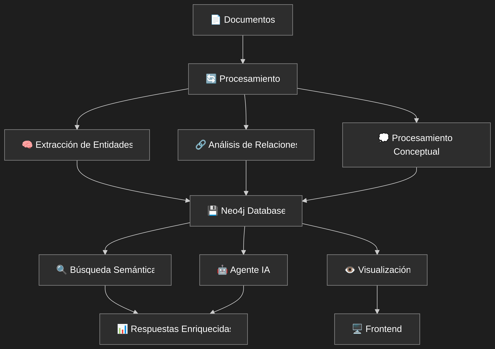
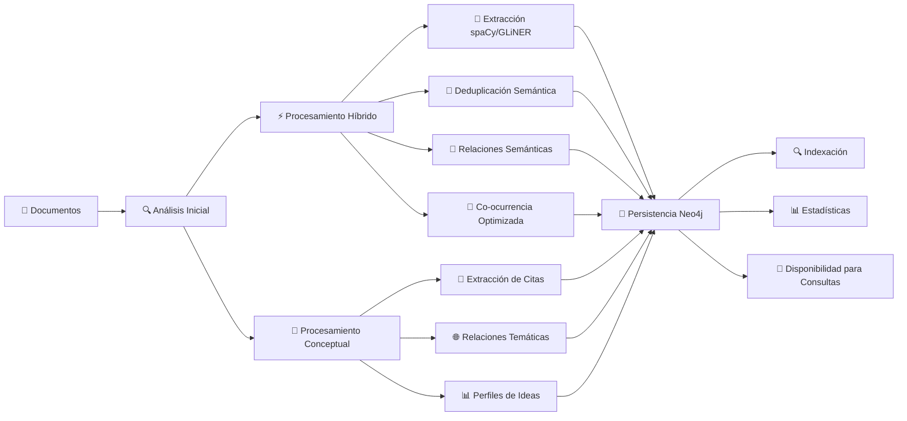
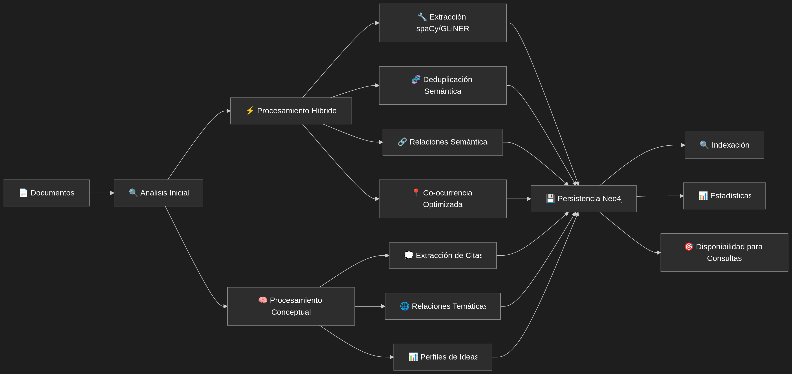

# 🧠 Sistema de Grafo de Conocimiento - Documentación Completa

## 📋 Índice
1. [Introducción y Propósito](#introducción-y-propósito)
2. [Arquitectura del Sistema](#arquitectura-del-sistema)
3. [Componentes Principales](#componentes-principales)
4. [Pipeline de Procesamiento](#pipeline-de-procesamiento)
5. [API y Endpoints](#api-y-endpoints)
6. [Herramientas para Agentes](#herramientas-para-agentes)
7. [Integración con Workspaces](#integración-con-workspaces)
8. [Visualización y Frontend](#visualización-y-frontend)
9. [Casos de Uso](#casos-de-uso)
10. [Configuración y Despliegue](#configuración-y-despliegue)
11. [Monitoreo y Logs](#monitoreo-y-logs)
12. [Mejores Prácticas](#mejores-prácticas)

---

## 🎯 Introducción y Propósito

El **Sistema de Grafo de Conocimiento** es el "cerebro relacional" del proyecto KognitoAI. Su propósito principal es transformar datos no estructurados en una base de conocimientos estructurada y semántica que va más allá de un sistema RAG tradicional.

### 🚀 Capacidades Principales

- **🔍 Descubrimiento de conexiones ocultas** entre documentos aparentemente inconexos
- **🧩 Razonamiento multihop** para responder preguntas que requieren conectar varios puntos
- **👁️ Visualización interactiva** de la estructura del conocimiento
- **🧠 Memoria persistente y relacional** de interacciones y aprendizajes
- **🔗 Inteligencia proactiva** para sugerir vínculos semánticos

### 🆚 Diferencias con RAG Tradicional

| Aspecto | RAG Tradicional | Grafo de Conocimiento |
|---------|----------------|----------------------|
| **Búsqueda** | Fragmentos de texto | Entidades y relaciones semánticas |
| **Razonamiento** | Búsqueda por similitud | Navegación multihop en grafos |
| **Contexto** | Limitado por tokens | Ilimitado por conexiones |
| **Transparencia** | "Caja negra" | Exploración visual de conexiones |
| **Proactividad** | Reactiva | Sugiere conexiones automáticamente |

---

## 🏗️ Arquitectura del Sistema

El sistema está distribuido en **cuatro capas principales** que interactúan entre sí:

### 📁 Estructura de Archivos

```
📂 knowledge_graph/
├── 📄 hybrid_graph_processor.py      # Procesador híbrido (spaCy + GLiNER + LLMs)
├── 📄 conceptual_graph_processor.py  # Procesador conceptual (LLM-only)
├── 📄 graph_database.py             # Adaptador Neo4j
├── 📄 graph_integration.py          # Integración y utilidades
├── 📄 entity_quality_reviewer.py    # Revisión de calidad
├── 📄 trend_analyzer.py             # Análisis de tendencias
└── 📄 reasoning_node.py             # Nodos de razonamiento

📂 api/
├── 📄 knowledge_graph.py            # Endpoints de API

📂 tools/
└── 📄 knowledge_graph_tool.py       # Herramienta para agentes

📂 utils/
└── 📄 knowledge_graph_service.py    # Servicio central
```

### 🔄 Flujo de Información



---

## 🧩 Componentes Principales

### 1. **HybridGraphProcessor** 🔄

**Archivo**: `knowledge_graph/hybrid_graph_processor.py`

**Propósito**: Combina modelos especializados locales con LLMs para extracción rápida y precisa.

#### 🛠️ Modelos Utilizados
- **spaCy**: NER rápido para entidades básicas (PERSON, ORG, LOC, etc.)
- **GLiNER**: Modelo zero-shot para tipos de entidades personalizados
- **SentenceTransformers**: Embeddings semánticos para deduplicación y relaciones
- **LLM (Gemini)**: Solo para análisis contextual complejo

#### ⚙️ Modos de Operación
```python
# Modo Híbrido: spaCy + GLiNER
use_hybrid_ner = True
use_gliner = True

# Modo GLiNER Exclusivo
use_hybrid_ner = False  
use_gliner = True

# Modo spaCy Solo (Fallback)
use_hybrid_ner = False
use_gliner = False
```

#### 📊 Pipeline de Procesamiento

```python
async def process_documents(documents, dataset_name):
    # Fase 1: Extracción de Entidades
    entities = await self._extract_entities(documents)
    
    # Deduplicación Inteligente
    entities = await self._deduplicate_entities(entities)
    
    # Fase 2: Relaciones Semánticas
    relationships = await self._extract_relationships_semantic(documents, entities)
    
    # GUARDAR INMEDIATAMENTE (evita timeouts)
    if self._save_callback:
        await self._save_callback(entities, relationships)
    
    # Fase 3: Co-ocurrencia Optimizada
    cooccurrence_rels = await self._extract_cooccurrence_relationships_optimized(documents, entities)
    
    return {
        "entities": entities,
        "relationships": relationships + cooccurrence_rels
    }
```

#### 🎯 Tipos de Entidades Soportadas

| Tipo | Descripción | Ejemplo |
|------|-------------|---------|
| **PERSON** | Personas | "Juan Pérez", "Einstein" |
| **ORG** | Organizaciones | "Google", "Universidad de Chile" |
| **LOC** | Lugares | "Santiago", "Chile" |
| **CONCEPT_PHRASE** | Frases conceptuales | "Inteligencia Artificial" |
| **CONCEPT_TECHNICAL** | Términos técnicos | "Machine Learning", "Blockchain" |
| **CONCEPT_COMPOUND** | Conceptos compuestos | "Red Neuronal Profunda" |
| **CONCEPT_EXPRESSION** | Expresiones clave | "entrenar modelo" |

### 2. **ConceptualGraphProcessor** 🧠

**Archivo**: `knowledge_graph/conceptual_graph_processor.py`

**Propósito**: Extrae citas conceptuales de alta calidad usando LLMs para crear un grafo más "filosófico".

#### 💭 Filosofía del Diseño
- **Cada nodo = Una cita** que expresa una idea completa
- **Las relaciones = Conexiones temáticas** entre ideas
- **Perfiles = Clusters** de ideas centrales interrelacionadas

#### 🔄 Pipeline Conceptual

```python
async def process_documents_conceptually(documents):
    # Fase 1: Extraer Citas Conceptuales
    conceptual_quotes = await self._extract_conceptual_quotes(documents)
    
    # Fase 2: Analizar Relaciones Temáticas  
    thematic_relationships = await self._analyze_thematic_relationships(conceptual_quotes)
    
    # Fase 3: Identificar Perfiles de Ideas
    idea_profiles = await self._identify_central_idea_profiles(conceptual_quotes, thematic_relationships)
    
    return {
        "conceptual_nodes": conceptual_quotes,
        "thematic_relationships": thematic_relationships,
        "idea_profiles": idea_profiles
    }
```

#### 🎭 Estrategias de Extracción

1. **LLM para Contenido Largo** (>500 chars)
   - Análisis semántico profundo
   - Categorización automática
   - Extracción de importancia

2. **Análisis de Oraciones Ricas**
   - Identificación de riqueza conceptual
   - Categorización temática
   - Evaluación de importancia

3. **Párrafos Densamente Conceptuales**
   - Análisis de densidad conceptual
   - Agrupación temática
   - Estructura narrativa

#### 📝 Categorías Conceptuales

| Categoría | Descripción | Indicadores |
|-----------|-------------|-------------|
| **definición_conceptual** | Definiciones y conceptos | "se entiende por", "define" |
| **marco_teórico** | Teorías y modelos | "teoría", "modelo", "framework" |
| **enfoque_metodológico** | Metodologías | "metodología", "método", "procedimiento" |
| **hallazgo_empírico** | Resultados y evidencias | "concluye", "resultado", "demuestra" |
| **relación_temática** | Conexiones conceptuales | "relación", "conexión", "vínculo" |
| **ejemplo_práctico** | Casos y ejemplos | "ejemplo", "caso de estudio" |
| **análisis_crítico** | Críticas y limitaciones | "crítica", "limitación", "desafío" |

### 3. **GraphDatabase** 💾

**Archivo**: `knowledge_graph/graph_database.py`

**Propósito**: Maneja la conexión y operaciones con Neo4j de forma asíncrona y robusta.

#### 🔌 Gestión de Conexiones

```python
class GraphDB:
    def __init__(self, uri: str, user: str, password: str):
        self.uri = uri
        self.user = user  
        self.password = password
        self._driver = None
        self._instance = None  # Singleton pattern
    
    async def execute_query(self, query: str, parameters: Dict = None):
        # Reintentos con retroceso exponencial
        # Reconexión automática
        # Thread pool para operaciones síncronas
```

#### 🛡️ Características de Robustez
- **Reintentos automáticos** con retroceso exponencial
- **Reconexión automática** si la conexión se pierde
- **Singleton pattern** para evitar múltiples conexiones
- **Validación de conectividad** antes de cada operación

#### 📊 Operaciones Principales

```python
# Agregar nodo con merge automático
async def add_node(node_type: str, properties: Dict[str, Any]):
    query = """
    MERGE (n:{node_type} {{ cognee_id: $unique_val }})
    ON CREATE SET n = $props
    ON MATCH SET n += $props
    """
    await self.execute_query(query, params)

# Crear relación entre nodos
async def add_relationship_by_property(source_key, source_val, target_key, target_val, rel_type, properties):
    query = """
    MATCH (a {{{source_key}: $source_val}}), (b {{{target_key}: $target_val}})
    MERGE (a)-[r:{rel_type}]->(b)
    SET r += $props
    """
    await self.execute_query(query, params)
```

### 4. **KnowledgeGraphService** 🔧

**Archivo**: `utils/knowledge_graph_service.py`

**Propósito**: Servicio central que orquesta todos los componentes del sistema.

#### 🎯 Responsabilidades
- **Orquestación** de procesadores (híbrido + conceptual)
- **Gestión de flujos** de procesamiento
- **Coordinación** con Neo4j y APIs
- **Manejo de errores** y recuperación
- **Cache** de resultados para optimización

---

## 🔄 Pipeline de Procesamiento

### 📈 Flujo Completo de Procesamiento



### ⚡ Optimizaciones de Rendimiento

#### 🚨 Guardado Inmediato (Prevención de Timeouts)
```python
# En HybridGraphProcessor
logger.info("💾 GUARDANDO DATOS INMEDIATAMENTE después de Fase 2...")
try:
    partial_result = {
        "entities": entities,
        "relationships": relationships,
        "metadata": {
            "status": "phase2_complete",
            "phases_completed": ["spacy_entities", "semantic_relationships"]
        }
    }
    if hasattr(self, '_save_callback') and self._save_callback:
        await self._save_callback(entities, relationships)
except Exception as save_error:
    logger.error(f"❌ Error guardando después de Fase 2: {save_error}")
```

#### 🎯 Co-ocurrencia Optimizada
```python
async def _extract_cooccurrence_relationships_optimized(self, documents, entities):
    # 1. Filtrar entidades por relevancia (confianza > 0.8)
    high_confidence_entities = [ent for ent in entities if ent.get("confidence", 0) > 0.8]
    
    # 2. Priorizar tipos importantes
    priority_types = ["PERSON", "ORG", "LOC", "CONCEPT"]
    priority_entities = [ent for ent in high_confidence_entities if ent.get("type") in priority_types]
    
    # 3. Ventanas deslizantes con solapamiento
    window_size = 1000  # caracteres
    overlap = 200       # caracteres de solapamiento
    
    # 4. Límites inteligentes
    max_relations = 2000
    max_documents = 50
```

#### 🧬 Deduplicación Inteligente
```python
async def _deduplicate_entities(self, entities):
    # Generar embeddings para todas las entidades
    entity_texts = [f"{e.get('name', '')} {e.get('description', '')}" for e in entities]
    embeddings = await self._get_embeddings(entity_texts)
    
    # Calcular matriz de similitud
    similarities = cosine_similarity(embeddings)
    
    # Fusionar duplicados (>92% similitud + tipos compatibles)
    threshold = 0.92
    deduplicated_entities = []
    
    for i, entity in enumerate(entities):
        similar_indices = [j for j in range(i+1, len(entities)) 
                          if similarities[i][j] > threshold 
                          and self._are_compatible_types(entity.get("type"), entities[j].get("type"))]
        
        if similar_indices:
            merged = self._merge_entities([entity] + [entities[j] for j in similar_indices])
            deduplicated_entities.append(merged)
```

---

## 🌐 API y Endpoints

### 📡 Estructura de la API

**Base URL**: `/api/knowledge-graph/`

### 🔍 Endpoints Principales

#### 1. **Estado del Grafo**
```http
GET /api/knowledge-graph/status
```
**Descripción**: Obtiene el estado del procesamiento del grafo.

**Respuesta**:
```json
{
    "success": true,
    "data": {
        "status": "not_processed",
        "document_count": 15,
        "workspace_id": "workspace-uuid"
    }
}
```

#### 2. **Búsqueda en el Grafo**
```http
POST /api/knowledge-graph/search-graph
```
**Body**:
```json
{
    "query": "¿Cómo se relaciona la inteligencia artificial con el machine learning?",
    "workspace_id": "workspace-uuid",
    "limit": 50
}
```

#### 3. **Procesamiento de Documentos**
```http
POST /api/knowledge-graph/process-knowledge-graph-optimized
```
**Body**:
```json
{
    "workspace_id": "workspace-uuid",
    "force_reprocess": false,
    "dataset_name": "mi_dataset",
    "processing_mode": "hybrid"
}
```

#### 4. **Datos del Grafo para Visualización**
```http
GET /api/knowledge-graph/data?workspace_id=xxx&limit=100&max_hops=2
```
**Respuesta**:
```json
{
    "success": true,
    "data": {
        "nodes": [
            {
                "id": "node_1",
                "label": "Inteligencia Artificial",
                "type": "CONCEPT_TECHNICAL",
                "properties": {...}
            }
        ],
        "edges": [
            {
                "id": "edge_1",
                "from": "node_1", 
                "to": "node_2",
                "label": "INCLUDES",
                "arrows": "to"
            }
        ]
    }
}
```

#### 5. **Estadísticas del Grafo**
```http
GET /api/knowledge-graph/stats?workspace_id=xxx
```
**Respuesta**:
```json
{
    "success": true,
    "data": {
        "total_entities": 1250,
        "total_relationships": 3400,
        "entity_types": [
            {"type": "PERSON", "count": 150},
            {"type": "ORG", "count": 200},
            {"type": "CONCEPT_TECHNICAL", "count": 300}
        ],
        "relationship_types": [
            {"type": "RELATED_TO", "count": 800},
            {"type": "PART_OF", "count": 450}
        ]
    }
}
```

#### 6. **Conexiones de Entidad**
```http
POST /api/knowledge-graph/entity-connections
```
**Body**:
```json
{
    "entity_id": "entity_123",
    "workspace_id": "workspace-uuid", 
    "depth": 2
}
```

#### 7. **Limpieza de Grafo**
```http
POST /api/knowledge-graph/clear-neo4j
```
**Body**:
```json
{
    "workspace_id": "workspace-uuid",
    "confirm_delete_all": false
}
```

### 🔧 Endpoints de Análisis Avanzado

#### 8. **Revisión de Calidad de Entidades**
```http
POST /api/knowledge-graph/review-entities
```
**Funcionalidad**: Detecta entidades mal clasificadas, duplicados y anomalías.

#### 9. **Análisis de Tendencias**
```http
POST /api/knowledge-graph/detect-trends
```
**Body**:
```json
{
    "dataset_name": "mi_dataset",
    "time_window": "last_6_months",
    "workspace_id": "workspace-uuid"
}
```

#### 10. **Chat Enriquecido**
```http
POST /api/knowledge-graph/enhanced-chat
```
**Body**:
```json
{
    "message": "¿Qué me puedes decir sobre las tendencias en IA?",
    "workspace_id": "workspace-uuid",
    "use_knowledge_graph": true
}
```

---

## 🤖 Herramientas para Agentes

### 🧠 KnowledgeGraphTool

**Archivo**: `tools/knowledge_graph_tool.py`

**Propósito**: Permite a los agentes de IA consultar el grafo de conocimiento usando lenguaje natural.

#### 🎯 Características
- **Consulta en lenguaje natural**: "Cómo se relaciona X con Y"
- **Razonamiento multihop**: Navegación profunda en el grafo
- **Respuestas contextuales**: Incorpora conexiones semánticas
- **Integración LangChain**: Compatible con el ecosistema de herramientas

#### 💻 Uso en Agentes

```python
from tools.knowledge_graph_tool import KnowledgeGraphTool

# Inicializar herramienta
kg_tool = KnowledgeGraphTool(
    account_id="user-123",
    workspace_id="workspace-456"
)

# Usar en el agente
async def agent_function(user_query):
    result = await kg_tool.arun(
        natural_language_query=user_query
    )
    return result
```

#### 📊 Formato de Respuesta

```json
{
    "status": "success",
    "summary": "El Machine Learning es una subdisciplina de la IA que incluye...",
    "sources": [
        {
            "content": "Definición técnica de ML",
            "type": "concept_definition",
            "confidence": 0.9
        }
    ],
    "method": "graph_search",
    "searched_at": "2025-12-22T10:00:00Z"
}
```

### 🔗 Integración con Agente Principal

```python
# En core/agent.py
async def process_with_knowledge_graph(self, query):
    if self.knowledge_graph_tool:
        kg_response = await self.knowledge_graph_tool.arun(
            natural_language_query=query
        )
        # Incorporar respuesta del grafo al contexto
        return self._integrate_kg_response(kg_response)
```

---

## 🏢 Integración con Workspaces

### 🔐 Multi-tenancy y Aislamiento

Cada workspace tiene su propio grafo de conocimiento aislado:

```python
# En la extracción de entidades
def _add_tenant_ids(self, data: Dict[str, Any]) -> Dict[str, Any]:
    if hasattr(self, 'account_id') and self.account_id:
        data["account_id"] = self.account_id
    if hasattr(self, 'workspace_id') and self.workspace_id:
        data["workspace_id"] = self.workspace_id
    if hasattr(self, 'dataset_name') and self.dataset_name:
        data["dataset_name"] = self.dataset_name
    return data
```

### 📊 Consultas Filtradas por Workspace

```cypher
// En api/knowledge_graph.py
MATCH (n)
WHERE (n.account_id = $account_id OR n.account_id IS NULL)
  AND (n.workspace_id = $workspace_id OR n.workspace_id IS NULL)
RETURN n, r, m
LIMIT $limit
```

### 🎯 Beneficios de la Integración

1. **Aislamiento completo** entre workspaces
2. **Permisos granulares** basados en roles de workspace
3. **Procesamiento específico** por contexto de proyecto
4. **Visualización filtrada** por workspace
5. **Búsqueda contextual** dentro del espacio de trabajo

---

## 👁️ Visualización y Frontend

### 📊 Formato de Datos para Visualización

**Compatibilidad**: vis.js, D3.js, Cytoscape.js

```json
{
    "nodes": [
        {
            "id": "entity_123",
            "label": "Inteligencia Artificial",
            "title": "Tipo: CONCEPT_TECHNICAL\nNombre: Inteligencia Artificial\nID: entity_123",
            "type": "CONCEPT_TECHNICAL",
            "color": "#4CAF50",
            "size": 20,
            "properties": {
                "confidence": 0.95,
                "extraction_method": "llm_conceptual",
                "source_document": "paper_ai.pdf"
            }
        }
    ],
    "edges": [
        {
            "id": "rel_456",
            "from": "entity_123",
            "to": "entity_789", 
            "label": "INCLUDES",
            "arrows": "to",
            "color": "#2196F3",
            "title": "Tipo de relación: INCLUDES\nDesde: Inteligencia Artificial\nHacia: Machine Learning",
            "width": 3
        }
    ]
}
```

### 🎨 Configuraciones de Visualización

#### Por Tipo de Entidad
```javascript
const entityStyles = {
    "PERSON": { color: "#FF6B6B", size: 15 },
    "ORG": { color: "#4ECDC4", size: 18 },
    "LOC": { color: "#45B7D1", size: 12 },
    "CONCEPT_TECHNICAL": { color: "#96CEB4", size: 20 },
    "CONCEPT_PHRASE": { color: "#FECA57", size: 16 }
};
```

#### Por Tipo de Relación
```javascript
const relationshipStyles = {
    "RELATED_TO": { color: "#999", width: 2 },
    "PART_OF": { color: "#FF9FF3", width: 3 },
    "INCLUDES": { color: "#54A0FF", width: 4 },
    "CAUSES": { color: "#FF6B6B", width: 5 }
};
```

### 🔍 Funcionalidades Interactivas

1. **Zoom y Pan**: Navegación fluida del grafo
2. **Filtrado dinámico**: Por tipo, confianza, workspace
3. **Búsqueda en tiempo real**: Resaltado de nodos encontrados
4. **Detalles expandibles**: Información detallada al hacer clic
5. **Layouts automáticos**: Force-directed, hierarchical, circular
6. **Exportación**: PNG, SVG, JSON

---

## 💡 Casos de Uso

### 🎓 Académico y Investigación

```python
# Procesar papers académicos
documents = [
    {"title": "Deep Learning Survey", "content": "texto del paper..."},
    {"title": "Neural Networks", "content": "texto del paper..."}
]

result = await processor.process_documents_conceptually(
    documents=documents,
    dataset_name="research_papers"
)

# Identificar tendencias de investigación
trends = await trend_analyzer.detect_trends(
    dataset_name="research_papers",
    time_window="last_2_years"
)
```

### 🏢 Empresarial y Análisis

```python
# Análisis de documentos corporativos
documents = [
    {"title": "Q4 Report", "content": "reporte trimestral..."},
    {"title": "Strategy Doc", "content": "documento de estrategia..."}
]

# Identificar conexiones entre departamentos
kg_service.search_graph_flow(
    query="cómo se relacionan ventas y marketing",
    workspace_id="company-workspace"
)
```

### 🏥 Sanitario y Investigación Médica

```python
# Análisis de literatura médica
documents = [
    {"title": "Cancer Research 2024", "content": "estudios sobre cáncer..."},
    {"title": "Treatment Protocols", "content": "protocolos de tratamiento..."}
]

# Descubrir relaciones entre tratamientos y síntomas
graph_integration.search_knowledge_graph(
    query="qué tratamientos están relacionados con efectos secundarios",
    return_type="medical_insights"
)
```

### 📚 Gestión del Conocimiento

```python
# Base de conocimiento organizacional
knowledge_base = [
    {"title": "Processes", "content": "procesos de la empresa..."},
    {"title": "Best Practices", "content": "mejores prácticas..."},
    {"title": "Lessons Learned", "content": "lecciones aprendidas..."}
]

# Crear perfiles de ideas centrales
profiles = processor.identify_central_idea_profiles(
    quotes=conceptual_quotes,
    relationships=thematic_relationships
)
```

---

## ⚙️ Configuración y Despliegue

### 🔧 Variables de Entorno

```bash
# Neo4j Configuration
NEO4J_URI=bolt://localhost:7687
NEO4J_USER=neo4j
NEO4J_PASSWORD=tu_password_seguro

# Model Configuration
USE_HYBRID_NER=true
USE_GLINER=true
GLINER_MODEL_SIZE=small  # small, base, large
GLINER_THRESHOLD=0.7

# Embeddings Model
EMBEDDING_MODEL_NAME=all-MiniLM-L6-v2
EMBEDDING_DIMENSION=384

# Performance Settings
MAX_DOCUMENTS_PER_BATCH=10
MAX_RELATIONS_PER_DOCUMENT=200
ENABLE_CACHING=true
CACHE_TTL_SECONDS=3600
```

### 🐳 Docker Configuration

```yaml
# docker-compose.yml
version: '3.8'
services:
  neo4j:
    image: neo4j:5.15
    environment:
      - NEO4J_AUTH=neo4j/password
      - NEO4J_PLUGINS='["apoc"]'
    ports:
      - "7474:7474"
      - "7687:7687"
    volumes:
      - neo4j_data:/data
  
  kognito-core:
    build: .
    environment:
      - NEO4J_URI=bolt://neo4j:7687
      - NEO4J_USER=neo4j
      - NEO4J_PASSWORD=password
    depends_on:
      - neo4j

volumes:
  neo4j_data:
```

### 📦 Dependencias Python

```txt
# requirements.txt
neo4j==5.15.0
spacy==3.7.2
gliner==0.2.0
sentence-transformers==2.2.2
scikit-learn==1.3.0
numpy==1.24.3
pydantic==2.5.0
fastapi==0.104.1
```

### 🔄 Inicialización Automática

```python
# scripts/init_knowledge_graph.py
async def initialize_system():
    """Inicializa todos los componentes del sistema de grafo."""
    
    # 1. Verificar conexión Neo4j
    graph_db = GraphDB(uri=NEO4J_URI, user=NEO4J_USER, password=NEO4J_PASSWORD)
    await graph_db.connect()
    
    # 2. Inicializar modelos
    hybrid_processor = HybridGraphProcessor()
    await hybrid_processor.initialize()
    
    conceptual_processor = ConceptualGraphProcessor()
    await conceptual_processor.initialize()
    
    # 3. Crear índices en Neo4j
    await create_neo4j_indexes(graph_db)
    
    print("✅ Sistema de Grafo de Conocimiento inicializado")

async def create_neo4j_indexes(graph_db):
    """Crea índices necesarios en optimizar consultas."""
    Neo4j para indexes = [
        "CREATE INDEX cognee_id IF NOT EXISTS FOR (n:Entity) ON (n.cognee_id)",
        "CREATE INDEX account_id IF NOT EXISTS FOR (n) ON (n.account_id)",
        "CREATE INDEX workspace_id IF NOT EXISTS FOR (n) ON (n.workspace_id)",
        "CREATE INDEX type IF NOT EXISTS FOR (n) ON (n.type)",
        "CREATE INDEX dataset_name IF NOT EXISTS FOR (n) ON (n.dataset_name)"
    ]
    
    for index_query in indexes:
        try:
            await graph_db.execute_query(index_query)
            print(f"✅ Índice creado: {index_query}")
        except Exception as e:
            print(f"⚠️ Error creando índice: {e}")
```

---

## 📊 Monitoreo y Logs

### 📈 Métricas Clave

#### Performance Metrics
```python
# Métricas de rendimiento
PROCESSING_TIME = "tiempo de procesamiento por documento"
ENTITIES_PER_SECOND = "entidades extraídas por segundo"
MEMORY_USAGE = "uso de memoria durante procesamiento"
CACHE_HIT_RATE = "tasa de aciertos del cache"

# Métricas de calidad
ENTITY_CONFIDENCE = "confianza promedio de entidades"
RELATIONSHIP_QUALITY = "calidad de relaciones extraídas"
DEDUPLICATION_RATE = "tasa de deduplicación exitosa"
```

#### Métricas de Negocio
```python
# Métricas de uso
GRAPH_SIZE = "tamaño total del grafo por workspace"
QUERY_FREQUENCY = "frecuencia de consultas al grafo"
USER_ENGAGEMENT = "interacción del usuario con visualizaciones"
KNOWLEDGE_DISCOVERY = "nuevas conexiones descubiertas"
```

### 📝 Estructura de Logs

```python
import logging

# Configurar logger específico
kg_logger = logging.getLogger("knowledge_graph")
kg_logger.setLevel(logging.INFO)

# Formato de logs
formatter = logging.Formatter(
    '%(asctime)s - %(name)s - %(levelname)s - %(message)s'
)

# Ejemplos de logs
logger.info(f"🧠 Iniciando procesamiento híbrido de {len(documents)} documentos")
logger.info(f"✅ Fase 1 completada: {len(entities)} entidades extraídas")
logger.warning(f"⚠️ Error en co-ocurrencia optimizada: {e}")
logger.error(f"❌ Error conectando a Neo4j: {e}")
```

### 🚨 Alertas y Notificaciones

```python
# Configuración de alertas
ALERT_THRESHOLDS = {
    "processing_time": 300,  # segundos
    "memory_usage": 1024,    # MB
    "error_rate": 0.05,      # 5%
    "cache_miss_rate": 0.3   # 30%
}

async def check_system_health():
    """Verifica la salud del sistema y envía alertas."""
    
    # Verificar conexión Neo4j
    if not await test_neo4j_connection():
        await send_alert("CRITICAL", "Neo4j connection failed")
    
    # Verificar uso de memoria
    memory_usage = get_memory_usage()
    if memory_usage > ALERT_THRESHOLDS["memory_usage"]:
        await send_alert("WARNING", f"High memory usage: {memory_usage}MB")
    
    # Verificar tasa de errores
    error_rate = calculate_error_rate()
    if error_rate > ALERT_THRESHOLDS["error_rate"]:
        await send_alert("CRITICAL", f"High error rate: {error_rate:.2%}")
```

---

## 🎯 Mejores Prácticas

### 👨‍💻 Para Desarrolladores

#### 1. **Manejo Robusto de Errores**
```python
try:
    result = await processor.process_documents(documents)
    return {"success": True, "data": result}
except Exception as e:
    logger.error(f"❌ Error en procesamiento: {e}")
    return {"success": False, "error": str(e)}
```

#### 2. **Optimización de Consultas**
```cypher
// ✅ BUENO: Usar límites y filtros específicos
MATCH (n:CONCEPT_TECHNICAL)
WHERE n.account_id = $account_id 
  AND n.confidence > 0.8
RETURN n
LIMIT 50

// ❌ MALO: Consultas sin límites
MATCH (n)
RETURN n
```

#### 3. **Gestión de Memoria**
```python
# Procesar documentos en lotes
batch_size = 10
for i in range(0, len(documents), batch_size):
    batch = documents[i:i + batch_size]
    await process_batch(batch)
    
    # Limpiar memoria entre lotes
    import gc
    gc.collect()
```

#### 4. **Cache Inteligente**
```python
from functools import lru_cache
import hashlib

def get_cache_key(query: str, params: dict) -> str:
    content = f"{query}_{sorted(params.items())}"
    return hashlib.md5(content.encode()).hexdigest()

@lru_cache(maxsize=1000)
async def cached_search(cache_key: str):
    # Implementar búsqueda cacheada
    pass
```

### 👥 Para Usuarios

#### 1. **Preparación de Documentos**
- ✅ **Formatos recomendados**: PDF, DOCX, TXT
- ✅ **Contenido limpio**: Sin marcas de agua, texto legible
- ✅ **Idioma consistente**: Preferiblemente un idioma por documento
- ❌ **Evitar**: Imágenes escaneadas, texto en tablas complejas

#### 2. **Estrategias de Consulta**
```python
# ✅ Consultas efectivas
"¿Cómo se relaciona [concepto A] con [concepto B]?"
"¿Qué conexiones tiene [entidad X]?"
"Muéstrame el subgraph de [tema Y]"

# ❌ Consultas ambiguas
"Tell me about AI"  # Muy general
"What is this?"     # Sin contexto
```

#### 3. **Interpretación de Resultados**
- **Confianza > 0.8**: Resultado muy confiable
- **Confianza 0.6-0.8**: Resultado probable, verificar
- **Confianza < 0.6**: Resultado incierto, usar con precaución

#### 4. **Uso de Visualización**
- **Zoom progresivo**: Empezar con vista general, luego detalles
- **Filtrado inteligente**: Usar tipos de entidad para enfocar búsqueda
- **Exploración sistemática**: Seguir conexiones desde nodos centrales

### 🔧 Para Administradores

#### 1. **Monitoreo Regular**
```bash
# Script de monitoreo diario
#!/bin/bash
echo "=== Monitoreo Grafo de Conocimiento ==="
curl -s http://localhost:8000/api/knowledge-graph/stats | jq '.data.total_entities'
curl -s http://localhost:8000/api/knowledge-graph/status | jq '.data.status'
```

#### 2. **Mantenimiento Preventivo**
```python
# Limpieza semanal de cache
async def cleanup_cache():
    """Limpia cache antiguo y optimiza base de datos."""
    
    # Limpiar cache expirado
    await cache_cleanup()
    
    # Actualizar estadísticas
    await update_graph_statistics()
    
    # Optimizar índices Neo4j
    await optimize_neo4j_indexes()
```

#### 3. **Backup y Recuperación**
```python
# Script de backup
async def backup_graph():
    """Crea backup completo del grafo de conocimiento."""
    
    # Exportar datos de Neo4j
    export_query = """
    MATCH (n)-[r]->(m)
    RETURN n, r, m
    """
    
    backup_data = await graph_db.execute_query(export_query)
    
    # Guardar backup
    timestamp = datetime.now().isoformat()
    backup_file = f"backup_kg_{timestamp}.json"
    
    with open(backup_file, 'w') as f:
        json.dump(backup_data, f, indent=2, default=str)
```

---

## 🚀 Roadmap y Futuras Mejoras

### 📅 Próximas Funcionalidades

#### Q1 2025
- [ ] **GraphQL API** para consultas más flexibles
- [ ] **Machine Learning** para predicción de relaciones
- [ ] **Colaboración en tiempo real** en visualizaciones
- [ ] **APIs externas** para enriquecimiento de entidades

#### Q2 2025
- [ ] **Procesamiento multimodal** (texto + imágenes)
- [ ] **Grafos dinámicos** con actualizaciones en tiempo real
- [ ] **Analytics avanzados** con dashboards
- [ ] **Integración con LLMs** más avanzada

#### Q3 2025
- [ ] **Grafos federados** para colaboración entre organizaciones
- [ ] **Auto-mejora** del grafo con feedback de usuarios
- [ ] **APIs móviles** para consultas desde dispositivos
- [ ] **Inteligencia artificial** explicativa

### 🎯 Objetivos a Largo Plazo

1. **Escalabilidad**: Soporte para grafos con millones de nodos
2. **Velocidad**: Consultas en tiempo real (<100ms)
3. **Precisión**: >95% de precisión en extracción de entidades
4. **Usabilidad**: Interface conversacional natural
5. **Interoperabilidad**: Estándares abiertos para integración

---

## 📚 Referencias y Recursos

### 📖 Documentación Técnica
- [Neo4j Documentation](https://neo4j.com/docs/)
- [spaCy Documentation](https://spacy.io/usage)
- [GLiNER Paper](https://arxiv.org/abs/2107.00000)
- [Sentence Transformers](https://www.sbert.net/)

### 🔗 APIs y Herramientas
- [FastAPI Documentation](https://fastapi.tiangolo.com/)
- [LangChain Tools](https://python.langchain.com/docs/modules/tools/)
- [vis.js Network](https://visjs.github.io/vis-network/docs/)

### 📊 Papers y Research
- [Knowledge Graphs in AI](https://arxiv.org/abs/2003.02320)
- [Graph Neural Networks](https://arxiv.org/abs/1812.08434)
- [Entity Extraction Survey](https://arxiv.org/abs/2107.02137)

### 🛠️ Código Fuente
- **Repositorio**: `/knowledge_graph/`
- **Tests**: `/tests/test_knowledge_graph.py`
- **Ejemplos**: `/examples/knowledge_graph_examples.py`

---

*Documentación generada el 22-12-2025*  
*Versión del Sistema: 1.0*  
*Última actualización: Sistema de Grafo de Conocimiento Completo*