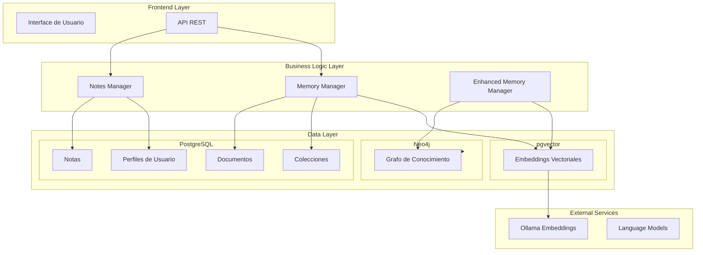

# 🧠 Documentación Completa del Sistema de Memoria del Agente

## 📋 **Tabla de Contenidos**

1. [Visión General](#visión-general)
2. [Arquitectura del Sistema](#arquitectura-del-sistema)
3. [Componentes Principales](#componentes-principales)
4. [Tipos de Memoria](#tipos-de-memoria)
5. [Gestión de Memoria](#gestión-de-memoria)
6. [APIs y Endpoints](#apis-y-endpoints)
7. [Ejemplos de Uso](#ejemplos-de-uso)
8. [Integración con el Agente](#integración-con-el-agente)

---

## 🔍 **Visión General**

El sistema de memoria del agente KAI es una infraestructura compleja y robusta que permite almacenar, recuperar y gestionar diferentes tipos de información del usuario y del sistema. Está diseñado para proporcionar contexto inteligente y persistente a las interacciones del agente.

### **🎯 Objetivos Principales**
- **Persistencia**: Mantener información a largo plazo
- **Contextualización**: Proporcionar contexto relevante para conversaciones
- **Búsqueda Inteligente**: Recuperación semántica y por texto completo
- **Organización**: Estructurar información en colecciones y workspaces
- **Colaboración**: Permitir compartir información entre usuarios y equipos

---

## 🏗️ **Arquitectura del Sistema**



---

## 🔧 **Componentes Principales**

### **1. Memory Manager (`core/memory_manager.py`)**

**Responsabilidad**: Gestor principal de memoria que maneja la persistencia y recuperación de información.

**Características**:
- **Perfiles Estructurados**: Datos clave-valor sobre usuarios
- **Memoria Vectorial (RAG)**: Fragmentos de texto con embeddings
- **Búsqueda Híbrida**: Combinación de búsqueda semántica y texto completo
- **Gestión de Documentos**: Procesamiento y almacenamiento de documentos

**Funciones Clave**:
```python
# Recuperar memorias relevantes
get_relevant_memories(account_id, query, k=20, hybrid_search=True)

# Añadir memoria a la base vectorial
add_memory_to_vector_db(account_id, content, type="general_memory")

# Procesar documentos para RAG
process_document_for_rag(file_name, extracted_text, topic, account_id)
```

### **2. Enhanced Memory Manager (`core/enhanced_memory_manager.py`)**

**Responsabilidad**: Extiende el sistema de memoria integrando grafo de conocimiento con embeddings.

**Características**:
- **Contexto Enriquecido**: Combina embeddings vectoriales con relaciones del grafo
- **Insights Automáticos**: Genera conexiones y patrones automáticamente
- **Caminos de Razonamiento**: Construye rutas de conocimiento conceptuales

**Funciones Clave**:
```python
# Obtener contexto enriquecido
get_enhanced_context(user_query, user_id, workspace_id, max_results=10)

# Guardar memoria enriquecida
save_enhanced_memory(user_message, llm_response, user_id, enhanced_context)
```

### **3. Notes Manager (`core/notes_manager.py`)**

**Responsabilidad**: Gestiona específicamente las notas del usuario con funcionalidades avanzadas.

**Características**:
- **CRUD Completo**: Crear, leer, actualizar, eliminar notas
- **Embeddings**: Generación automática de embeddings para búsqueda semántica
- **Vinculación**: Asociación con perfiles de contacto
- **Permisos**: Control de acceso basado en workspaces

**Funciones Clave**:
```python
# Añadir nueva nota
add_note(account_id, title, content, category, workspace_id)

# Obtener notas con paginación
get_notes_as_dicts(account_id, search_query, workspace_id, skip, limit)

# Vincular perfil a nota
link_profile_to_note(account_id, note_id, profile_id)
```

---

## 📚 **Tipos de Memoria**

### **1. Memoria Estructurada (Perfiles)**

```sql
-- Tabla: profiles
account_id: UUID
nombre: VARCHAR
gustos: TEXT
intereses: TEXT
otros_datos: TEXT
```

**Uso**: Información personal del usuario (nombre, preferencias, intereses)

### **2. Memoria Vectorial (Embeddings)**

```sql
-- Tabla: langchain_pg_embedding
id: UUID
content: TEXT
embedding: VECTOR
account_id: UUID
content_type: VARCHAR  -- 'user_memories', 'user_documents', 'user_notes'
topic: VARCHAR
workspace_id: UUID
metadata: JSONB
```

**Tipos de Contenido**:
- **user_memories**: Memorias conversacionales y episodios
- **user_documents**: Documentos procesados para RAG
- **user_notes**: Notas del usuario con embeddings

### **3. Memoria de Notas**

```sql
-- Tabla: notas
id: INTEGER
account_id: UUID
title: VARCHAR
content: TEXT
category: VARCHAR
embedding: VECTOR
workspace_id: UUID
created_at: TIMESTAMP
updated_at: TIMESTAMP
```

**Características**:
- Embeddings automáticos para búsqueda semántica
- Soporte para Markdown y formato rico
- Vinculación con perfiles de contacto
- Control de permisos por workspace

### **4. Memoria de Grafo (Neo4j)**

**Entidades**:
- **Nodos**: Personas, organizaciones, conceptos, lugares
- **Relaciones**: Conexiones semánticas entre entidades
- **Propiedades**: Confianza, tipo, descripción, metadatos

**Uso**: Relaciones complejas y razonamiento conceptual

---

## 🔍 **Gestión de Memoria**

### **Búsqueda Híbrida**

El sistema implementa búsqueda híbrida que combina:

1. **Búsqueda Semántica**: Usa embeddings para encontrar contenido similar conceptualmente
2. **Búsqueda de Texto Completo (FTS)**: Encuentra coincidencias exactas de texto
3. **Reranking**: Mejora los resultados usando modelos especializados

```python
# Ejemplo de búsqueda híbrida
results = await get_relevant_memories(
    account_id="uuid-user",
    query="machine learning algorithms",
    k=20,
    hybrid_search=True,
    bm25_weight=0.5,  # Peso para FTS vs semántica
    reranking=True
)
```

### **Optimizaciones de Rendimiento**

1. **Columnas Optimizadas**: Evita JOINs usando columnas denormalizadas
2. **Batch Processing**: Procesamiento en lotes para mejorar velocidad
3. **Caché de Embeddings**: Reutiliza embeddings ya calculados
4. **Paginación**: Control de memoria con límites de resultados

### **Deduplicación Inteligente**

```python
# Umbral de similitud para deduplicación
SIMILARITY_THRESHOLD = 0.92

# Fusión de entidades similares
def merge_entities(entities):
    # Combina entidades con alta similitud semántica
    # Mantiene metadatos del mejor candidato
    # Actualiza confianza promedio
```

---

## 🌐 **APIs y Endpoints**

### **Notas API (`api/notes.py`)**

| Método | Endpoint | Descripción |
|--------|----------|-------------|
| POST | `/notes/add-note` | Crear nueva nota |
| GET | `/notes/{note_id}` | Obtener nota por ID |
| PUT | `/notes/update-note` | Actualizar nota |
| DELETE | `/notes/delete-note` | Eliminar nota |
| POST | `/notes/list-notes` | Listar notas con paginación |
| POST | `/notes/{note_id}/link-profile` | Vincular perfil a nota |
| POST | `/notes/generate-pdf` | Generar PDF de nota |

**Ejemplo de Uso**:
```python
# Crear nota
response = await add_note(
    title="Reunión con cliente",
    content="Puntos importantes discutidos...",
    category="Trabajo",
    workspace_id="uuid-workspace"
)
```

### **Colecciones API (`api/collections.py`)**

| Método | Endpoint | Descripción |
|--------|----------|-------------|
| GET | `/collections` | Listar colecciones |
| POST | `/collections` | Crear nueva colección |
| GET | `/collections/{topic}/details` | Obtener detalles de colección |
| PUT | `/update-collection` | Actualizar colección |

### **Memoria API (Integrada)**

```python
# Búsqueda de memorias relevantes
async def search_memories(
    account_id: str,
    query: str,
    content_types: List[str] = ["user_memories", "user_documents", "user_notes"],
    workspace_id: Optional[str] = None
) -> ToolOutputWithSources:
```

---

## 💡 **Ejemplos de Uso**

### **1. Añadir Memoria Conversacional**

```python
# Guardar interacción usuario-agente
await add_memory_to_vector_db(
    account_id="user-uuid",
    content="User: ¿Qué sabes sobre machine learning?\nAI: Machine learning es una rama de la IA...",
    type="enhanced_episodic",
    workspace_id="workspace-uuid"
)
```

### **2. Búsqueda Contextual**

```python
# Obtener contexto para nueva conversación
context = await get_relevant_memories(
    account_id="user-uuid",
    query="proyecto de IA que discutimos ayer",
    k=5,
    workspace_id="workspace-uuid"
)
```

### **3. Procesamiento de Documentos**

```python
# Añadir documento al sistema RAG
chunks_count = await process_document_for_rag(
    file_name="manual_usuario.pdf",
    extracted_text="Contenido del manual...",
    topic="documentacion",
    account_id="user-uuid",
    workspace_id="workspace-uuid"
)
```

### **4. Memoria Enriquecida**

```python
# Obtener contexto con grafo de conocimiento
enhanced_context = await enhanced_memory_manager.get_enhanced_context(
    user_query="relación entre deep learning y redes neuronales",
    user_id="user-uuid",
    workspace_id="workspace-uuid"
)
```

### **5. Gestión de Notas**

```python
# Crear nota con vinculación a perfil
note = await notes_manager.add_note(
    account_id="user-uuid",
    title="Idea de proyecto",
    content="Desarrollar una aplicación de...",
    category="Ideas",
    workspace_id="workspace-uuid"
)

# Vincular perfil de contacto
await notes_manager.link_profile_to_note(
    account_id="user-uuid",
    note_id=note["id"],
    profile_id="profile-uuid"
)
```

---

## 🔗 **Integración con el Agente**

### **Flujo de Trabajo Típico**

1. **Entrada del Usuario**:
   ```python
   user_message = "¿Qué sabes sobre mi proyecto de IA?"
   ```

2. **Recuperación de Contexto**:
   ```python
   context = await get_relevant_memories(
       account_id=user_id,
       query=user_message,
       k=10,
       content_types=["user_memories", "user_documents", "user_notes"]
   )
   ```

3. **Generación de Respuesta**:
   ```python
   # El LLM recibe el contexto recuperado
   response = await llm.agenerate([
       f"Contexto: {context.context_for_llm}",
       f"Pregunta: {user_message}"
   ])
   ```

4. **Guardado de Memoria**:
   ```python
   await add_memory_to_vector_db(
       account_id=user_id,
       content=f"User: {user_message}\nAI: {response}",
       type="enhanced_episodic"
   )
   ```

### **Herramientas del Agente**

```python
# AddNoteTool
add_note_tool = AddNoteTool(
    account_id=user_id,
    workspace_id=workspace_id
)

# Usar herramienta
result = await add_note_tool._arun(
    content="Recordar revisar el presupuesto del proyecto",
    title="Tareas pendientes",
    category="Trabajo"
)
```

### **Análisis Proactivo**

```python
# Análisis automático de nuevas memorias
async def proactive_memory_analysis():
    # Buscar conexiones entre memorias recientes
    # Identificar gaps de información
    # Sugerir relaciones relevantes
    pass
```

---

## 📊 **Métricas y Monitoreo**

### **Métricas Clave**

- **Tiempo de Recuperación**: Latencia promedio de búsquedas
- **Precisión de Contexto**: Relevancia de memorias recuperadas
- **Tasa de Utilización**: Frecuencia de uso de memorias
- **Calidad de Embeddings**: Consistencia semántica

### **Logging y Debugging**

```python
# Configuración de logging
logger.info(f"🔍 Buscando memorias relevantes para: '{query[:50]}...'")
logger.info(f"✅ Encontradas {len(results)} memorias relevantes")
logger.error(f"❌ Error en búsqueda de memorias: {error}")
```

---

## 🚀 **Mejores Prácticas**

### **1. Gestión de Memoria**

- **Categorización**: Usar categorías consistentes para organizar contenido
- **Regular Cleanup**: Eliminar memorias obsoletas o irrelevantes
- **Backup Regular**: Respaldar memorias críticas

### **2. Búsqueda Efectiva**

- **Consultas Específicas**: Usar términos precisos para mejores resultados
- **Filtros Apropiados**: Aplicar filtros de workspace y tipo de contenido
- **Límites Razonables**: No sobrecargar con demasiados resultados

### **3. Rendimiento**

- **Paginación**: Siempre usar paginación para listas grandes
- **Índices**: Mantener índices actualizados en la base de datos
- **Cache**: Aprovechar el cache de embeddings cuando sea posible

---

## 🔮 **Futuras Mejoras**

1. **Memoria Persistente**: Mejorar retención a largo plazo
2. **Análisis Predictivo**: Anticipar necesidades de información
3. **Integración Multimodal**: Soporte para imágenes, audio, video
4. **Colaboración Avanzada**: Compartir memorias entre equipos
5. **IA Explicativa**: Explicar por qué se recuperó cierta información

---

## 📞 **Soporte y Troubleshooting**

### **Problemas Comunes**

1. **Memories No Se Recuperan**:
   - Verificar que `account_id` sea correcto
   - Comprobar permisos de workspace
   - Revisar logs de embeddings

2. **Búsqueda Lenta**:
   - Reducir `k` (número de resultados)
   - Verificar índices en base de datos
   - Considerar usar filtros más específicos

3. **Embeddings Faltantes**:
   - Verificar que Ollama esté corriendo
   - Comprobar configuración de embeddings
   - Revectorizar contenido manualmente

### **Herramientas de Debug**

```python
# Listar todas las memorias de un usuario
all_memories = await list_user_documents(account_id="user-uuid")

# Verificar embeddings de una nota
note_embedding = await get_note_embedding(note_id)

# Buscar memorias duplicadas
duplicates = await find_duplicate_memories(account_id="user-uuid")
```

---

**📝 Nota**: Esta documentación cubre el sistema de memoria del agente KAI en su estado actual. Para actualizaciones y cambios recientes, consultar el historial de commits y la documentación de la API.